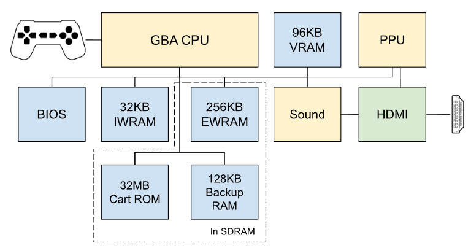

Version 0.1 of [GBATang](https://github.com/nand2mario/gbatang) is just released. It is the first FPGA core for a 32-bit console available for Tang FPGA boards (Tang Mega 138K and the upcoming 60K). The journey is an interesting one for me. This first blog post discusses the experience of porting and building this core, its overall technical design and in more details, the CPU part.

<!--more-->

## It's just a simple port of the MiSTer core, right? 

After the [NES and](https://github.com/nand2mario/nestang) [SNES cores](https://github.com/nand2mario/snestang) reached a relatively stable state, the natural target to make a FPGA clone for would be the “portal SNES” - Game Boy Advance. Released in 2001, it is part of the sixth generation of game consoles including Playstation 2, Dreamcast and the original Xbox. Although not a 3D console by design, GBA had a lot of games exploiting the more powerful 32-bit processor for software 3D graphics. And there is PCM audio, more powerful sprite graphics and more. Are the Tang FPGA boards capable of replicating these more powerful components? It is quite intriguing.

So the GBATang project was started as a port of MiSTer GBA core to Tang boards. That core is originally written by the prolific [Robert Peip](https://github.com/RobertPeip), aka FPGAzumSpass. Thanks a lot to Robert for bringing us so many excellent open source FPGA projects. As the porting progressed, however, it quickly became obvious that a simple port would not be sufficient. The 22nm Gowin 5 FPGA cannot do the 100Mhz `Fmax` required by the core. It only achieved around 70 Mhz on the first try.

Some quick optimizations and switching to more-intensive place-and-route algorithms pushed the `Fmax` up to over 80 Mhz, but it seems hard to go further up. A look at the code reveals that the core is using the “cycle counting” technique. Basically it uses counters to keep track of the multiple FPGA cycles that correspond to a single GBA clock cycle. This way it can spread the potentially complicated work done in a single GBA cycle to multiple FPGA cycles, making components like memory and CPU easier to implement. It is a fine decision for the MiSTer board. Unfortunately it does not work for Tang boards. So I was stuck.

## Going back to a more traditional FPGA design

One way out would be to find all bottlenecks, optimize and make the core work at 100Mhz. But another obvious route is to try to move the design towards the original GBA. For example, the MiSTer GBA core does not employ pipelining for the CPU. Pipelining is a key way to improve performance. So adding pipelining, which is used by the actual GBA CPU, is an obvious thing to do. Cycle counting itself also incurs overhead. So by moving to a 16Mhz design, we avoid this overhead too. So the decision is made to move to a 16Mhz design, which I would call a “traditional FPGA replica” design, meaning it tries harder to replicate how the original hardware works.

So I ended up replacing the CPU and memory system completely. Instead of everything working at 100Mhz, in GBATang most components work at 16Mhz, with the exception of the SDRAM controller (66Mhz, 4x main clock), and the PPU (33Mhz, 2x main clock). 

Here are the main components of GBATang,

{width="500"}

The CPU, PPU and Sound are where most computation happens. And the blue blocks are different kinds of memories with different timing characteristics. Let’s go over a few noteworthy things here.

The GBA CPU is a 32-bit armv4t processor running at 16Mhz, a low-power and fairly speedy processor at the time. It would present some challenges to our design. Compared with old 16-bit or 8-bit processors, it is not only wider but employs various tricks for performance. It is able to achieve one-instruction-per-cycle speed a lot of times, quite a feat at its time. We discuss more details about the CPU in the next section. In the end, I was able to get the pipelining CPU to work at 16Mhz properly.

The PPU is an improved version of the SNES PPU, with added bitmap graphics capabilities, but no true 3D. GBATang mostly inherits the MiSTer GBA core PPU design. Changes are made so that it works properly with the 16 Mhz CPU and other parts of the system. It is currently working at 33Mhz, meaning that it is not yet a replica of the original GBA PPU, as the original design does all its heavy lifting at 16 Mhz. I am not sure if we have enough knowledge about the original PPU to do a proper 16 Mhz design.

The memory part is also rewritten to work the changed system architecture. The external work RAM (EWRAM), cartridge ROM and cartridge backup RAMs are in SDRAM, while the other memories are in FPGA block RAM. How the memory part works will be discussed in later parts of the blog series. I actually made some failed effort to fit the core into the smaller Tang Primer 25K FPGA. The logic is actually doable. But VRAM turns out to be the blocker. Compared with SNES, which has 64KB of VRAM, GBA has 96KB of VRAM. And the Primer 25K only has about 110KB of block RAM, which is not enough to hold the VRAM and IWRAM. And it is hard to put the VRAM in SDRAM as it has a 1-cycle timing requirement. So I had to give that up.

## The GBATang CPU

Now let us discuss how the 16 Mhz GBATang CPU works. The actual GBA CPU is using a 3-stage pipelined design: Fetch, Decode and Execute are happening in parallel. Under good conditions, this allows the CPU to execute one instruction per cycle. In comparison, the 65C816 processor in SNES takes at least 6 cycles to execute one instruction. So pipelining brings good performance.

For the MiSTer core, the fact that it runs at 100 Mhz allows the CPU to serialize its operations. It simply uses a state machine to fetch an instruction, decode it and then execute it. In our case, we need to introduce true pipelining to the design. The first candidate I looked at is the CPU soft core by Ruslan Lepetenok, used in the [unfinished GBA core](https://github.com/mara-kr/GBA) by a group of CMU students in 2016. It is quite complete in functionality. However, after some effort to integrate it with the MiSTer core, it turns out it does not have enough performance either. The `Fmax` is around 15 Mhz.

The challenge with Lepetenok’s CPU is that the execution stage is the obvious bottleneck. A lot of computation is happening during this stage and the FPGA cannot keep up. So I looked around again and finally settled with [this excellent armv4 design](https://github.com/risclite/ARM9-compatible-soft-CPU-core) by Github user risclite. The good thing about risclite’s soft CPU is that it makes good use of modern FPGA’s hard blocks like the multiplier. And it moved some work from the Execution stage to the earlier Decode stage. So the former is not a bottleneck anymore.

The following is a quick (and over-simplified) diagram on how the 3 stages work together,

{width="550"}

The first stage fetches instructions from the memory location pointed to by `rom_addr`. The second stage does two things. First is to decode the instruction into control signals like `code_is_dp0` (“this is a data processing type 0 instruction”), and compute various other addresses and signals. Then it also executes any multiplication required by the instruction. The last stage does the rest of the execution, including mainly the addition operation, to get the final result. By further dividing the work this way, the CPU reduces latency of the execution stage, and makes good use of the hardened multiplication blocks of the FPGA. So my first trial of integration showed `Fmax` of around 35 Mhz, more than enough for our purpose.

Things are not all rosy, though. Further tests show that we were still missing some details of the particular CPU model of the original GBA CPU, including unaligned memory accesses, some handling of data hazards and interactions with DMA, interrupts and timers. Apart from these details, there is one major missing feature - the support for 16-bit instructions.

## Adding 16-bit instruction support

The GBA CPU is a 32-bit processor. However, it actually supports two instruction sets, one 32-bit and one 16-bit (Thumbv1). The reason one needs the 16-bit instruction set is the 32-bit one is two “sparse”, requiring too much instruction memory bandwidth to keep the processor busy. Particularly, if the program is stored in external memory, for instance game pak ROM, fetching 32 bits may take as long as 8 cycles. Therefore, developers are actually recommended to use the 16-bit instruction set if the program is intended to run from the game pak.

The risclite CPU, however, does not support Thumb at all. Fortunately, the CMU core I looked at employed a decoder for mapping 32-bit instructions to 16-bit ones. The two instruction sets are actually similar enough to make a one-to-one mapping possible. Adapting the decoder solved most of the problem, except a few corner cases. 

An interesting corner case is the translation of the BL (“branch and link”) instruction. The 16-bit BL instruction is actually two consecutive instructions, each carrying 11 bits of the target address. This is fine. We just remember the first half of the target address when we see the first instruction, hold off doing the jump, and only execute the jump when we see the second instruction. But two complications arise. The first complication is that the CPU datasheet mandates that the jump target address is calculated based on the PC location of the first BL instruction. When we actually execute the jump in the second BL, this makes the jump target calculation wrong. So a flag has to be introduced to fix the address calculation. The second complication is buried deeper. There is a chance that an interrupt would preempt the second BL instruction, and if the interrupt handler contains a BL instruction, it would destroy our stored first-half target address. Does it mean this stored-and-assemble approach to translating the BL instruction is doomed, or we need to introduce complex special handling for interrupts? It turns out there is a very simple solution - one simply disables interrupts on the second BL instruction. Now that hidden and hideous problem is gone for good, with one line of code.

After a few weeks of bug fixing, the CPU is now stable enough to pass all of [jsmolka's CPU tests](https://github.com/jsmolka/gba-tests), and runs well enough to support GBATang 0.1. There could still be some minor bugs.

This concludes our post today. Thanks for reading. Next posts will discuss memory, DMA, interrupt handling and more.

