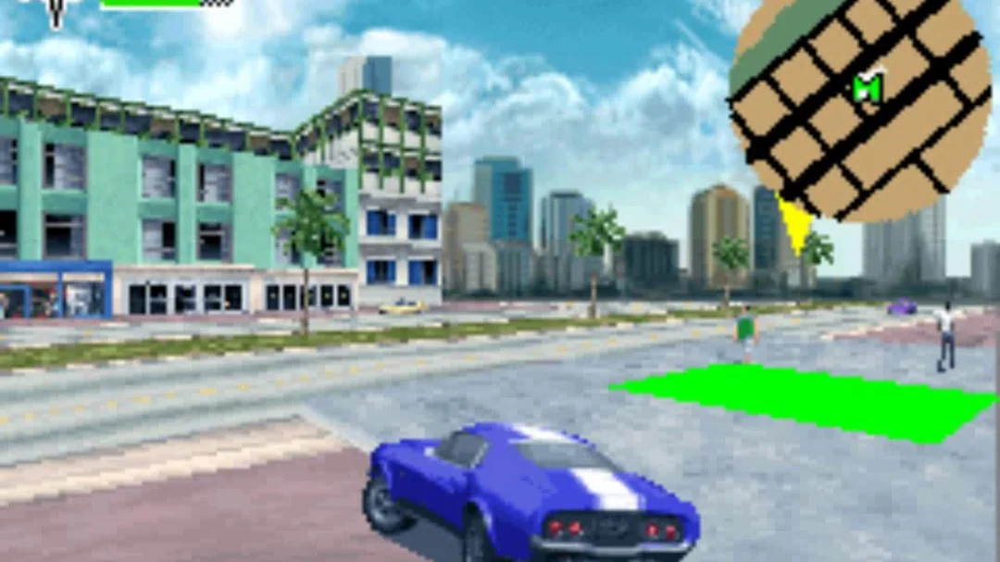

[GBATang](https://github.com/nand2mario/gbatang) has been improving pretty quickly since its release and just reached [version 0.4](https://github.com/nand2mario/gbatang/releases).  More games are running. Graphics rendering has improved a lot. And sound bugs were fixed. Continuing [part one](../gbatang_part_1), let us discuss the components that were not covered in the first post.

<!--more-->

## Combining FPGA block RAM and SDRAM to make the GBA memory system

Just as other consoles in the era, Game Boy Advance used multiple types of memories as sub systems have different memory needs in terms of size, speed and latency. The following is the Game Boy Advance memory map,

```
Address             Region              Size    Wdith Cycles (8/16/32 bit)
00000000-00003FFF   BIOS ROM            16KB    32    1/1/1
02000000-0203FFFF   EWRAM Work RAM 256K 256KB   16    3/3/6
03000000-03007FFF   IWRAM Work RAM 32K  32KB    32    1/1/1
04000000-040003FE   I/O registers       1KB     32    1/1/1
05000000-050003FF   Palette RAM         1KB     16    1/1/2
06000000-06017FFF   VRAM                96KB    16    1/1/2
07000000-070003FF   OAM                 1KB     32    1/1/1
08000000-09FFFFFF   GamePak ROM         32MB    16    5/5/8
0D000000-0DFFFFFF   EEPROM (serial)     8KB     1     5
0E000000-0E00FFFF   GamePak Flash       128KB   16    5/5/8
0E000000-0E00FFFF   GamePak SRAM        64KB    8     5    
```

Smaller memories like the on-chip IWRAM have lower latency, while larger memories like the gamepak ROM are slower. The separate 256KB EWRAM memory chip sits in the middle, balancing size and speed. As shown in the [architecture diagram](../gbatang_part_1/gbatang_blocks.png), all memories can be accessed directly by the CPU through the memory bus, and live in the same address space. The gamepak can also contain some writable memory for game saves, in the form of EEPROM, flash memory, or battery-backed SRAM (one of the three).

For FPGA gaming cores, we typically map memories either to FPGA blocks RAMs, or external SDRAMs. So that is what is done for GBATang,
* Block RAM: BIOS, IWRAM, Palette, VRAM, OAM, EEPROM. Total size is 155KB.
* SDRAM: GamePak ROM, EWRAM, Flash/SRAM. Total size is 32MB + 384KB.

Note that the 256KB EWRAM can be put in the SDRAM as it allows a 3-cycle access latency. That is ~170ns and long enough for SDRAM. This is important for fitting the core into the future Tang 60K as BRAM is more limited. For all the memories in block RAM, implementation is easy. On the other hand, working with SDRAM takes more effort. For an example where things get complicated, see the [bank-interleaving SDRAM controller for SNESTang](../../softcore_for_fpga_gaming). Fortunately for GBATang, bank-interleaved is not necessary as there can be only one active access to SDRAM at any time, as all accesses to EWRAM, GamePak ROM and Flash/SRAM come from the CPU. The GBATang SDRAM controller uses a 67Mhz (4x GBA clock), CL2 (2 cycles between read command and data) design. The SDRAM controller is in `sdram_gba.v`. And a typical timing looks like this,

```
mclk     /‾‾‾‾‾‾‾\_______/‾‾‾‾‾‾‾\_______/‾‾‾‾‾‾‾\_______/‾‾‾‾‾‾‾\_______/‾‾‾‾‾‾‾\_______/
clk      /0\_/1\_/2\_/3\_/0\_/1\_/2\_/3\_/0\_/1\_/2\_/3\_/0\_/1\_/3\_/3\_/0\_/1\_/2\_/3\_/
sdram    $-----------|RAS|CAS|       |DAT|CAS|       |DAT|-----------|RAS|CAS|       |DAT|
cpu_rd   /‾‾‾‾‾‾‾‾‾‾‾‾‾‾‾\_____
cpu_ready                           _____/‾‾‾‾‾‾‾‾‾‾‾‾‾‾‾\____
```

`mclk` is the 16.7Mhz GBA CPU clock. `clk` is the 67Mhz memory clock. Here the first access is a 32-bit read. At the end of the `cpu_rd` pulse from the CPU, the SDRAM controller prepares the row activation command (`RAS`) for the memory, then column activation (`CAS`) in the next memory cycle. The memory registers the CAS command in the next cycle, and provides 16-bit of data (`DAT`) two cycles later ("CL2"). CAS for the next half-word is formed immediately after that. To improve performance, the CPU is actually notified one cycle before the 32-bit word is avalable with a `cpu_ready` pulse. It may, in turn, issue the next memory access immediately in the next cycle, so requests can happen back-to-back. In this way, we can sustain 2-cycle 16-bit access latency from `cpu_ready` to data available to the CPU, providing enough performance when the code is read from gamepak sequentially.

As for the cartridge save memory, a GBA gamepak can have one of three types: SRAM, flash or EEPROM. Currently GBATang only supports the runtime behavior, not persistence of these. So data is lost after power-off. Persistence will be implemented in a future version. For the runtime behavior, SRAM is the easiest, as it behaves exactly like normal memory. Flash and EEPROM merit some discussion. GBA flash memory is read as normal memory and erased or written to by commands written to magic addresses (`0xe00555` and `0xe002aaa`). I found that it is more straightforward to directly do the flash protocol in the SDRAM controller. So a state machine was added to the SDRAM controller to transparently implement the flash chip behavior there.

As for EEPROM, it is a serial protocol mapped to the `0xd000000` to `0xdffffff` address range. The protocol is very simple and easy to implement. One complication, though, is there are two types of EEPROM chips for different GBA gamepaks. One is 512 bytes and the other is 8KB in size. The protocol is slightly different. After looking at the MiSTer GBA core, the way to implement this is by guessing the chip model by waiting for the DMA request, as the EEPROM can only be accessed through DMA and the DMA request size reveals the chip type.

## Memory access multiplexing

Now that we have separate memories implemented with either SDRAM or BRAM, we can serve memory access requests from different GBA components. All PPU-related memories (VRAM, OAM...) are also accessible by the PPU through separate BRAM ports. Other than that, requests come mainly from three sources: CPU instruction fetches (`rom_en`), CPU data read/writes (`ram_cen/ram_wen`), DMA (`dma_bus_ena/dma_bus_rnw`). Then raw requests go out to all the separate BRAMs and the SDRAM controller. One difficulty here is CPU instruction fetches and CPU data accesses can happen at the same time, and need to be serialized. So a memory controller / multiplexer (`gba_memory.sv`) is built to manage all this juggling work. This module turns out to be quite complicated, taking me several days to get right. This is mostly because of the tight performance / cycle count requirements by the GBA. So a mixture of combinational and sequence logic has to be employed to drive the control signals at the right time and sequence.

Here are some typical timings and scenarios. You can see that requests for the first memory access (e.g. `rd_lo`) actually go out in the same cycle as the CPU/DMA request, meaning these signals are driven by combinational logic in this cycle, and by sequential logic in later cycles.

```
  cycle       0     1     2     3     4     5     6     7     8     9    
cpu read 16-bit from game pak, data expected in cycle 2 (sequential) or 5 (random)
  cpu      | req |     | DATA|
  sdram    |rd_lo|ready| data|
  state    | MAIN|WAIT1| MAIN|
 cpu_ready       |  1  |
cpu read 32-bit from game pak, data expected in cycle 4 (sequential) or 7 (random)
  cpu      | req |                 | DATA      |
  sdram    |rd_lo| wait|rd_hi|ready| data      |
  state    | MAIN|WAIT1|WAIT1|WAIT1| MAIN
 cpu_ready                   |  1  |
cpu read 32-bit rom_data and 16-bit ram_rdata from game pak
  cpu      | req |                             | rom/ram_rdata  |
  sdram    |rd_lo| wait|rd_hi|ready|rd_lo|ready|
  state    | MAIN|WAIT1|WAIT1|WAIT1|STRT2|WAIT2| MAIN
 cpu_ready                               |  1  |
read from IWRAM in a single cycle
  dma      | req | DATA|
  iwram    |  rd |     |      
  state    | MAIN| MAIN|
```

## Other components

Other components required fewer changes to the upstream compared to the closely-coupled CPU and memory systems. Most of the changes were needed by the move to 16Mhz main clock.

**DMA**. GBA has a simple CPU-stopping DMA similar to SNES. Four DMA channels are available, with DMA1/DMA2 normally serving the new PCM sound system, and DMA3 copying data between external and internal memory. The main issue with the original implementation is that it is too slow. It was not a problem when running under 100Mhz, but takes up too many cycles for 16Mhz. So it was restructured to do data transfer in as fast as two cycles per datum. Start-up, shut-down operations were also optimized to execute in fewer cycles.

**Sound**. The sound module also required some changes. One issue is in the PCM audio module. GBA supports two DMA-driven PCM audio channels, not available in SNES. Each PCM channel includes a 32-byte sample buffer, filled periodically with DMA transfers. Small changes (combining cycles) were needed to make it work under 16Mhz.

**PPU**. The GBA PPU inherited a lot from Nintendo's previous graphics chips, including designs like scanline-based rendering and Mode 7 (affine transforms). It also has new capabilities like bitmaped modes (mode 3-5), 256 color sprites and etc. They enable features like video playback and CPU-rendered 3D graphics, which were quite impressive at the time.


{width="500"}

As discussed in [part 1](gbatang_part_1), the current PPU implementation cannot finish all its work under 16Mhz. So the initial version of GBATang chose to run it under 33Mhz. With more testing and a discussion with Robert Peip, I further moved it up to run at 50Mhz, 3x the GBA clock. Under this frequency, and with some cycle-combining optimizations, it now handles rendering of all games I tested well.

**MMIO registers**. GBA makes heavy uses of memory-mapped-IO registers. A 1KB memory region (`0x400000 - 0x40003ff`) is dedicated to these vital registers. One issue arose in our porting. The MiSTer core uses some clever `inout` port tricks (`eProcReg_gba`) to implement these registers generically. Sadly Verilator does not have full `inout` support (cannot slice inout ports). So I had to implement half of the functionality manually (all register reads).

Now we have went over all major systems of GBATang. This concludes part 2 of the GBATang series. Thanks for reading. In part 3, I will discuss debugging of the core: tools built and some processes to quickly identify and solve game compatibility problems.

