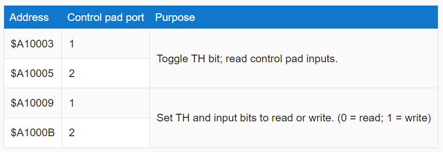

Today we discuss Sega Genesis (or Mega Drive). The 16-bit game consoles held a special place in game history. After the 8-bit machines became extremely popular in the mid-1980s, companies had more resources to pour into R&D of the next generation, leading to more sophisticated designs. And the users truly desired "arcade-level performance", hence the "Blast Processing" marketing by Sega. These machines were well-received and significantly pushed the industry forward. Although companies like NEC and SNK entered the home console market during this period, the main rivalry was between two companies, Nintendo and Sega. [SNESTang](https://github.com/nand2mario/snestang) has been available for some time now. It is about time I bring the other major 16-bit machine, Sega Genesis or Mega Drive, to the Tang boards. [MDTang 0.1](https://github.com/nand2mario/mdtang) is a port of [Genesis-MiSTer](https://github.com/MiSTer-devel/Genesis_MiSTer) to Tang Mega 138K/138K Pro. In the future, it will also support TangConsole 60K when it is released.

<!--more-->

## Actually a port

My last project GBATang was a [partial-rewrite](https://nand2mario.github.io/posts/2024/gbatang_part_1/) as I blogged about last month. [SNESTang](https://github.com/nand2mario/snestang) was also quite involved in changes. In contrast, MDTang is a straightforward port of the original core. The Genesis operated with a master clock of 53.69Mhz, which is the main frequency used by Genesis-MiSTer. The Motorola 68000 (m68k) CPU core and VDP display processor of the original core were very well written and their Fmax immediately satisfied the 53Mhz requirement. So I was able to quickly set up the CPU, VDP, add in an appropriate memory controller and video output. Test roms were running merely two days later.

I'll focus the rest of our discussion on three parts where the Tang board presented idiosyncrasies and demanded some effort, a rare data layout used by the processor, the display interface / frame buffer, and the sound (Z80) processor.

## Odd addresses

Motorola 68k was an extremely popular processor from the 1980s to the 1990s, used in well-known machines like the Macintosh, Amiga and Atari ST. It is a 16-bit CPU with 16-bit data registers and 24-bit address lines. One interesting aspect of m68k is that it is a Big-Endian CPU, which means data is stored in memory with the higher 8-bit coming first. Today, all major computer architectures are Little-Endian. So this unfamiliar layout tripped me up quite a few times. For instance, one has to remember that the UDS/LDS (upper/lower data) signals refer to the upper and lower 8-bit of the **register** rather than the **memory**. The "upper" byte actually goes into the even ("lower") memory byte. That is also the reason why many IO registers in Genesis has odd (pun intended) memory addresses, such as for the gamepads,


{width="500"}

Because it is Big-Endian, the odd memory addresses actually corresponds to the lower byte of the 16-bit data registers. So that's where the Sega engineers put the I/O registers.

## Refactoring the frame buffer

My previous retro cores all employed fix-resolution video output modules. The Genesis, however, supports two horizontal resolutions, 256 and 320. As a result, we need to up-scale a 320x224 or 256x224 image to 720p resolution. This prompts the question: Can we have a video output module that supports two resolutions, or even better, any resolutions? 

As we know, scaling video by integer factors is relatively easy. One simply counts the number of HDMI pixels and advance one original pixel when the count reaches the fixed scaling factor. Moreover, if the factor is a power of 2, it becomes even easier as one just uses shifting to calculate the original coordiate. However, when the scaling factor is not an integer, it becomes less clear how to approach this problem. Using floating point multiplication or even fixed point multiplication is not a good idea, since address calculation needs to work at HDMI pixel clock speed, which can approach 100Mhz or more.

Fortunately, there is a neat trick we can employ here. Similar to the [Bresenham's line algorithm](https://en.wikipedia.org/wiki/Bresenham%27s_line_algorithm) for line-drawing, we can use a simple integer counter to calculate the original coordiate prior to fractional-scaling, as shown in the following code snippet. 

```verilog
reg [10:0] xcnt;    // fractional scaling counters
reg [10:0] ycnt;

always @(posedge clk_pixel) begin
    reg [10:0] xcnt_next;
    reg [10:0] ycnt_next;
    xcnt_next = xcnt + width;   // original width: 256 or 320
    ycnt_next = ycnt + height;  // original height

    if (active) begin
        xcnt <= xcnt_next;
        if (xcnt_next >= 960) begin
            xcnt <= xcnt_next - 960;    // target width 960
            xx <= xx + 1;
        end
    end

    if (newline) begin
        ycnt <= ycnt_next;
        if (ycnt_next >= 720) begin
            ycnt <= ycnt_next - 720;
            yy <= yy + 1;
        end
    end
```

As can be seen, only integer additions and comparisons are required to perform the scaling. The synthesizer actually does a good job of eliminating some trailing zero bits at the end of `xcnt` and `ycnt`. Thus, the code is clean and it performs well.

If you want to know more details or reuse the module, refer to [framebuffer.sv](https://github.com/nand2mario/mdtang/blob/master/src/iosys/framebuffer.sv).

## Matching the Z80 to Tang

The porting of the m68k and VDP proceeded smoothly. However, a minor obstacle emerged after integrating the sound system. The Genesis uses three main chips for its sound system. The 8-bit Z80 CPU serves as the main sound controller. The Yamaha 2612 FM synthesizer acts as the main sound DSP. Additionalyy, a Texas Instruments SN76489 PSG chip is used for backward compatibility with the Sega Master system. 

During the initial pass, the Z80 failed timing tests at 53Mhz. The maximum achievable frequency (Fmax) was approximately 40Mhz. While it is somewhat funny that the more performant m68k was able to pass the timing tests while the slower Z80 cannot, a closer look reveals the reason. The FX68K actually uses two master cycles (`phi1` and `phi2`) to execute a single m68k cycle, making it more FPAG-friendly. The T80 (Z80 clone) CPU here crams all work into a single cycle, resulting in the timing problem.

Fortunately, the solution is not overly complex. Since the Z80 is enabled once every 15 master clock cycles, it actually has ample leeway to schedule its work. This is significantly different from the timing challenges in GBATang, where most cycles already have work scheduled. Thus, I fixed it by making the Z80 run from another clock that is half the speed of the main clock. To make this work, the enabler signals and bus state machines also required some adjustments. So it took an hour to get it right, which is a negligible amount of time in FPGA engineering. :)

## Comparing Genesis, SNES and GBA

Now that I have ported the SNES, GBA and Genesis cores, we can make a comparison of these systems within the context of FPGA recreation. Firstly, Nintendo consoles always possess some rather peculier technologies. The Mario company is renouned or perhaps infamous for not using the most up-to-date technology in their machines, right up to the present day with the Switch. For instance, the GBA employed the eight-year-old ARM7TDMI processor. Nevertheless, every Nintendo console also contained some special technology that is essential for realizing the company's vision for future gaming. For SNES, it is "Mode 7" along with the DSP chip, the Mario chip, and other extension chips. For the GBA, it's the bitmap modes and the overall SoC design. Thus, recreating Nintendo machines is a difficult yet fun endeavor. The design is at times unnecessarily complex, at other times ingenius, sometimes both depending on one's perspective.

In comparison, the Genesis is far more straightforward and utilitarian. Most components, such as the m68k, z80 and ym2612 are all off-the-shelf chips. Luckily for Sega, the Motorola chip is legendary and greatly helped the Genesis. It is fast, versatile and also very easy to program. In terms of FPGA recreation, this design significantly eases the core developer's work. I literally swapped out the Z80 implementation in the midst of the process and encountered no issues. And because of these components' popularity, the available open-source replicas are of high quality. When I began, I was expecting to encounter performance issues with the m68k. Given my experience with the GBA, running a non-pipelined 16-bit CPU at over 50Mhz would not be easy on the Tang boards. However, I was proven wrong, and the FX68K is well designed and passes on my first try.

That's all for today. Thanks for reading, and happy hacking.

