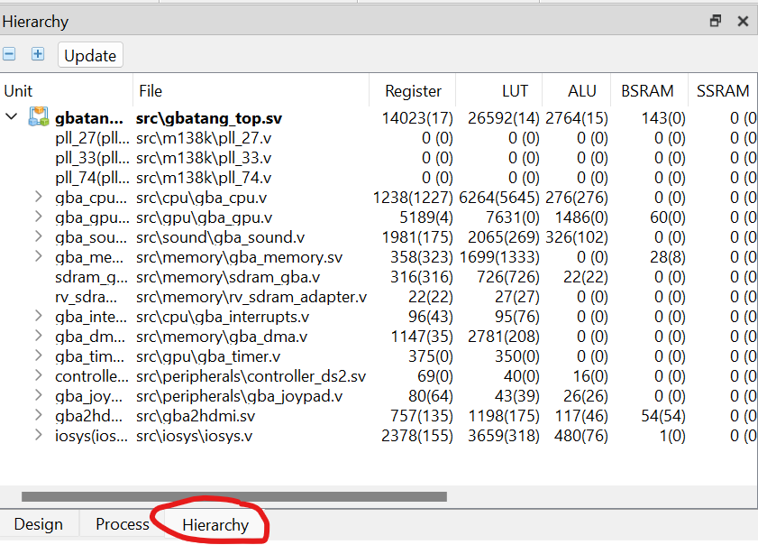

Here are a few tips and tricks for using the [Gowin EDA IDE](https://www.gowinsemi.com/en/support/home/) and [Tang FPGA boards](https://wiki.sipeed.com/hardware/en/tang/index.html), such as Tang Nano 20K, Tang Primer 25K and Tang Mega 138K.  These are small things that I wish I knew when picking up the Tang boards. Gowin is a relatively small FPGA vendor and documentation is not that complete. So I hope this is helpful for the community. If you are coming from Xilinx or Intel FPGAs, you may also find these useful for quickly getting started.

## Gowin EDA Basics

**Use the Pro version, not the EDU version**. The [Gowin EDA](https://www.gowinsemi.com/en/support/home/) Pro version is more versatile and also free as of September 2024. You do not need to request the license from Gowin. Just use Sipeed's license server: 106.55.34.119 (`gowinlic.sipeed.com`), port 10559.

**Windows or Linux works, not Mac**. I mainly use Macs for my other computing needs. But Gowin tools, interestingly also Intel and AMD FPGA toolchains, do not have Mac support. So don't bother. You need Windows or Linux.

**Enable System Verilog support**. The IDE defaults to the very old 2001 version of Verilog. Make sure you turn on modern System Verilog support at "Project->Configuration->Synthesis->Verilog Language".

**Inspect LUT-count of individual modules**. In addition to synthesis and pnr reports, the IDE actually shows resource usage for each individual module. But it's a bit hard to find. You need to choose the "Hierarchy" tab on the project explorer, then make the explorer pane large to reveal resource usage to the right. If it is not there, synthesize the project first.

{width="400"}

## Debugging

**Verilator+gtkwave works great as a simulation solution**. Gowin IDE comes with support for a third-party simulator (Metrics DSim). But I never found that convenient. Luckily, the open source Verilator works great for me. It is much faster than Vivado simulator (xsim) or ModelSim, quite stable, and supports large projects well. Follow [online guides](https://itsembedded.com/dhd/verilator_1/) and you should be able to get your simulation up quickly. If you use Gowin primitives (constructs specific to Gowin FPGAs), Verilator does not directly support them. However, Gowin IDE comes with simulation implementation of these primitives. It is there in the IDE's directory (`IDE/simlib/*`), although I have never needed to use them.

**A UART printing facility is very helpful**. Using a simple UART printing facility like [print.v](https://github.com/sipeed/TangPrimer-20K-example/blob/4b986045a3863819fe4a0a403b78e9b2b2e20d61/DDR-test/LicheeTang20K_DDR_Test/src/print.v) could be very helpful when you debug individual modules on your board. It is simple to set up and works similarly as logging-based software debugging.

**Use Gowin Analyzer Oscilloscope for on-board debugging**. Gowin [GAO](https://www.gowinsemi.com/upload/database_doc/37/document/5bfcfed078251.pdf?_file=database_doc%2F37%2Fdocument%2F5bfcfed078251.pdf) works similarly as Xilinx ILA or Intel Signal-Tap. You specify what signals to collect, the conditions triggering the collection. Then the tool generates the necessary logic to collect these signals for you. It is a very useful facility. One common problem is **missing signals**: some wires/registers may have been optimized away by the synthesizer. In this case, you can add [/* synthesis syn_keep=1 */](https://cdn.gowinsemi.com.cn/SUG550E.pdf) *after the signal definition* to keep it. When you modify your GAO, you need to rebuild your bitstream. This could take a lot of time. There's one shortcut though. If you only need to change the **values of triggering conditions**, you don't need to rebuild. You can just change them in the GAO application.

## Timing

For larger projects with more complex logic, the place-n-route tool may fail to achieve timing closure, which may result in failures at runtime. This is indicated by errors in the "Timing Analysis Report", accessible in the "Process" project explorer tab. Note that no timing errors are shown in the building log below, so you need to check the report manually after building is finished.

When you have difficulty achieving timing closure, here are a few things to check.

**Use the timing optimized placement algorithm** (`Project->Configuration->Place->Place Option`). Digital circuit place-and-route are famous NP-Hard problems. So no optimal algorithm exists. Each particular algorithm is designed with its own trade-offs. The default algorithm chosen by Gowin is a fairly quick one. If that does not achieve timing closure, you can set "Place Options" to "2" to use the timing-optimized placement algorithm. This normally results in better timing at the cost of much longer building time. Note that this is only available in the Pro IDE.

**Use the timing optimized routing algorithm** (`Project->Configuration->Route->Route Option`). Set "Route Option" to "1" to use the timing-optimized routing algorith. Works similarly to the placement algorithm option. I found it to be less helpful than the placement counterpart.  Also only available in the Pro IDE.

**Turn on/off registers on IO buffers** (`Project->Configuration->Place->Place * registers to IOB`). The circuits driving I/O pins (IO buffers) contain optional registers that can drive these pins. These options turn them on or off. For timing sensitive external components (like memory chips), you need these on to get predictable timing from the FPGA. For other non-timing sensitive external components, you can try turning them on or off to see how they impact timing.

**Adding timing constraints**. The way timing checks work is that they check all possible signal paths in the circuit and see if there is enough time for the signal to travel from the origin, propagate through the LUTs, arrive and become stable at the destination. In most cases, the checking tool works well. But sometimes it needs input from the programmer. For example there could be impossible routes ("false paths") that the tool think is valid. Other times, a signal may only be needed not one but two cycles from the origin ("multi-cycle path"). Gowin tools use the "Synopsys Timing Constraints" timing configuration file format. I found [this Xilinx article](https://docs.xilinx.com/r/en-US/ug903-vivado-using-constraints/set_multicycle_path-Syntax) helpful in writing multi-cycle path timing constratraints. The timing instructions format is the same.

Of course, timing failures often indicate that the code contains critical paths that are too long. Finding them and optimizing the code are necessary in this case.

That's all for this entry. Hope these tips are helpful for getting your project running on Tang FPGA boards. 