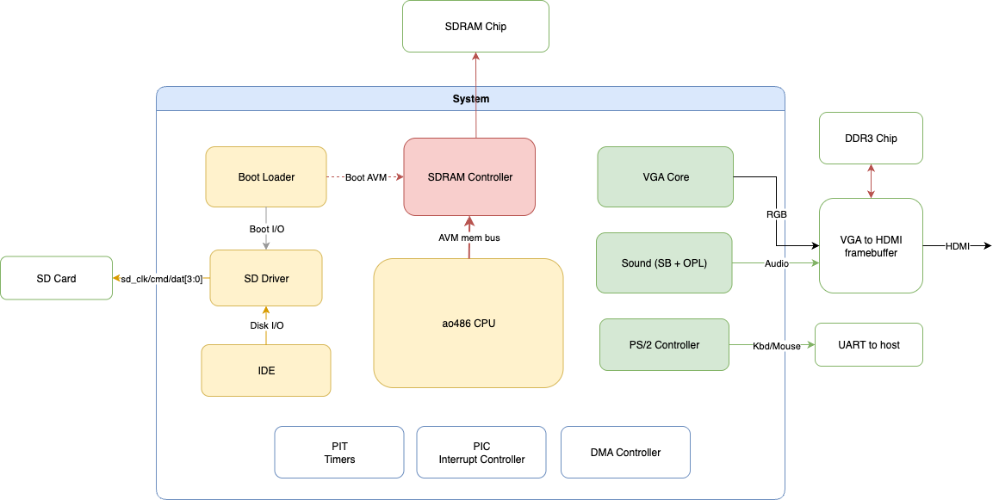
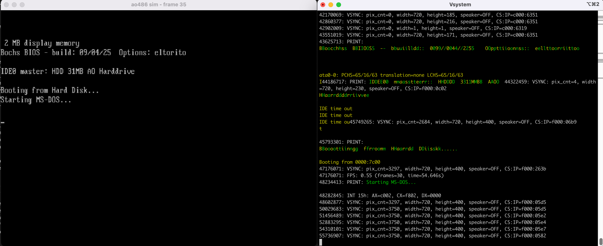
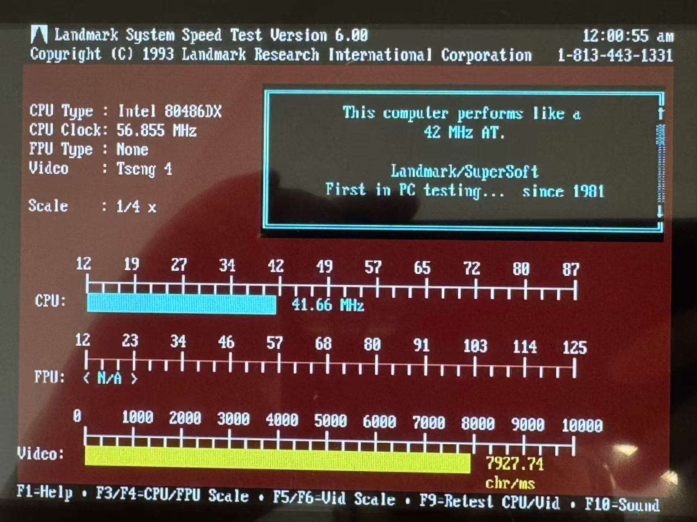
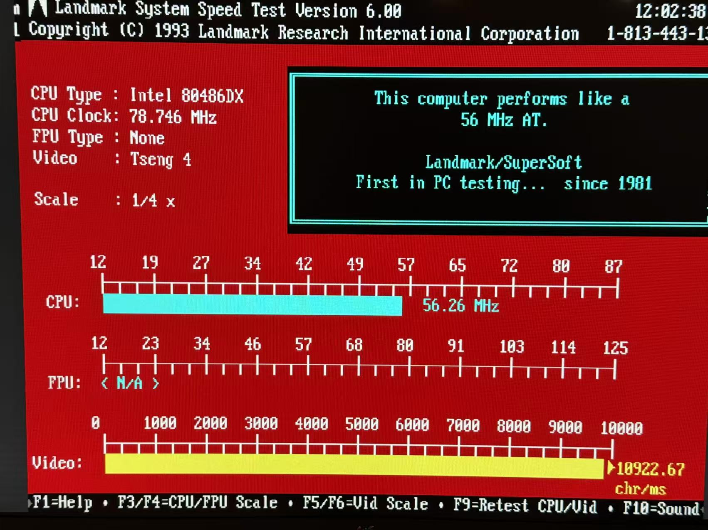

Yesterday I released [486Tang](https://github.com/nand2mario/486tang) v0.1 on GitHub. It’s a port of the ao486 MiSTer PC core to the Sipeed Tang Console 138K FPGA. I’ve been trying to get an x86 core running on the Tang for a while. As far as I know, this is the first time ao486 has been ported to a non-Altera FPGA. Here’s a short write‑up of the project.

<!--more-->

*Thanks to everyone coming from Hacker News! If 486Tang caught your eye, I share [progress updates and related projects](https://x.com/nand2mario) over on X.*

## 486Tang Architecture

Every FPGA board is a little different. Porting a core means moving pieces around and rewiring things to fit. Here are the major components in 486Tang:


{width="800"}

Compared to ao486 on MiSTer, there are a few major differences:

1. **Switching to SDRAM for main memory.** The MiSTer core uses DDR3 as main memory. Obviously, at the time of the 80486, DDR didn’t exist, so SDRAM is a natural fit. I also wanted to dedicate DDR3 to the framebuffer; time‑multiplexing it would have been complicated. So SDRAM became the main memory and DDR3 the framebuffer. The SDRAM on Tang is 16‑bit wide while ao486 expects 32‑bit accesses, which would normally mean one 32‑bit word every two cycles. I mitigated this by running the SDRAM logic at 2× the system clock so a 32‑bit word can be read or written every CPU cycle (“double‑pumping” the memory).

2. **SD‑backed IDE.** On MiSTer, the core forwards IDE requests to the ARM HPS over a fast HPS‑FPGA link; the HPS then accesses a VHD image. Tang doesn’t have a comparable high‑speed MCU‑to‑FPGA interface—only a feeble UART—so I moved disk storage into the SD card and let the FPGA access it directly.

3. **Boot‑loading module.** A PC needs several things to boot: BIOS, VGA BIOS, CMOS settings, and IDE IDENTIFY data (512 bytes). Since I didn’t rely on an MCU for disk data, I stored all of these in the first 128 KB of the SD card. A small boot loader module reads them into main memory and IDE, and then releases the CPU when everything is ready.

## System bring-up with the help of a whole-system simulator

After restructuring the system, the main challenge was bringing it up to a DOS prompt. A 486 PC is complex—CPU and peripherals—more so than the game consoles I’ve worked on. The ao486 CPU alone is >25K lines of Verilog, versus a few K for older cores like M68K. Debugging on hardware was painful: GAO builds took 10+ minutes and there were many more signals to probe. Without a good plan, it would be unmanageable and bugs could take days to isolate—not viable for a hobby project.

My solution was Verilator for subsystem and whole‑system simulation. The codebase is relatively mature, so I skipped per‑module unit tests and focused on simulating subsystems like VGA and a full boot to DOS. Verilator is fast enough to reach a DOS prompt in a few minutes—an order of magnitude better if you factor in the complete waveforms you get in simulation. The trick, then, is surfacing useful progress and error signals. A few simple instrumentation hooks were enough for me:

1. Bochs BIOS can print debug strings to port 0x8888 in debug builds. I intercept and print these (the yellow messages in the simulator). The same path exists on hardware—the CPU forwards them over UART—so BIOS issues show up immediately without waiting for a GAO build.

2. Subsystem‑scoped tracing. For Sound Blaster, IDE, etc., I added `--sound`, `--ide` flags to trace I/O operations and key state changes. This is much faster than editing Verilog or using GAO.

3. Bochs BIOS assembly listings are invaluable. I initially used a manual disassembly—old console habits—without symbols, which was painful. Rebuilding Bochs and using the official listings solved that.

A lot of the bugs were in the new glue I added, as expected. ao486 itself is mature. Still, a few issues only showed up on this toolchain/hardware, mostly due to **toolchain behavior differences**. In one case a variable meant to be static behaved like an automatic variable and didn’t retain state across invocations, so a CE pulse never occurred. Buried deep, it took a while to find.

Here's a simulation session. On the left the simulated 486 screen. On the right is the simulator terminal output. You can see the green VGA output and yellow debug output, along with other events like INT 15h and video VSYNCs.



## Performance optimizations

With simulation help, the core ran on Tang Console—just not fast. The Gowin GW5A isn’t a particularly fast FPGA. Initial benchmarks put it around a 25 MHz 80386.


{width="400"}

The main obstacle to clock speed is long combinational paths. When you find a critical path, you either shorten it or pipeline it by inserting registers—both risks bugs. A solid test suite is essential; I used [test386.asm](https://github.com/barotto/test386.asm) to validate changes.

Here are a few concrete wins:

**Reset tree and fan-out reduction.** Gowin’s tools didn’t replicate resets aggressively enough (even with “Place → Replicate Resources”). One reset net had >5,000 fan-out, which ballooned delays. Manually replicating the reset and a few other high‑fan-out nets helped a lot.

**Instruction fetch optimization.** A long combinational chain sat in the decode/fetch interface. In `decoder_regs.v`, the number of bytes the fetcher may accept was computed using the last decoded instruction’s length:

```verilog
reg [3:0] decoder_count;
assign acceptable_1     = 4'd12 - decoder_count + consume_count;
always @(posedge clk) begin
  ...
  decoder_count <= after_consume_count + accepted;
end
```

Here, `12` is the buffer size, `decoder_count` is the current occupancy, and `consume_count` is the length of the outgoing instruction. Reasonable—but computing `consume_count` (opcode, ModR/M, etc.) was on the Fmax‑limiting path. By the way, this is one of several well-known problems of the x86 - variable length instructions complicating decoding, another is complex address modes and "effective address" calculation.

The fix was to drop the dependency on `consume_count`:

```verilog
assign acceptable_1    = 4'd12 - decoder_count;
```

This may cause the fetcher to “under‑fetch” for one cycle because the outgoing instruction’s space isn’t reclaimed immediately. But `decoder_count` updates next cycle, reclaiming the space. With a 12‑byte buffer, the CPI impact was negligible and Fmax improved measurably on this board.

**TLB optimization.** The Translation Lookaside Buffer (TLB) is a small cache that translates virtual to physical addresses. ao486 uses a 32‑entry fully‑associative TLB with a purely combinational read path—zero extra cycles, but a long path on every memory access (code and data).

DOS workloads barely stress the TLB; even many 386 extenders use a flat model. As a first step I converted the TLB to 4‑way set‑associative. That’s simpler and already slightly faster than fully‑associative for these workloads. There’s room to optimize further since the long combinational path rarely helps.

A rough v0.1 end‑to‑end result: about +35% per Landmark 6 benchmarks, reaching roughly 486SX‑20 territory.


{width="400"}

## Reflections

Here are a few reflections after the port:

**Clock speed scaling.** I appreciate the lure of the megahertz race now. Scaling the whole system clock was the most effective lever—more so than extra caches or deeper pipelines at this stage. Up to ~200–300 MHz, CPU, memory, and I/O can often scale together. After that, memory latency dominates, caches grow deeper, and once clock speeds stop increasing, multiprocessing takes over—the story of the 2000s.

**x86 vs. ARM.** Working with ao486 deepened my respect for x86’s complexity. John Crawford’s 1990 paper “The i486 CPU: Executing Instructions in One Clock Cycle” is a great read; it argues convincingly against scrapping x86 for a new RISC ISA given the software base (10K+ apps then). Compatibility was the right bet, but the baggage is real. By contrast, last year’s ARM7‑based [GBATang](https://github.com/nand2mario/gbatang/) felt refreshingly simple: fixed‑length 32‑bit instructions, saner addressing, and competitive performance. You can’t have your cake and eat it.

* * * * *

So there you have it—that’s 486Tang in v0.1. Thanks for reading, and see you next time.
