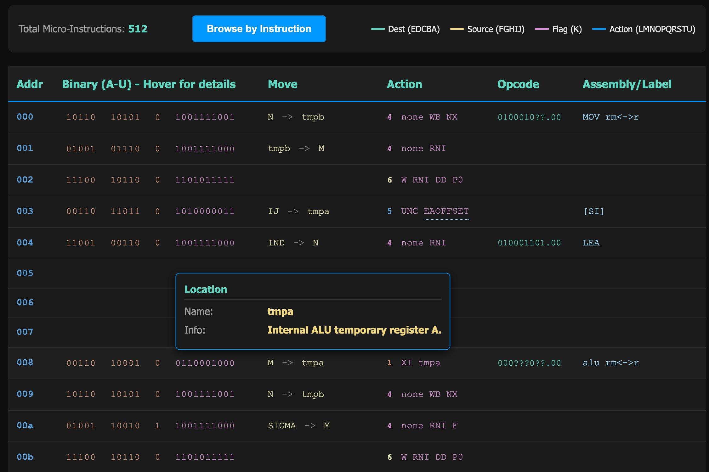

Since releasing [486Tang](/posts/2025/486tang_486_on_a_credit_card_size_fpga_board/), I’ve been working on recreating the 8086 with a design that stays as faithful as possible to the original chip. That exploration naturally led me deep into the original 8086 microcode — [extracted and disassembled](https://www.reenigne.org/blog/8086-microcode-disassembled/) by Andrew Jenner in 2020.

Like all microcoded CPUs, the 8086 hides a lot of subtle behavior below the assembly layer. While studying it I kept extensive notes, and those eventually evolved into something more useful: an interactive browser for the entire 8086 microcode ROM.

<!--more-->

So here it is: the **[online 8086 microcode browser](https://nand2mario.github.io/8086_microcode.html)**.
Every 21-bit micro-instruction is decoded into readable fields. Hover over any field and you’ll get a tooltip explaining what it does. All jump targets are clickable — the 8086 μcode uses a surprising number of indirect jumps, calls, and short branches.

{width="800"}

One handy feature is **Browse by Instruction**.
Click the button and you’ll get a list of ~300 documented 8086 instructions. Select any one, and the viewer jumps directly to its μcode entry point. Internally there are only about 60 unique μcode entry routines, and this feature makes navigating them effortless.

---

### **A few fun tidbits about 8086 μcode**

1. **Register IDs change meaning depending on context.**
   For example, `10100` refers to **SIGMA** (the ALU result) when used as a source, but to **tmpaL** (the low 8 bits of a temporary ALU register) when used as a destination.

2. **N and R are the same physical register.**
   Meanwhile, SI is called **IJ** internally — naming inside the chip is extremely inconsistent and reflects its evolutionary design process.

3. **IP (PC) does *not* point to the next instruction.**
   It actually points to the next *prefetch* address. The μcode uses a dedicated micro-operation called **CORR** to rewind IP back to the true next-instruction boundary when handling branches and interrupts.

4. **Almost all arithmetic instructions share the same 4 μinstructions (`008–00B`).**
   The heavy lifting is done by a single micro-operation named **XI**, which performs different arithmetic behaviors depending on opcode or ModRM bits. The amount of reuse here is elegant — and very 1978 Intel.

