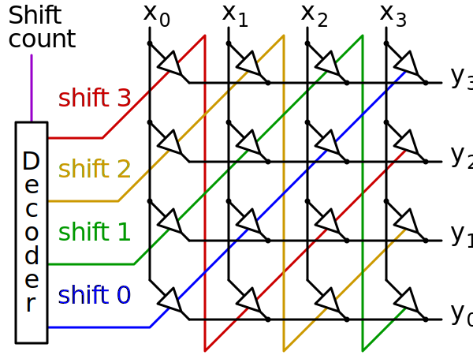
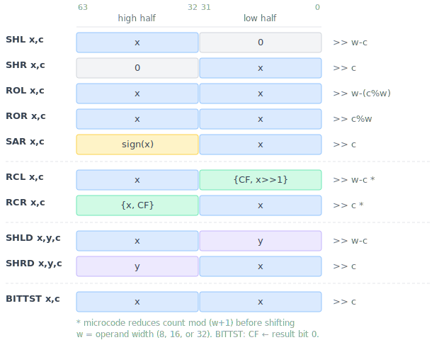

<!-- <style>
  pre code { font-size: 0.85em; }
  code { font-size: 0.85em; }
</style> -->

<!-- # 80386 Barrel Shifter -->

I’m currently building an 80386-compatible core in SystemVerilog, driven by the original Intel microcode extracted from real 386 silicon. Real mode is now operational in simulation, with more than 10,000 single-instruction test cases passing successfully, and work on protected-mode features is in progress. In the course of this work, corners of the 386 microcode and silicon have been examined in detail; this series documents the resulting findings.

In the [previous post](/posts/2026/80386_multiplication_and_division/), we looked at multiplication and division -- iterative algorithms that process one bit per cycle. Today we look at how the CPU does shifts and rotates. The 386 has a dedicated **barrel shifter** that completes an arbitrary multi-bit shift in a single cycle.

## A hybrid barrel shifter

A barrel shifter is a combinational circuit that shifts its input by any number of positions in one clock cycle, without iterating. The diagram below shows a simple 4-bit crossbar barrel shifter -- each output bit can select from any input bit via a grid of switches controlled by the shift amount.

<figure>

<figcaption style="text-align: center;">A 4-bit crossbar barrel shifter. Each output y selects from input x via the switch grid.<br>
<small>Cmglee, <a href="https://creativecommons.org/licenses/by-sa/3.0">CC BY-SA 3.0</a>, via Wikimedia Commons</small></figcaption>
</figure>

The 386 avoids the cost of a full crossbar with a hybrid, two stages design, with 64-bit input and 32-bit output:

1. **Coarse shifter**: A 32x8 crossbar that shifts the input by 0, 4, 8, 12, ..., or 28 bits (multiples of 4)
2. **Fine shifter**: Shifts the coarse output by 0, 1, 2, or 3 bits

Combined, the two stages support any shift amount from 0 to 31 bits in a single cycle. The 64-bit input width is what makes the same hardware work for shifts, rotates, and double-precision shifts -- as we'll see, the microcode just sets up the two 32-bit halves differently for each operation. The entire barrel shifter uses approximately 2,000 transistors -- half the transistor count of an entire 6502 processor. For a detailed look at the actual silicon circuits, see Ken Shirriff's [reverse engineering of the 386 barrel shifter](http://www.righto.com/2023/12/386-barrel-shifter.html).

## A microcode puzzle

The shift and rotate instructions are x86 "Group 2". Take `SHR EBX, 5` as an example -- shift EBX right by 5 bits. It encodes as `C1 EB 05`:

```txt
 C1         EB                05
 opcode     ModR/M byte       immediate
 ────────   ──────────────
 1100 0001  11 101 011
 ││││ ││││  ││ │││ │││
 ││││ ││││  ││ │││ └┴┴── r/m = 011 (EBX)
 ││││ ││││  ││ └┴┴────── reg = 101 (SHR)
 ││││ ││││  └┴────────── mod = 11  (register)
 ││││ │││└── W=1: 32-bit operand (W=0 for byte)
 └┴┴┴─┴┴┴── C0/C1: immediate count (D0/D1: count=1, D2/D3: count=CL)
```

The opcode selects operand size and count source, while the REG field of the ModR/M byte selects the operation: ROL (000), ROR (001), RCL (010), RCR (011), SHL (100), SHR (101), or SAR (111). All seven operations share the same opcode -- they differ only in the 3-bit REG field. 

The barrel shifter is controlled through two micro-operations: **`<<>>?`** (SHIFT1) latches the shift count and configures direction from `modrm[5:3]`, and **`>><<?`** (SHIFT2) performs the actual shift. Now here's the surprising part. When I examined the microcode, I found that ROL, ROR, SHL, SHR, and SAR all share **the exact same three-micro-instruction sequence**:

```asm
; ROL/ROR/SHL/SHR/SAR r, imm8   (entry 0F9)
0F9  DSTREG            IMM            <<>>?              ; SHIFT1: setup barrel shifter
0FA  SIGMA             DSTREG         >><<?   RNI        ; SHIFT2: execute shift
0FB  SIGMA  -> DSTREG                                    ; write result

; ROL/ROR/SHL/SHR/SAR r, CL     (entry 0FF)
0FF  DSTREG            ECX            <<>>?              ; SHIFT1
100  SIGMA             DSTREG         >><<?   RNI        ; SHIFT2
101  SIGMA  -> DSTREG                                    ; write result

; ROL/ROR/SHL/SHR/SAR r, 1      (entry 105)
105  DSTREG            1              <<>>?              ; SHIFT1
106  SIGMA             DSTREG         >><<?   RNI        ; SHIFT2
107  SIGMA  -> DSTREG                                    ; write result
```

Think about that. SHL shifts bits left and fills with zeros. SHR shifts right and fills with zeros. ROL wraps bits around. SAR preserves the sign bit. Yet they all execute the same microcode -- just `<<>>?`, `>><<?`, write result. How can one barrel shifter, controlled by one microcode sequence, produce all these different operations?

## Everything is a right shift

The answer is quite clever: **every operation reduces to a right shift** -- the hardware just sets up the 64-bit input differently for each one.

Right shifts are straightforward: the operand is placed in the low half of the shifter input and shifted right by the requested count. Left shifts work by placing the operand in the high half and zeros in the low half, then right-shifting by **`width - count`**. For example, `SHL x, 5` with a 32-bit operand becomes `{x, 0} >> 27`, which equals `x << 5`. Rotates duplicate the value in both halves, so bits that shift off one end appear at the other. SAR fills the high half with the sign bit.

The following diagram shows how each operation prepares its 64-bit input. The barrel shifter always right-shifts and takes the lower 32 bits of the result:



For left operations (SHL, ROL, RCL, SHLD), an internal `shift_swap` signal reverses which operand occupies the high and low positions, and the shift count is complemented to `width - count`. This is why the microcode can be identical for left and right variants -- the `<<>>?` micro-op reads `modrm[5:3]` to determine the operation type and configures the swap and count accordingly, all in hardware.

*A note on methodology: the data layout and control scheme described here is worked out from the microcode and experimentation, not from examining the barrel shifter's control circuits directly. It hasn't been verified against the silicon. That said, this model passes all hundreds of shift/rotate test cases I've thrown at it, so it should be quite close to what the real hardware does.*

## RCL and RCR: rotating through carry

RCL and RCR are the exceptions to the clean "everything is a right shift" pattern, for two reasons. First, the carry flag participates as an extra bit, so the rotation space is `width + 1` bits (9/17/33) rather than `width`. Second, the count must be reduced modulo `width + 1` -- not a power of two, so you can't just mask the low bits as ROL/ROR do.

The 386 handles both problems in microcode. The count is reduced by a subtraction loop, and the carry flag is embedded directly into the shifter input: for RCR, the high half becomes `{x, CF}`, and for RCL, the low half becomes `{CF, x>>1}`. The barrel shifter then performs an ordinary right shift -- no special rotate-through-carry hardware needed.

Here's the RCL/RCR microcode:

```asm
; RCL/RCR r, CL    (entry 0E9)
0E9  ECX    -> (-3A-)  BITS_V         PASS2              ; CNT=CL, SIGMA=width-1
0EA  SIGMA             1              ADD                ; SIGMA = width
0EB  SIGMA  -> TMPB                                      ; TMPB = width
0EC  COUNTR -> TMPC    TMPB           SUB                ; TMPC=count, SIGMA=count-width
0ED  DSTREG -> TMPD    TMPC           <<>>?              ; TMPD=r, SHIFT1: SIGMA={r,CF}
0EE  SIGMA  -> TMPE    0F1            JG                 ; TMPE={r,CF}, jump if count > width
0EF  TMPE              TMPD           >><<?   RNI        ; SHIFT2: final result
0F0  SIGMA  -> DSTREG                                    ; write result

; Loop for large counts (count > width)
0F1  TMPC              TMPB           SUB                ; SIGMA = TMPC - width
0F2  SIGMA  -> TMPC    TMPB           SUB                ; TMPC -= width
0F3  -1                BITS_V         <<>>?              ; SHIFT1 with count=width-1
0F4  TMPE              TMPD           SHIFT              ; shift {hi, lo} >> (width-1)
0F5  TMPE   -> TMPD    0F1            JG                 ; TMPD=prev TMPE, loop if > 0
0F6  SIGMA  -> TMPE    TMPC           <<>>?              ; SHIFT1 with final count
0F7  TMPE              TMPD           >><<?   RNI        ; SHIFT2: final result
0F8  SIGMA  -> DSTREG                                    ; write result
```

A quick note on the microcode syntax. Each line is one micro-instruction. The hex number on the left is the microcode address. The fields are, in order: source `->` destination, ALU source, and operation. Moves are written `SRC -> DEST`, meaning copy from SRC to DEST. SIGMA is the ALU accumulator -- most operations produce their result there. `JG` is "jump if greater than zero" (checking the result of the previous SUB). Due to the microcode pipeline, the instruction after a jump or `RNI` (run next instruction) always executes before the jump/termination takes effect.

The first part of the microcode is the fast path (0E9 to 0F0), for cases where `CL <= width`. The second part deals with cases where the shift count needs reduction. Surprisingly, the slow path does not subtract `width+1` repetitively. Instead, it reduces the count by `width` each time and rotates the operand one position in the opposite direction.

Consider `RCR BH, 73h` with BH=0x0A and CF=1. The count 0x73 is masked to 5 bits = 19. So the final result is 0x0A rotate through CF=1 by `19 mod 9 = 1`, resulting in 0x85. Here, the loop subtracts `width` (8) from the count each iteration at 0F1. The right shift by `width-1` (7) at 0F4, combined with the SHIFT1 at 0F6 re-embedding CF, amounts to a single left rotation of the 9-bit value. Two iterations reduce the count from 19 to 3, then the SHIFT2 at 0F7 completes the remaining shift.

```
iter 1: {0x15, 0x0A} >> 7 = 0x2A     count: 19→11
iter 2: {0x2A, 0x15} >> 7 = 0x54     count: 11→3
final:  {0x54, 0x2A} >> 3 = 0xA85 →  low 8 bits = 0x85
```

RCL/RCR are slower than the other shift instructions. The Intel manual lists ROL/ROR/SHL/SHR/SAR at 3 cycles (register). RCL/RCR take 9 cycles in the best case and more when the count exceeds the operand width. From our discussion above, it seems that the microcode can actually be optimized, by doing modulo `width+1` reductions and removing the shifting in the loop.

## Bit test instructions

The 386 also introduced bit test instructions -- BT, BTS, BTR, and BTC -- that test, set, reset, or complement a single bit. These reuse the barrel shifter through a **rotate-modify-rotate** strategy: rotate the operand right so the target bit lands at position 0, test or modify it there, then rotate back. This avoids the need for a variable-index bit extraction circuit -- the barrel shifter handles the positioning.

| Instruction | Operation |
|-------------|-----------|
| BT r/m, r/imm | CF = bit[n]; operand unchanged |
| BTS r/m, r/imm | CF = bit[n]; bit[n] = 1 |
| BTR r/m, r/imm | CF = bit[n]; bit[n] = 0 |
| BTC r/m, r/imm | CF = bit[n]; bit[n] = ~bit[n] |

The specific operation (set, reset, or complement) is selected by a single micro-op called `SERECO` that decodes `IR[4:3]`: BT passes through unchanged, BTS ORs with 1, BTR ANDs with ~1, and BTC XORs with 1.

For memory operands, there's an additional twist: the bit index is a **signed offset** that can address bits outside the nominal operand. A bit index of 35 on a dword accesses bit 3 of the *next* dword in memory. The microcode uses the barrel shifter to arithmetic-right-shift the bit index by 3 (computing the byte offset), adjusts the memory address, and then proceeds with the rotate-modify-rotate sequence.

## Conclusion

The barrel shifter is a good example of the 80386’s design style: invest in dedicated hardware where it pays off, and aggressively reuse that hardware. The barrel shifter supports eight shift and rotate instructions, double-precision shifts, and the bit test family—all driven by different microcode sequences that prepare the 64-bit input in instruction-specific ways.

Parameterized microcode is a recurring theme in Intel CPUs. On the 8086, a single micro-op drove all ALU operations. Here, two micro-ops expose most of the barrel shifter's capabilities. With each generation, though, more work shifts from explicit microcode control to implicit hardware -- the 386 already handles EA calculation and stack addressing in dedicated logic that the microcode simply assumes is there. This makes the CPU faster, but also makes microcode-based reverse engineering harder, since more of the interesting behavior is hidden in the datapath.

Thanks for reading. You can follow me on X ([@nand2mario](https://x.com/nand2mario)) for updates, or use [RSS](/feed.xml).

Credits: This analysis of the 80386 draws on the microcode disassembly and silicon reverse engineering work of [reenigne](https://www.reenigne.org/blog/), [gloriouscow](https://github.com/dbalsom), [smartest blob](https://github.com/a-mcego), and [Ken Shirriff](https://www.righto.com). 