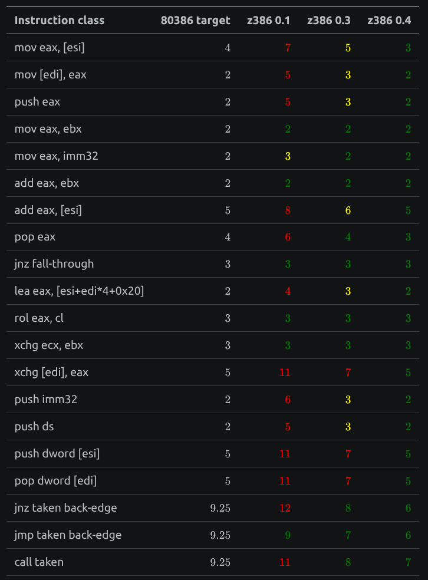

The [z386](https://github.com/nand2mario/z386) FPGA CPU I [released in May](../z386/) was a working 80386 — smaller than existing implementations, fairly fast, and driven by the original Intel microcode. But it was not yet a complete 386. One major missing feature was **Early Start**, where the real 386 begins the next instruction's memory access before the current instruction finishes. Over the following month I added early start and a series of other optimizations, and the result is a machine that now reaches ao486-class performance.

| core | Doom (FPS) | 3DBench | Landmark |
|---|---:|---:|---:|
| z386 0.1 (May) | 16.6 | 33.7 | 147 |
| **z386 0.4 (June)** | **22.5** | **43.1** | **164** |
| ao486 | 21.0 | 43.8 | 204 |

Doom (original, max details) went up ~35% (16.6 → 22.5), past ao486's 21.0, and the 16-bit 3DBench is now within a hair of ao486. The improvements came from CPI improvements - doing more per clock. Per-instruction, z386 went from well above the 386's cycle counts to at or below them on nearly everything:

<figure style="width: 100%; max-width: 400px; margin: 28px auto 32px;">

<figcaption style="text-align: center;">Instruction timings: z386 0.1 → 0.4 vs the original 80386.</figcaption>
</figure>

The [memory pipeline post](../80386_memory_pipeline/) earlier in this [series](/tags/386/) introduced Early Start as a concept. This post is what it took to build it on an FPGA, plus the rest of the CPI work that got z386 to parity, and finally how all of it stayed inside the 85 MHz timing budget. I'll move quickly through the early-start idea and spend the time on implementation.

## Early Start

With Early Start, the 386 address path does not wait for the new instruction to begin in the usual microcoded sense. It starts the address work — effective-address computation, segment relocation, the bus cycle — in the **last cycle of the previous instruction**, overlapping it with that instruction's writeback. Intel reports the optimization is worth about **9%** overall. 

As for how early-start works, the clue is in the microcode. Here is the entry for an ALU instruction that reads a memory operand (`ADD reg, [mem]`):

```asm
; ADD/OR/ADC/SBB/AND/SUB/XOR m,r
04A  EFLAGS -> FLAGSB                 FLGSBA          RD   9
04B                                               DLY
04C  OPR_R  -> TMPB    WRITE_RESULT   JMP         UNL
04D  TMPB              SRCREG         +-&|^
```

The interesting thing is the **first** micro-instruction, `04A`, already issues `RD` — it starts the memory read. There is no micro-instruction before it that computes the effective address, adds the segment base, or checks the limit. The address generation is **implicit** and done by hardwired logic. We can illustrate this mechanism concretely by looking at an example:

```asm
add eax, 16
mov ebx, [eax+4]
```

In execution order the microcode is as listed in the following table. Line `023` runs the ALU (`EAX + 16`) and asserts `RNI` — "run next instruction", so the machine is already committed to starting `MOV r,m` next. Line `024` writes the result back into `EAX`. The `024` cycle is also the early-start cycle for next instruction (load):

| cycle | `add eax, 16` | `mov ebx, [eax+4]` |
|---|---|---|
| 1 | `023`: `EAX + 16` in the ALU, `RNI` | — |
| 2 | `024`: write `EAX` (= old `EAX` + 16) | **early-start window**: peek at the next instruction, forward the just-produced `EAX`, compute `EA = EAX + 4`, relocate, and issue `RD` |
| 3 | — | load microcode begins — the read is **already on the bus** |
| 4 | — | `DLY` (data arriving) |
| 5 | — | `OPR_R -> EBX` |

This overlap makes memory access at least one cycle earlier, and reduces load/store latency. The subtlety is the last micro-instruction of the previous instruction could write back data to registers, and causes data hazard. Here `EAX` is being *written* in that very cycle, so not yet in the register file. This is of course solves with a forwarding network so the early-start gets the latest value. Earlier versions of the fowarding in Intel 386DX were buggy and produced the famous **POPAD bug** — when `POPAD` is followed by an instruction using `[EAX+...]`, the early-start machinery forwards the wrong value.

## Implementing Early Start

z386 tracks each instruction through a small lifecycle. The two events that matter here are **`i_pop`** — the cycle the instruction is pulled from the prefetch queue, which is the *previous* instruction's `RNI` delay slot — and **`i_first`**, the first cycle of its own microcode. `i_pop` is exactly the 386's early-start window in cycle 2 above.

So early start, in z386, is: **compute the effective address combinationally at `i_pop`, forwarding the in-flight register write.** The decoder produces the base/index/displacement selectors, and:

```systemverilog
wire [31:0] ea_early = calc_ea_core(fwd_onehot_gpr(ea_dec_base_sel_r),
                                    fwd_onehot_gpr(ea_dec_index_sel_r),
                                    ...);
```

`fwd_onehot_gpr` is the bypass. If the previous instruction's delay-slot writeback targets the EA's base or index register, it substitutes the writeback value (`dest_value`) for the register-file copy — handling byte, word, and dword writes separately, because a partial write only updates part of the register:

```systemverilog
FWD_BLO: fwd_onehot_gpr = {cur[31:8],  dest_value[7:0]};        // AL
FWD_W:   fwd_onehot_gpr = {cur[31:16], dest_value[15:0]};       // AX
default: fwd_onehot_gpr = dest_value;                           // EAX
```

Stack pointers get the same treatment through `forwarded_esp`, so a `push` right after an instruction that adjusts `ESP` still sees the new value. `ea_early` is then registered into `ea_reg` at `i_pop`, ready for the load/store microcode at `i_first`. Functionally this is exactly the 386's hardwired EA generator, and it reproduces the same forwarding corner cases — including the POPAD one — that the microcode quietly relies on.

With the forwarded GPR and stack pointer ready, the early-start cycle proceeds to calculate the effective address, and relocation (applying the segment base), to finally produce the linear address. This turns out to be a hotspot for timing issues. It took quite some iterations to get the length of the path within budget.

## Shaving cycles off memory accesses

The 10% performance gain from early-start is quite significant. However to achieve more than 30%, a lot of the other optimizations come in the form of shortening the memory access pipe. Here are a quick list of optimizations:

**Tightening the store queue**. Stores were 3 cycles where the 386 takes 2. The common way to reduce write latency is through a *store queue*. Instead of writing to external memory, the CPU maintains a small buffer of to be written data. z386 already had a 3-entry store queue. However the interface was too conservative and wasted a cycle. Releasing the delay (DLY micro-op) earlier gained a cycle for writes.

**Issueing the read/write at i_first**. i_first marks the first cycle of an instruction. With early-start, it would naturally follow that most reads/writes will be issued here. However, the old memory pipe sometimes splits the TLB and memory/cache request into two cycles. Combining them into the i_first cycle saves another cycle on top of early-start.

Here's an example of the memory pipe at work, with no stall at all if the cache hits:

```
; ADD/OR/ADC/SBB/AND/SUB/XOR r,m
i_pop           forward GPR, set IND(early-EA), relocate
027 RD          TLB, cache request
028 DLY         tag compare, write OPR_R
029 OPR_R->TMPB OPR_R ready
02A RNI
02B SIGMA->DSTREG
```

**Splitting the cache**. I played around with the cache and found a 16KB+16KB split-cache design works better. It is actually twice the size of the ao486 caches. And given the new memory pipe design, a simpler PIPT (physically indexed, physically tagged) cache actually work better here, so that is also adopted. At a high level, a split cache exploits the fact that code (used by prefetcher) and data (used by the data path) seldomly intersect. And the icache is read-only and thus more area efficient. The only complexity is they need to be kept coherent by a snooping protocol. Code is actually written to by the data path when they are loaded or, more rarely, self-modified.

## Early branch redirect

It is NOT my goal for z386 to be 100% 80386 cycle accurate. Accurate behavior is very meaning for, and helped greatly by the microcode. However for places where using a bit more resources can increase performance significantly, or there's a FPGA resource that can help a lot, we should adopt the faster design. The multiplier was such an example, where the FPGA DSP block saved a lot of cycles. Early branch redirect is another example.

For a direct relative branch — `jmp rel`, `call rel`, or a taken `jcc` — the target is just `EIP + displacement`, fully known at decode with no register or memory dependency. These are often performance critical. Yet 386 only redirected the prefetcher *after* the microcode resolved the branch. So z386 now computes the target early at `i_first` and redirects immediately.

This is **not** a branch prediction. The `jcc` condition is resolved at `i_first` from the settled flags, so the target is *exact*. It just starts the refill earlier. Taken `jnz`/`jmp` is now **6** cycles — well below the 386's 9.25, helping CPI significantly.

## A wider frontend

There is a second, very 386-ish trick. When an unconditional `jmp`/`call rel` is sitting in the decode queue, its fall-through path is *always dead* — yet the prefetcher would keep fetching it, so the branch target's fetch ends up queued behind a guaranteed-useless (and possibly missing) line. So the decoder now signals the prefetcher to **stop fetching the dead fall-through** of an unconditional rel branch, clearing the way for the redirect's target fetch. (Backward conditional branches are deliberately excluded — their fall-through *is* the loop exit, and suppressing it thrashed Dhrystone's tight loops.) `call` taken went 10 → 8.

After all this, the bottleneck is squarely the decode-queue refill — decode-queue-empty is now the #1 stall at ~20% of cycles, because the faster execution drains the queue faster than prefetch refills it after each branch. Going further there (early call-target prefetch, a return-address stack, wider decode) is the next frontier, but it deepens exactly the prefetch→decode timing cone that has been the hardest to close — which is the other half of this story.


## Maintaining a high clock speed

Optimizations often take area, and worse, impacts Fmax. If it slows down the clock too much, it defeats its own purpose. z386 was almost able to maintain its clock speed after all the above optimization. It was able to achieve 80MHz actual clock speed, compared with the 85MHz of v0.1. The CPI improved by a larger margin so overall performance of 32-bit code rises by about 30%.

One technique is worth mentioned when optimizing timing, **adder carry chain fusion**. The original 386 design has a special case for "complex effective address". If all three terms of EA is present: `EA = base+index<<scale+disp`, then it has to be calculated in two cycles instead of one. The reason is the same combinational path has another 32-bit adder for segment relocation, and three 32-bit adders are too slow for the clock cycle. The lucky thing for DE10-Nano, though, is that Altera ALM (the FPGA logic cell) supports fast 3-input adder, with a "shared arithmetic chain". What this boils down to is that a 3-input adder is only slightly slower than a 2-input adder, with a single carry chain. So we take adavantage of this and maintain the clock speed, while doing complex EA in a single cycle.

Beyond those, closing 80 MHz was a steady grind of smaller cleanups, each shaving a path: predecoding the microcode control bits in the ROM's output-register cycle (so they don't decode on the execution path); replicating the live-TLB linear per cache way to break a 329-fanout net; flattening the `stall`/`uc_exec` enable logic from ~5 LUT levels to ~2; and taking the fault and TLB-permission cones off the prefetch-start and cache-capture enables. These don't change logic behavior; they exist purely so the CPI features above could work at clock.

## Conclusion

z386 0.1 finished the basic machinary needed for the 386 microcode to execute correctly (mostly). My other goal for the project has always been for it to be as fast or faster than the other opensource x86 core, ao486. I think z386 0.4 achieved that too. So there are now a fast pipelined x86 open source core (ao486), and a fast non-pipelined one (z386). In theory, one would expect a pipelined CPU to be faster. However, given the complexity of the x86 architecture, it is hard to get correct and optimized.

Regarding correctness, z386 does not boot Windows yet. There's no reason why it could not. x86 is complicated. So [help](https://github.com/nand2mario/z386) in bugs fixing would be appreciately. Please also report game compatibility bugs for [z386_MiSTer](https://github.com/nand2mario/z386_MiSTer) as it also help improve the CPU core.

Thanks for reading and happy hacking. You can follow me on X ([@nand2mario](https://x.com/nand2mario)) for updates, or use [RSS](/feed.xml).

## Credits

The analysis of the 80386 in this post draws on the microcode disassembly and silicon reverse engineering work of [reenigne](https://www.reenigne.org/blog/), [gloriouscow](https://github.com/dbalsom), [smartest blob](https://github.com/a-mcego), and [Ken Shirriff](https://www.righto.com).
