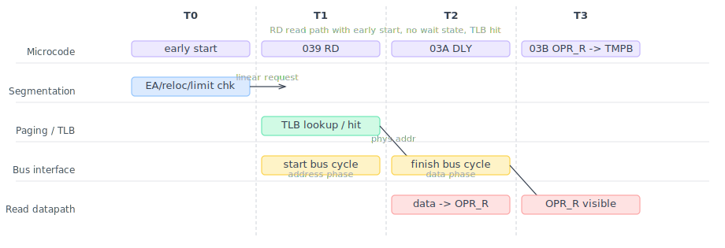

The FPGA 386 core I've been building now boots DOS, runs applications like Norton Commander, and plays games like Doom. On DE10-Nano it currently runs at 75 MHz. With the core now far enough along to run real software, this seems like a good point to step back and look at one of the 80386's performance-critical subsystems: its memory pipeline.

*32-bit Protected Mode* was the defining feature of the 80386. In the [previous post](/posts/2026/80386_protection/), I looked at one side of that story: the virtual-memory protection mechanisms. We saw how the 80386 implements protection with a dedicated PLA, segment caches, and a hardware page walker. This time I want to look at virtual memory from a different angle: the microarchitecture of the memory access pipeline, how address translation is made efficient, how microcode drives the process, and what kind of RTL timing the design achieves.

On paper, x86 virtual memory management looks expensive. Every memory reference seems to require effective address calculation, segment relocation, limit checking, TLB lookup, and, on a miss, two page-table reads plus Accessed/Dirty-bit updates. Yet Intel's own 1986 IEEE ICCD paper, Jim Slager's *Performance Optimizations of the 80386*, describes the common-case address path as completing in about **1.5 clocks**. How did the 386 pull that off?

The answer is that virtual memory is not really a serial chain of checks, even if the diagrams make it look that way. It is a carefully overlapped memory pipeline that uses pre-calculation, pipelining, and parallelism to keep the common case surprisingly short.

<!--more-->

## Microcode for memory accesses

Intel's *80386 Programmer's Reference Manual* describes 80386 address translation like this:

> "The 80386 transforms logical addresses (i.e., addresses as viewed by programmers) into physical address (i.e., actual addresses in physical memory) in two steps: segment translation... and page translation..."

The manual illustrates it as follows:

<figure>

<figcaption style="text-align: center;">Address Translation Overview (figure 5-1, <i>80386 Programmer's Reference Manual</i>)</figcaption>
</figure>

Before looking at the hardware, it helps to start from the microcode. Here is the microcode for an ALU instruction that reads memory, modifies it, and writes it back, for example `ADD [BX+4], 8`:

```asm
; ADD/OR/ADC/SBB/AND/SUB/XOR m,i
039  EFLAGS -> FLAGSB                 FLGSBA          RD   9
03A                                               DLY
03B  OPR_R  -> TMPB    WRITE_RESULT   JMP         UNL
03C  TMPB              IMM            +-&|^

; WRITE_RESULT
046  SIGMA  -> OPR_W                          RNI     WR   0
047                                               DLY
```

If this is the first post in the series you are reading, here is the minimum amount of syntax you need:

- the hexadecimal number at the start (`039`, `03A`, ...) is the microcode address
- `SRC -> DST` means moving a value between internal registers or buses
- `RD` and `WR` start memory reads and writes
- `DLY` means "wait here until the memory side catches up"
- `SIGMA` is the ALU result register
- `OPR_R` and `OPR_W` are the read-data and write-data registers for memory operands
- `RNI` means "run next instruction", i.e. this micro-routine is ending

Three things matter here:

- `RD` starts a memory read
- `WR` starts a memory write
- `DLY` is where the microcode waits for the result to become available

Note that patterns like `RD + DLY` and `WR + DLY` occur all over the microcode. If address generation, translation, and bus arbitration were slow, the entire machine would bog down. So the interesting question is:

> How does the hardware make these tiny `RD` and `WR` hooks cheap enough that the whole machine still works?

Intel's answer was to build a dedicated address path that usually adds only about one extra cycle, or in their own phrasing, about **1.5 clocks** for the address pipeline itself.

## Efficient segmentation

Here is the familiar way in which segmentation transforms a logical address into a linear address:

<figure>

<figcaption style="text-align: center;">Segment Translation (figure 5-2, <i>80386 Programmer's Reference Manual</i>)</figcaption>
</figure>

Segmentation is mandatory and active in both protected and real mode. The above illustration is easy to understand in protected mode: the segment base address is looked up from the in-memory GDT/LDT tables. What may not be obvious from the diagram is that the same segment calculation is also active in real mode, even when the linear address seemingly does not go through lookup tables. We'll talk about that below.

### Why segmentation could have been expensive

The `RD/DLY` pattern above shows the contract between the microcode and the memory system: once a read is issued, the rest of the machine expects the address path to do its work quickly. A simple instruction boundary already shows how little slack there is.

Consider a pair of instructions like:

```asm
MOV AX, 123h
ADD [AX+45h], 2
```

Its microcode in execution order is:

```asm
; MOV r,i
005  IMM                              PASS    RNI
006  SIGMA  -> DSTREG

; ADD m,i
039  EFLAGS -> FLAGSB                 FLGSBA          RD   9
03A                                               DLY
03B  OPR_R  -> TMPB    WRITE_RESULT   JMP         UNL
...
```

Line `006` writes the new value of `AX`. Instructions are executed back-to-back in the 386, so in the very next cycle line `039` wants to begin a memory read using that value as part of the effective address. That leaves almost no slack. The address hardware must react immediately at the instruction boundary.

This is where segmentation becomes a performance problem rather than just a correctness mechanism. If it were implemented naively, every access would need to fetch the segment descriptor, add the base, compare against the limit, and only then proceed. That would be hopelessly slow.

### Cached segment state

The first optimization is simply to avoid repeating descriptor lookup on every access.

When a selector is loaded into a segment register, the processor also loads the descriptor's base, limit, and attributes into the register's invisible part. The hidden state (called **descriptor caches**) exists so the processor does **not** need to consult the descriptor tables on every memory reference. On the die photo, it actually occupies considerable space.

<figure>

<figcaption style="text-align: center;">The 80386 die. The Descriptor Cache is highlighted in red.<br>
<small>Base image: <a href="https://commons.wikimedia.org/wiki/File:Intel_80386_DX_die.JPG">Intel 80386 DX die</a>, Wikimedia Commons</small></figcaption>
</figure>

This is a crucial design choice. Without it, segmentation would either require extra memory accesses on every reference or a much more elaborate descriptor cache hierarchy. With it, ordinary accesses see segmentation as local state, not table-walking.

It also gives rise to a subtle but important architectural property: changing a descriptor in memory does not affect a segment register that already has that descriptor loaded. The cached copy remains in force until the selector is reloaded.

The descriptor caches also support real-mode address translation. Here is the microcode for real-mode and protected-mode `MOV` to a segment register:

```asm
; r MOV ES/SS/DS/FS/GS,rw
009  DSTREG    DES_SR                 PASS    RnI DLY SBRM 0
00A  SIGMA  -> SEGREG

; p MOV ES/DS/FS/GS,rw
580            DES_SR  TST_DES_SIMPLE PTSAV1      DLY SPTR 0
581                    LD_DESCRIPTOR  LCALL
582  DSTREG -> SLCTR   TST_SEL_NONSS  PTSELE      DLY
583  SLCTR2 -> SEGREG  TMPC                   RNI     SDEL
584                                               DLY
```

We actually talked about the protected-mode segment-loading microcode in the [protection post](../80386_protection). The `LD_DESCRIPTOR` routine does the heavy lifting and generically loads the descriptor into the corresponding segment descriptor cache. The interested reader is referred to that post for details.

For real mode, however, the microcode is very different. Line 009 uses a special operation `SBRM` (set-base-real-mode) to modify the `base` value in the hidden descriptor cache with the register (`DSTREG`) in the right segment (`DES_SR`), i.e. setting the corresponding base address to `seg<<4`. In this way, later processing of real-mode and protected-mode segmentation is unified into the same set of logic, reducing area and improving efficiency.

You may have noticed that the real-mode routine does not touch the `limit` value in the segment cache, which is supposed to be 64 KB in real mode. Nor is there any hardware that implicitly sets the limit; in fact, the limit is initialized only once when the processor boots. This interesting design choice by Intel is what makes the famous "[unreal mode](https://en.wikipedia.org/wiki/Unreal_mode)" trick possible. By entering protected mode, setting the limit to a large value, and returning to real mode, software can create a variant of real mode that allows access to a 4 GB data segment.

### Parallel relocation and limit checking

Once the descriptor state is cached, the next problem is the actual arithmetic.

To form a linear address, the processor adds:

```text
effective_address = base + index*scale + displacement
linear = segment_base + effective_address
```

At the same time, it must verify that the effective address is within the segment limit. The efficient way to do this is **not** to wait for the final linear address and compare that against some adjusted bound. The correct approach, which the 386 uses, is to compute linear address and conduct the limit check in parallel.

- one arithmetic path adds the segment base to the effective address
- another arithmetic path compares the last accessed byte offset against the segment limit

For the limit test, there are still more details: we actually need to check whether

```text
offset + size - 1 <= limit
```

`size` is the byte length of the current operation. For example, for a dword access at `0x100`, the last byte accessed is `0x103`. A naive implementation here would need two full adders in series within the same cycle, one to compute the sum and one to compare the two sides. A better implementation is to compute something like:

```text
limit - offset
```

And then use a small amount of shallow logic to determine whether the remaining space is enough for a byte, word, or dword. A single wide NOR gate could be used to check if the top 30 bits are all zero, and then a few more gates would be enough to check whether the lowest two bits are valid. This matches the kind of optimization described in Intel's address-translation discussion in the ICCD paper.

### Why complex addressing modes cost an extra cycle

The 386 supports rich addressing modes:

```text
EA = base + index*scale + displacement
```

First the scale factor (1, 2, 4 or 8) can be done with a fixed shift (4-way multiplexers) and is cheap. Then, if no more than two addition terms are present, the whole EA can be computed with a single full adder. However, if all three terms are present, we would need two full adders, again in series.

Intel designers again optimized for the common case here. If the effective-address hardware only has to add two 32-bit terms in the fast case, then EA is calculated in a single cycle. The occasional `base + index*scale + displacement` form can take an extra step rather than forcing *every* memory reference through deeper combinational logic.

## Early start

One of the most interesting memory optimizations in the 80386 is **Early Start**. For some instructions, the address path does not wait for the new instruction to "start" in the usual microcoded sense. Instead, it begins address-related work in the **last cycle of the previous instruction**, overlapping that work with the previous instruction's writeback.

Our earlier example of `MOV AX, 123h` followed by `ADD [AX+45h], 2` is exactly such a case. The execution order is:

```asm
; MOV r,i
005  IMM                              PASS    RNI
006  SIGMA  -> DSTREG
; ADD m,i
039  EFLAGS -> FLAGSB                 FLGSBA          RD   9
03A                                               DLY
...
```

In the second cycle, at microcode address `006`, the result of the `MOV` instruction (`0x123`) is written into `AX`. That same cycle is also the hardwired early-start window for the following `ADD`. During that cycle, the address path peeks ahead, sees that the next instruction needs `AX+45h`, and uses the just-produced value of `AX` through bypass logic to generate the effective address:

```text
EA = 0x123 + 0x45 = 0x158
```

By the time the `ADD` instruction officially begins in the third cycle, the memory read for the operand at `[AX+45h]` is already underway on the external bus.

Without early start, the `ADD` would have had to wait until cycle 3 just to begin reading `AX` and computing the address. By overlapping these hardwired functions with the final cycle of the `MOV`, the 80386 effectively hides much of the 1.5-to-2-cycle address-generation latency, allowing the microcode to begin processing the fetched data as soon as it arrives.

Slager reports in the same ICCD paper that early start improves overall performance by about 9%. The benefit shows up clearly in the timing of common memory instructions with no wait states:

| Instruction class | Typical clocks |
|---|---:|
| Store | 2 |
| Push register | 2 |
| Load | 4 |
| Pop | 4 |

Unfortunately, early start also introduced some real complexity, and that complexity appears to be behind at least one production 80386 bug: the **POPAD bug**. The bug exists in all Intel 80386DX steppings.

At the end of `POPAD`, the new value for `EAX` is committed through a mechanism called **IRF** (Indirect access to Register File). If the next instruction immediately uses a complex addressing mode such as `[EAX+4]`, the forwarding logic does not handle this case correctly. In other words, the exact optimization that usually makes the machine faster also creates a corner case where the "peek ahead" machinery sees the wrong value.

That is a useful reminder that optimizations like early start were hard to get right, precisely because they introduced so many corner cases.

## Paging fast path

Paging is the other obvious place where the 386 could have become slow. Without a TLB, every memory access would need extra table lookups before the real work could even begin.

I covered the paging mechanism itself, including the hardware page walker, in much more detail in the [protection post](/posts/2026/80386_protection/), so I will keep this section short. The main point here is simply that paging is part of the fast path too. On a TLB hit, translation stays cheap enough to fit into the same overlapped memory pipeline. On a miss, the hardware page walker takes over and does the expensive work without turning it into a large microcode routine.

## Bus interface and caching

To finish our memory-pipeline discussion, we need to talk about the bus interface unit and caches. The 80386, like the 80286 but unlike the 8086, uses a non-multiplexed address/data bus. That avoids the dead time that a multiplexed bus would need to switch directions between address and data phases. If the system memory can keep up, a bus cycle is only two clocks: an address phase and a data phase. It also allows **address pipelining**: while one bus cycle is finishing, the address for the next cycle can already be presented. In effect, this gives the memory system an extra cycle to respond without immediately slowing down the processor.

In practice, system DRAM in that era was usually slower than that ideal. Typical DRAM latency was about 80 ns to 130 ns, which already corresponds to two or more CPU cycles. So two clocks are the best-case bus cycle, and anything slower shows up as *wait states* where the processor is simply waiting for the external memory system.

The other important point is arbitration. Prefetch and data cycles ultimately compete for the same external bus, but Intel's design gives priority to real data cycles and lets prefetch fill the gaps. In the ideal zero-wait-state case, this means much of the contention can be hidden: data cycles go first, and instruction fetch uses the slack between them. Even so, the basic constraint remains the same: code fetch, data access, and paging all share the same memory path.

This is where the cache comes into play. The 386 has no on-chip cache, but it is the first x86 processor designed with cache very much in mind. The Intel 82385 companion chip is a dedicated cache controller designed to sit between the processor, an SRAM cache, and main memory. On a cache hit, it provides the CPU with a no-wait-state, 2-clock bus cycle. On misses, it forwards accesses to main memory and refills the cache lines. The cache, typically 64 KB to 128 KB in higher-end systems, turns out to be very effective: it is common for a 386 with cache to be 30% to 40% faster than one without.

## Putting it together

Seen as a whole, the memory pipeline looks something like this:

1. microcode issues `RD` or `WR`
2. effective address hardware begins work, sometimes with an early start
3. segmentation relocates and checks in parallel
4. the TLB translates the linear address on a hit
5. the bus interface schedules the access while prefetch competes in the background
6. the result returns in time for the microcode's `DLY` synchronization point

<figure>

<figcaption style="text-align: center;">Cycle-by-cycle view of an <code>RD</code> memory read through the 80386 memory pipeline, showing the early-start case</figcaption>
</figure>

## Mapping the memory pipeline to an FPGA 386

We have been mostly focused on the historical 386 in this series so far. Here I want to begin discussing how that memory-pipeline model maps onto the FPGA 386 core I've been building. It uses SDRAM, like the `ao486` core, and relies on caching to reduce memory-access latency.

There are a few points worth discussing when mapping the historical 386 memory pipeline to modern FPGAs, mostly around asynchronous vs. synchronous logic and memory. The overall goal is to map the microarchitecture relatively faithfully while still achieving high Fmax and low CPI.

**Latches vs. registers**. The 80386 (and 486) are primarily latch-based designs; see Ken Shirriff's article [Inside the Intel 386 processor die: the clock circuit](https://www.righto.com/2023/11/intel-386-clock-circuit.html) for a die-level view of the 386 clocking scheme. Latches are level-triggered and their output follows the input as long as the enable signal is high. In contrast, modern flip-flops are edge-triggered and take snapshots of the input at clock edges. Compared with flip-flops (registers), latches require fewer transistors and allow "time borrowing" (a slightly slower phase can borrow time from a neighboring faster phase). So dividing work *evenly* matters more in the FPGA design. I experimented quite a bit with where to insert registers, and different decisions led to different Fmax values. In the end I landed on the pipeline design presented in the previous section and it works fine.

**Two clock phases**. The 386 also has two clock phases per clock cycle. That is why the address-translation latency is quoted as 1.5 cycles. One way to emulate this in an FPGA would be to double the clock speed and use one FPGA clock cycle as a phase. I did not do that; I simply made address translation 2 cycles. That could mean slightly more latency and some CPI impact here, but I have found no good way to verify it.

**Cache design**. One of the common challenges in implementing caches on an FPGA is that block RAMs are synchronous: the value is only available one cycle later. That is why an FPGA-based cache typically takes two cycles, one for tag lookup and one for data retrieval. To implement an 82385-style cache and achieve zero wait state, address pipelining is basically mandatory, because that leaves exactly two cycles for the cache to return data. I have not implemented address pipelining yet, so an L2 cache would incur a wait state here. That is why I decided to do L1 cache instead: a 16 KB instruction cache and a 16 KB data cache sit inside the CPU and provide one-cycle hit latency, faster than the external 82385 cache, although smaller in size.

## Conclusion

The 80386 memory pipeline is a carefully engineered combination of latency-hiding techniques spanning microcode, segmentation, the TLB, the bus interface, prefetch, and external caching. The result is a processor where protected virtual memory usually performs much closer to physical memory than the architectural diagrams alone would suggest, and slows down mainly in the less common cases.

That, more than paging alone, is what made the 386 a practical foundation for serious PC operating systems. There are still some topics to cover, like instruction prefetching and decoding, task switching and interrupts. Now that the core is already running DOS and games, I expect to start talking about those topics, along with the actual implementation, next time.

Thanks for reading. You can follow me on X ([@nand2mario](https://x.com/nand2mario)) for updates, or use [RSS](/feed.xml).

Credits: This analysis of the 80386 draws on the microcode disassembly and silicon reverse engineering work of [reenigne](https://www.reenigne.org/blog/), [gloriouscow](https://github.com/dbalsom), [smartest blob](https://github.com/a-mcego), and [Ken Shirriff](https://www.righto.com).
