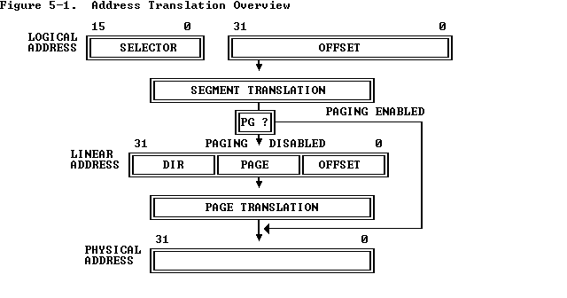
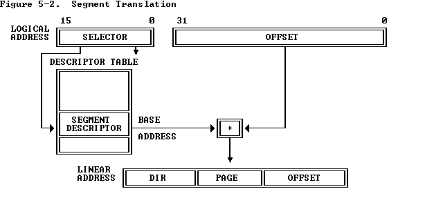

I'm building an 80386-compatible core in SystemVerilog and blogging the process. *32-bit Protected Mode* was the defining feature of the 80386. In the [previous post](/posts/2026/80386_protection/), we looked at one side of protected mode: the virtual-memory protection mechanisms. We discussed how the 80386 implements protection with a dedicated PLA, segment caches, and a hardware page walker. This time I want to continue that discussion by covering the actual memory access pipeline itself, how address translation is done efficiently, how microcode drives the process, and what kind of RTL **timing** the design achieves.

As we discussed last time, x86 virtual memory management looks expensive on paper. Every memory reference seems to require effective address calculation, segment relocation, limit checking, TLB lookup, and on a miss, two page-table reads plus Accessed/Dirty-bit updates. Yet Intel's own 1986 paper *Performance Optimizations of the 80386* describes the common-case address path as completing in about **1.5 clocks**. How did the 386 pull that off?

The answer is that the 386 is not organized as a slow serial chain of checks. It contains a carefully designed memory pipeline that takes advantage of pre-calculation, pipelining, and parallelism to achieve as little additional latency as possible for its time.

<!--more-->

## Microcode ops for memory accesses

Intel's *80386 Programmer's Reference Manual* describes 386 address translation like this:

> "The 80386 transforms logical addresses (i.e., addresses as viewed by programmers) into physical address (i.e., actual addresses in physical memory) in two steps: segment translation... and page translation..."

The manual illustrates it like this:



Before looking at the hardware, it helps to start from the microcode. Here is the microcode for an ALU instruction that reads memory, modifies it, and writes it back, i.e. an instruction like `ADD [BX+4], 8`:

```asm
; ADD/OR/ADC/SBB/AND/SUB/XOR m,i
039  EFLAGS -> FLAGSB                 FLGSBA          RD   9
03A                                               DLY
03B  OPR_R  -> TMPB    WRITE_RESULT   JMP         UNL
03C  TMPB              IMM            +-&|^

; WRITE_RESULT
046  SIGMA  -> OPR_W                          RNI     WR   0
047                                               DLY
```

Three things matter here:

- `RD` starts a memory read
- `WR` starts a memory write
- `DLY` is where the microcode waits for the result to become available

Note that patterns like `RD + DLY` and `WR + DLY` occur all over the microcode. If address generation, translation, and bus arbitration were slow, the entire machine would bog down. So the interesting question is:

> How does the hardware make these tiny `RD` and `WR` hooks cheap enough that the whole machine still works?

Intel's answer was to build a dedicated address path that usually adds only about one extra cycle, or in their own phrasing, about **1.5 clocks** for the address pipeline itself.

## Efficient segmentation

Here is the familiar way in which segmentation transforms a logical address into a linear address:



Segmentation is mandatory and active in both protected and real mode. The above illustration is easy to understand in protected mode: the segment base address is looked up from the in-memory GDT/LDT tables. What may not be obvious from the diagram is that the same segment calculation is also active in real mode, even when the linear address seemingly does not go through lookup tables. We'll talk about that below.

### Why segmentation could have been expensive

Consider a pair of instructions like:

```asm
MOV AX, 123h
ADD [AX+45h], 2
```

Its microcode in execution order is:

```asm
; MOV r,i
005  IMM                              PASS    RNI
006  SIGMA  -> DSTREG

; ADD m,i
039  EFLAGS -> FLAGSB                 FLGSBA          RD   9
03A                                               DLY
...
```

Two points are clear from the microcode:

The first point is **address translation is almost completely done in hardware** (hardwired logic). Just as in the first microcode example above, the micro-instruction assumes the address is already at the right position (the `IND` register is the internal memory address register) when the micro-instruction is executed. And the destination of the memory access is also implicit (`OPR_R` for reads).

The other point is the **immediacy of the effective and linear address calculation**. Line `006` writes the new value of `AX`. Instructions are executed back-to-back in the 386 (unlike the one-cycle delay in 8086). That means in the very next cycle, line `039` wants to start the memory read using that value as part of the effective address. That leaves almost no slack. The address hardware must react immediately at the boundary between instructions.

Then it should be quite obvious that the segmentation logic needs to do a good job to achieve good performance. If segmentation were implemented naively, every access would also need to fetch the segment descriptor, add the base, compare the final address to the limit, and only then proceed. That would be hopelessly slow.

### Cached segment state

The first optimization is simply to avoid repeating descriptor lookup on every access.

When a selector is loaded into a segment register, the processor also loads the descriptor's base, limit, and attributes into the register's invisible part. The hidden state (called **descriptor caches**) exists so the processor does **not** need to consult the descriptor tables on every memory reference. On the die photo, it actually occupies considerable space.

(Add a die shot that highlights the descriptor cache)

This is a crucial design choice. Without it, segmentation would either require extra memory accesses on every reference or a much more elaborate descriptor cache hierarchy. With it, ordinary accesses see segmentation as local state, not table-walking.

It also gives rise to a subtle but important architectural property: changing a descriptor in memory does not affect a segment register that already has that descriptor loaded. The cached copy remains in force until the selector is reloaded.

The descriptor caches also support real mode address translation. Here's microcode for real mode and protected mode MOV instruction to segment registers:

```asm
; r MOV ES/SS/DS/FS/GS,rw
009  DSTREG    DES_SR                 PASS    RnI DLY SBRM 0
00A  SIGMA  -> SEGREG

; p MOV ES/DS/FS/GS,rw
580            DES_SR  TST_DES_SIMPLE PTSAV1      DLY SPTR 0
581                    LD_DESCRIPTOR  LCALL
582  DSTREG -> SLCTR   TST_SEL_NONSS  PTSELE      DLY
583  SLCTR2 -> SEGREG  TMPC                   RNI     SDEL
584                                               DLY
```

We actually talked about the protected-mode segment-loading microcode in the [protection post](../80386_protection). The `LD_DESCRIPTOR` routine does the heavy lifting and generically loads the descriptor into the corresponding segment descriptor cache. The interested reader is referred to that post for details.

For real mode, however, the microcode is very different. Line 009 uses a special operation `SBRM` (set-mode-real-mode) to modify the `base` value in the hidden descriptor cache with the register (`DSTREG`) in the right segment (`DES_SR`), i.e. setting the corresponding base address to `seg<<4`. In this way, later processing of real-mode and protected-mode segmentation is unified into the same set of logic, reducing area and improving efficiency.

You may have noticed that the real-mode routine does not touch the `limit` value in the segment cache, which is supposed to be 64KB in real mode. And there is not any hardware that implicitly sets the limit - in fact the limit is initialized only once when the processor boots. This interesting design choice by Intel is taken advantage of by the famous "[unreal mode](https://en.wikipedia.org/wiki/Unreal_mode)" trick. By entering protected mode, setting limit to a large number, and returning to real mode, a variant of real mode can be enabled that allows access to a 4GB data segment.

### Parallel relocation and limit checking

Once the descriptor state is cached, the next problem is the actual arithmetic.

To form a linear address, the processor adds:

```text
effective_address = base + index*scale + displacement
linear = segment_base + effective_address
```

At the same time, it must verify that the effective address is within the segment limit. The efficient way to do this is **not** to wait for the final linear address and compare that against some adjusted bound. The correct approach, which the 386 uses, is to compute linear address and conduct the limit check in parallel.

- one arithmetic path adds the segment base to the effective address
- another arithmetic path compares the last accessed byte offset against the segment limit

For the limit test, there are still more details: we actually need to check whether

```text
offset + size - 1 <= limit
```

`size` is the byte length of the current operation. For example, for a dword access at `0x100`, the last byte accessed is `0x103`. A naive implementation here would need serially two full adders in the same cycle, one for computing the sum and one for comparing the two sides. A better implementation is to compute something like:

```text
limit - offset
```

And then use a small amount of shallow logic to determine whether the remaining space is enough for a byte, word, or dword. A single wide NOR gate could be used to check if the top 30 bits are all zero, and then a few more gates would be enough to check whether the lowest two bits are valid. This matches the kind of optimization described in Intel's address-translation discussion in the ICCD paper.

### Why complex addressing modes cost an extra cycle

The 386 supports rich addressing modes:

```text
EA = base + index*scale + displacement
```

First the scale factor (1, 2, 4 or 8) can be done with a fixed shift (4-way multiplexers) and is cheap. Then, if no more than two addition terms are present, the whole EA can be computed with a single full adder. However, if all three terms are present, we would need two full adders, again in series.

Intel designers again optimized for the common case here. If the effective-address hardware only has to add two 32-bit terms in the fast case, then EA is calculated in a single cycle. The occasional `base + index*scale + displacement` form can take an extra step rather than forcing *every* memory reference through deeper combinational logic.

## Early start

One of the most interesting discoveries in Intel's ICCD paper is the **early start** optimization.

The basic idea is simple: for some instructions, the address path does not wait for the new instruction to "start" in the usual microcoded sense. Instead, it begins address-related work in the **last cycle of the previous instruction**, overlapping that work with the previous instruction's writeback.

Here's an example of an early-start instruction: POP

```asm
; POP rv
09F  SIGMA  -> eSP                                    RD   3
0A0                                           RNI DLY
0A1  OPR_R  -> DSTREG                             UNL
```

### What makes early start possible

According to Intel's paper, the instruction unit decodes instructions into a **111-bit internal word** with 19 fields. One of those fields is an **early-start flag**. For instructions marked this way, the address-generation operands can be launched to the address hardware before the previous instruction has fully retired.

That only works if the register file can tolerate one instruction reading operands while another is still writing them back. Intel describes the supporting structure explicitly:

- two read ports
- one write port
- a register-address comparator
- a bypass path that effectively shorts the write bus onto a read bus when the same register is being written and read

So early start is not just "microcode begins sooner." It is a whole hardware arrangement: decoded instruction format, register-file ports, comparator logic, and autonomous address-generation hardware.

### Why it matters

The payoff shows up in the common instruction timings from Intel's paper:

| Instruction class | Typical clocks |
|---|---:|
| Store | 2 |
| Push register | 2 |
| Load | 4 |
| Pop | 4 |

Stores and pushes can hit the theoretical minimum because their addresses are effectively ready when the instruction begins. Loads and pops still need the memory read to come back, so they cost more.

This is one of the clearest examples in the whole 386 of Intel moving work out of the microcode and into hardwired assist logic. The microcode still orchestrates the instruction, but the timing win comes from surrounding it with specialized hardware.

## Bus interface and caching

To finish our memory-pipeline discussion, we need to talk about the bus interface unit and caches. The 80386, like the 80286 but unlike the 8086, uses a non-multiplexed address/data bus. That avoids the dead time that a multiplexed bus would need to switch directions between address and data phases. So if the memory subsystem can follow fast enough, a bus cycle is only two clocks: an address phase and a data phase. It also allows **address pipelining** to hide memory latency: while one bus cycle is finishing, the address for the next cycle can already be presented.

This basically means that if the external memory can catch up, the 80386 bus interface does not add much latency to memory accesses. DRAM latency at the time was about 80 ns to 130 ns, which corresponds to two or more CPU cycles. Any cycles beyond 2 are spent as *wait states*, null cycles where no work is done on the bus.

This is where the cache comes into play. The 386 has no on-chip cache, but it is the first x86 processor designed with cache very much in mind. The Intel 82385 companion chip is a dedicated cache controller designed to sit between the processor, an SRAM cache, and main memory. On a cache hit, it provides the CPU with a no-wait-state, 2-clock bus cycle. On misses, it forwards accesses to main memory and refills the cache lines. The cache, typically 64 KB to 128 KB in higher-end systems, turns out to be very effective: it is common for a 386 with cache to be 30% to 40% faster than one without.

## Putting it together

Seen as a whole, the memory pipeline looks something like this:

1. microcode issues `RD` or `WR`
2. effective address hardware begins work, sometimes with an early start
3. segmentation relocates and checks in parallel
4. the TLB translates the linear address on a hit
5. the bus interface schedules the access while prefetch competes in the background
6. the result returns in time for the microcode's `DLY` synchronization point

(Let's draw a SVG diagram illustrating cycle-by-cycle what happens in the pipeline for a RD memory access. The left side is the micro-instructions for 039 and 03A. The right side is the cycles/steps for the memory pipeline operations)

## Mapping the memory pipeline to an FPGA 386

We have been mostly focused on the historical 386 in this series so far. Here I want to begin discussing the FPGA 386 core I've been building. A quick status update: the core has been under development since January and, as of now, it is able to boot DOS and run applications like Norton Commander and games like Doom. The memory it uses is SDRAM, the same as the `ao486` core. To reduce memory-access latency, caching is implemented. The core currently runs at 75 MHz on DE10-Nano, with benchmark scores that exceed the 80386 numbers I have found.

There are a few points worth discussing when mapping the historical 386 memory pipeline to modern FPGAs, mostly around asynchronous vs. synchronous logic and memory. The overall goal is to map the microarchitecture relatively faithfully while still achieving high Fmax and low CPI.

**Latches vs. registers**. The 80386 (and 486) are primarily latch-based designs (see Shirriff's die-level reverse-engineering work; TODO: cite). Latches are level-triggered and their output follows the input as long as the enable signal is high. In contrast, modern flip-flops are edge-triggered and take snapshots of the input at clock edges. Compared with modern flip-flops (registers), latches require fewer transistors and allow "time borrowing" (a slightly slow phase can borrow time from a neighboring faster phase). So dividing work *evenly* matters more in the FPGA design. I experimented quite a bit with where to insert registers, and different decisions led to different Fmax values. In the end I landed on the pipeline design presented in the previous section and it works fine.

**Two clock phases**. The 386 also has two clock phases per clock cycle. That is why the address-translation latency is quoted as 1.5 cycles. One way to emulate this in an FPGA would be to double the clock speed and use one FPGA clock cycle as a phase. I did not do that; I simply made address translation 2 cycles. That could mean slightly more latency and some CPI impact here, but I have found no good way to verify it.

**Cache design**. One of the common challenges in implementing caches on an FPGA is that block RAMs are synchronous: the value is only available one cycle later. That is why an FPGA-based cache typically takes two cycles, one for tag lookup and one for data retrieval. To implement an 82385-style cache and achieve 0 wait state, address pipelining is basically mandatory, because that leaves exactly two cycles for the cache to return data. I have not implemented address pipelining yet, so an L2 cache would incur a wait state here. That is why I decided to do L1 cache instead: a 16 KB instruction cache and a 16 KB data cache sit inside the CPU and provide one-cycle hit latency, faster than the external 82385 cache, although smaller in size.

## Conclusion

This concludes our discussion of the virtual-memory system of the 80386, the most complicated subsystem in the processor. There are still some topics to cover, like task switching and interrupts. Now that the core is already running DOS and games, I expect to start talking about those topics, along with the actual implementation, next time.

Thanks for reading. You can follow me on X ([@nand2mario](https://x.com/nand2mario)) for updates, or use [RSS](/feed.xml).

Credits: This analysis of the 80386 draws on the microcode disassembly and silicon reverse engineering work of [reenigne](https://www.reenigne.org/blog/), [gloriouscow](https://github.com/dbalsom), [smartest blob](https://github.com/a-mcego), and [Ken Shirriff](https://www.righto.com).
