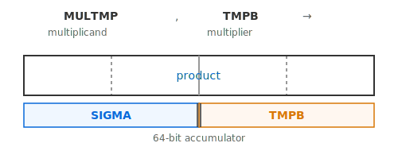

<!-- <style>
  pre code { font-size: 0.85em; }
  code { font-size: 0.85em; }
</style> -->

<!-- # 80386 Multiplication and Division -->

When Intel released the 80386 in October 1985, it marked a watershed moment for personal computing. The 386 was the first 32-bit x86 processor, increasing the register width from 16 to 32 bits and vastly expanding the address space compared to its predecessors. This wasn't just an incremental upgrade—it was the foundation that would carry the PC architecture for decades to come.

The timing was significant. By the mid-1980s, the IBM PC had established x86 as the dominant PC architecture, but the 16-bit 8086/286 processors were hitting their limits. Memory was constrained to 1MB (or 16MB with the 286's limited protected mode). Competing 32-bit architectures like the Motorola 68020 threatened Intel's dominance. The 386 was Intel's answer: full 32-bit computing with backward compatibility for the massive library of existing DOS software.

The 386 introduced important and long-lasting x86 features: a flat 4GB address space, virtual memory with paging, and a protected mode that actually worked. It would go on to run Windows 3.0, Windows 95, early Linux, and countless other operating systems that shaped modern computing.

## Faster arithmetic

In addition to its architectural advances, the 386 delivered a major jump in arithmetic performance. On the earlier 8086, multiplication and division were slow — 16-bit multiplication typically required 120–130 cycles, with division taking even longer at over 150 cycles. The 286 significantly improved on this by introducing faster microcode routines and modest hardware enhancements.

The 386 pushed performance further with dedicated hardware that processes multiplication and division at the rate of **one bit per cycle**, combined with a native 32-bit datapath width. The microcode still orchestrates the operation, but the heavy lifting happens in specialized datapath logic that advances every cycle.

Here are the actual cycle counts from the Intel 386 Programmer's Reference Manual:

| Instruction | 8-bit | 16-bit | 32-bit |
|-------------|-------|--------|--------|
| MUL | 9-14 | 9-22 | 9-38 |
| IMUL | 9-14 | 9-22 | 9-38 |
| DIV | 14 | 22 | 38 |
| IDIV | 19 | 27 | 43 |

The ranges for MUL/IMUL reflect an "early-out" optimization—the loop exits early when the remaining multiplier bits are all zeros (or all ones for signed). Division has no early-out, so cycle counts are fixed at roughly `width + overhead`.

To save silicon, the 386 reuses the main ALU for the per-iteration add/subtract work rather than having a separate multiplier unit. The microcode controls the iteration, while dedicated datapath logic handles the shifting and loop termination. Let's look at how these algorithms work.

## Add-and-shift multiplication

The classic multiplication algorithm in processors is the Booth algorithm. However, the 80386 does not use that. Instead, an "add-and-shift" multiplication algorithm is used. This is similar to grade-school long multiplication. The difference is that instead of moving from lower digits to higher, we shift to the right. Here's the data layout:



Three key internal registers participate in multiplication: MULTMP, TMPB, and SIGMA. A notable challenge is that x86 instructions support 8-bit, 16-bit, and 32-bit operands. Consistent with the design philosophy of the 8086, the 386 achieves this flexibility by reusing the same registers and microcode routines for all operand sizes. In most cases, the identical hardware and microcode sequence accommodate different widths seamlessly. The diagram above shows how, for example, the result of multiplying two 16-bit numbers is arranged within a 32-bit product: it occupies the lower half of the SIGMA register and the upper half of TMPB.

Here is the multiplication algorithm in pseudocode:

```c
1: COUNTR = width-1
2: while (true):
3:   if (TMPB[0]) SIGMA <= SIGMA + MULTMP
4:   {SIGMA, TMPB} >>= 1      // arithmetic shift for signed
5:   if (--COUNTR==0) break
6:   if (remaining TMPB bits are all 0 or all 1 for signed) break
7: {SIGMA, TMPB} >>= COUNTR   // compensate for early exit
8: correction for signed multiplication
```

Shifting to the right rather than the left simplifies the hardware circuits. Line 6 implements the important "early-out" optimization, which means the loop can terminate early if the remaining multiplier bits are all zeros—or all ones, in the case of signed multiplication. When this happens, line 7 adjusts for the early exit by shifting the accumulated result right by the number of remaining COUNTR bits.

Lines 1–7 fully describe unsigned multiplication. To extend this to signed multiplication, only a few tweaks are needed: use arithmetic (not logical) shifts on lines 4 and 7, and, as a final correction in line 8, subtract the multiplicand from the upper product register (SIGMA) if the multiplier was negative. For a deeper dive into the mathematics, see college-level computer organization resources such as [this one](https://web.ece.ucsb.edu/~parhami/pres_folder/f31-book-arith-pres-pt3.pdf).

The 80386 multiplication microcode closely mirrors the algorithm described above, and shows both the timing and the likely underlying hardware involved. The microcode routine shown here handles register-based multiplication—both unsigned and signed—and supports all three operand sizes: 8, 16, and 32 bits. Other forms, such as multiplying with a memory operand, are implemented similarly.

Before we examine the code, it’s helpful to quickly review the 80386’s microcode syntax and conventions. While the [8086 used 21-bit micro-operations](https://www.reenigne.org/blog/8086-microcode-disassembled/), the 80386 expanded these to 37 bits, adding fields to control more complex hardware functionality. Moves are written as `src->dest`, which simply means copying data from one register to another. The `alujmp` field directs either the ALU (using `src` and `alu_src` as inputs) or the microcode control flow, handling everything from arithmetic to jumps to indirect operations (`alu_src` as the jump target). Pay special attention to the `RPT` keyword found on the third line of the upcoming listing: this signals the microcode sequencer to repeatedly execute a micro-instruction, decrementing the COUNTR register each time, and continuing until COUNTR reaches zero, i.e. looping for COUNTR+1 iterations.

```asm
; MUL/IMUL r
; src     dest    alu_src        alujmp  uop sub busop
DSTREG -> MULTMP  BITS_V         LDCNTR          ; MULTMP=r (multiplicand), COUNTR=width-1
eAX_AL -> TMPB    0              PASS2           ; TMPB=multiplier (AL/AX/EAX)
SIGMA             TMPB           IMUL3   RPT DLY ; hardware mult loop with early-out 
SIGMA                            PASS            ; pass through SIGMA
COUNTR -> TMPD                                   ; save remaining COUNTR
RESULT -> TMPC    TMPD           LDBSR8          ; load shift count: right shift, COUNTR
SIGMA  -> TMPD    TMPC           SHIFT           ; shift {SIGMA,RESULT} to get low result
SIGMA  -> eAX_AL  TMPD           MULFIX          ; write low result, set flags, signed mult correction
SIGMA             TMPD           SHIFT   RNI     ; shift {0,ProdU} to get high result
SIGMA  -> eDX_AH                                 ; write high result
```

The `RESULT` register is used by both multiplication and division. For multiplication, it accumulates the lower half of the product as bits shift right out of TMPB during the loop. `MULFIX` is the correction for signed multiplication on pseudocode line 8.

### Other variants

The 386 introduced two new forms of IMUL beyond the original single-operand form:

- **Two-operand**: `IMUL reg, r/m` - multiplies reg by r/m, stores in reg (single-width result)
- **Three-operand**: `IMUL reg, r/m, imm` - multiplies r/m by immediate, stores in reg (single-width result)

These variants are interesting because they only produce a single-width result (discarding the upper half), making them faster for common cases where overflow isn't expected. The microcode for these uses a slightly different entry point that skips writing the upper result to EDX/DX/AH.

## Division

80386 uses the standard [non-restoring division algorithm](https://en.wikipedia.org/wiki/Division_algorithm#Non-restoring_division) for division. Here's the data layout:


The dividend is {SIGMA, DIVTMP} (max 64 bits), while the divisor is TMPB (max 32 bits). Each iteration shifts the dividend left by one bit and either adds or subtracts the divisor, building up the quotient in RESULT one bit at a time.

```c
1: do:                               // loop body is DIV7
2:     {SIGMA,DIVTMP} <<= 1;
3:     if (SIGMA < 0) SIGMA += TMPB;
4:     else           SIGMA -= TMPB;
5:     RESULT = (RESULT << 1) | (SIGMA >= 0 ? 1 : 0)
6:     COUNTR--;
7: while (COUNTR > 0)
8: if (SIGMA < 0) SIGMA += TMPB;     // DIV5
```

Let's look at the division routine (`DIV r` at F6.6/F7.6) directly.

```asm
; DIV r
eAX_AL -> DIVTMP  BITS_V         LDCNTR          ; DIVTMP = lower half of dividend, COUNTR=width-1
eDX_AH                           PASS            ; SIGMA = upper half of dividend
DSTREG -> TMPB                                   ; TMPB = divisor
SIGMA             TMPB            DIV7   RPT DLY ; Loop: dividend={SIGMA,DIVTMP}, divisor=TMPB
SIGMA             TMPB            DIV5           ; Final correction
SIGMA                            PASS            ; Preserve remainder through ALU
RESULT -> eAX_AL                         RNI     ; accumulator = quotient 
SIGMA  -> eDX_AH                                 ; upper-half reg = remainder
```

DIV7 and DIV5 are both single-cycle micro-operations. DIV7 implements the core of the division loop, corresponding to pseudocode lines 2–5 (excluding the COUNTR decrement). With each iteration, DIV7 updates SIGMA (the remainder) and RESULT (the quotient accumulator). The loop is controlled by the RPT instruction, which keeps the sequencer repeatedly executing DIV7 for COUNTR+1 iterations—there’s no early exit for division. After completing the main loop, DIV5 performs the final correction required by the non-restoring division algorithm (pseudocode line 8).

### Signed division (IDIV)

IDIV is more complex than DIV because it must handle signs. The approach is:

1. Convert dividend and divisor to absolute values
2. Perform unsigned division
3. Adjust signs of quotient and remainder

Here's the IDIV microcode:

```asm
; IDIV r
-1                BITS_V         ADD             ; COUNTR=width-2
SIGMA  -> COUNTR
eDX_AH                           PASS            ; SIGMA=upper dividend
eAX_AL -> DIVTMP                                 ; DIVTMP=lower dividend
DSTREG -> TMPB                                   ; TMPB=divisor
SIGMA             TMPB           PREDIV          ; |dividend|divisor|, save signs, first iteration
SIGMA             TMPB            DIV7   RPT DLY ; main division loop
SIGMA             TMPB            DIV5           ; non-restoring correction
SIGMA             TMPB           IDIV1           ; correct remainder sign
SIGMA                            PASS
SIGMA  -> TMPB                                   ; save remainder
RESULT                           IDIV2           ; correct quotient sign -> SIGMA
TMPB   -> eDX_AH                         RNI     ; write remainder
SIGMA  -> eAX_AL                                 ; write quotient
```

The key micro-ops are:

- **PREDIV**: Computes absolute values of dividend and divisor, saves their signs in internal flip-flops, and performs the first division iteration
- **IDIV1**: Corrects the remainder's sign (remainder has same sign as dividend)
- **IDIV2**: Corrects the quotient's sign (negative if operand signs differ)

This explains why IDIV takes 5 more cycles than DIV - the extra cycles handle sign computation and correction.

## Additional notes

One of the biggest hurdles in deciphering CPUs is interpreting the role and meaning of each micro-operation and constant. Their interdependence often makes the process both challenging and fascinating. Consider BITS_V: at first glance, seeing it used in LDCNTR and loop logic, you might assume it simply represents the instruction’s bit width—such as 8, 16, or 32—meaning the RPT instruction would run for that number of COUNTR cycles. This approach seems to suffice for MUL and DIV. However, when applied to IDIV and AAM, the microcode repeatedly failed to function as expected. After many hours spent troubleshooting, I finally came across a clue in a seemingly unrelated part of the microcode:

```asm
; PUSHAd
ESP               BITS_V         SUB         DLY      0    
SIGMA     INDSTK  -1             ADD             IN=+      
...
SIGMA  -> eSP                                DLY           
```

This finally gave me the hint that BITS_V is `width-1` instead of `width`. Here PUSHA pushes 8 registers to the stack, so SP should be subtracted by `8*2=16` or `8*4=32` bytes. The existence of `SIGMA-1` (SIGMA, -1, ADD) after `SIGMA=ESP-BITS_V` (ESP, BITS_V, SUB) clearly indicates that BITS_V is one less than 16 or 32.

## Comparison with modern CPUs

The 386's iterative approach to multiplication and division was state-of-the-art for its time, but modern x86 processors have [moved far beyond it](https://uops.info/):

| Era | Processor | 32-bit MUL | 32-bit DIV |
|-----|-----------|------------|------------|
| 1985 | 80386 | 9-38 cycles | 38 cycles |
| 1993 | Pentium | 10 cycles | 41 cycles |
| 2000s | Core 2 | 3-4 cycles | 17-41 cycles |
| 2020s | Zen 3/Alder Lake | 3-4 cycles | 13-19 cycles |

Modern CPUs use dedicated multiplier arrays (often Booth-encoded Wallace trees) that can multiply 64-bit numbers in just a few cycles. Division remains slower because it's inherently sequential - each quotient bit depends on the previous remainder. However, modern CPUs use radix-4 or radix-16 division (computing 2-4 bits per cycle) and sophisticated prediction to speed things up.

The 386's "one bit per cycle" approach is elegant in its simplicity and its reuse of the main ALU. For an FPGA implementation, this microcode-driven design is actually quite practical - it minimizes hardware while still achieving reasonable performance.

Follows me on X ([@nand2mario](https://x.com/nand2mario)) for updates, or use [RSS](/feed.xml).

Credits: This analysis of the 80386 draws on the microcode disassembly and silicon reverse engineering work of [reenigne](https://www.reenigne.org/blog/), [gloriouscow](https://github.com/dbalsom), [smartest blob](https://github.com/a-mcego), and [Ken Shirriff](https://www.righto.com). For a detailed examination of the silicon itself, see Ken Shirriff’s [silicon reverse engineering series on the 80386](https://www.righto.com/search/label/386).
