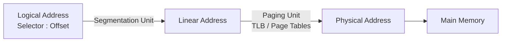

<!-- TODO: intro paragraph. connect to series. the "problem": how do you make protection fast? -->

In the [previous post](/posts/2026/80386_barrel_shifter/), we looked at how the 386 reuses one barrel shifter for all shift and rotate instructions. This time we look at a much bigger topic: how the 386 enforces protection -- the mechanism that lets multiple programs and an operating system share one processor without stepping on each other. The x86 protection model is notoriously complex, with four privilege rings, segmentation, paging, call gates, task switches, and virtual 8086 mode. What's interesting from a hardware perspective is how the 386 split this work between three very different mechanisms: a dedicated PLA for privilege checking, a hardware state machine for page walks, and microcode for everything else.

<!--more-->

## The protection problem

The 80386 separates programs from one another, and from the operating system, using two address translation layers: **Segmentation** and **Paging**.



Segmentation maps a logical address (a 16-bit selector plus a 32-bit offset) to a 32-bit linear address, enforcing privilege and limit checks along the way. Paging then translates that linear address to a physical address, adding a second layer of User/Supervisor and Read/Write protection. The two layers are independent -- segmentation is always active in protected mode, while paging is optional (controlled by CR0.PG).

The 386 supports four privilege rings (0 through 3), but in practice nearly all operating systems use just two: ring 0 for the kernel and ring 3 for user programs. Three privilege levels interact on every segment access:

*   **CPL (Current Privilege Level):** The privilege of the running code, stored in the low 2 bits of CS.
*   **DPL (Descriptor Privilege Level):** The privilege assigned to the target segment by the OS.
*   **RPL (Requested Privilege Level):** A field in the selector. This prevents a "confused deputy" attack: even if privileged code loads a selector, the RPL can restrict effective privilege to that of the original caller.

The core rule for data access: `max(CPL, RPL) <= DPL`. For code transfers, the rules get considerably more complex -- conforming segments, call gates, and interrupt gates each have different privilege validation logic. Checking all of this in microcode would take dozens of micro-instructions. Instead, the 386 offloads most of it to a dedicated hardware unit.

## The Protection PLA

<!-- TODO: ken shirriff photo of the protection unit die area? -->

The 80386 achieves high-speed privilege checking through a dedicated combinational ROM that Intel called the **Protection PLA**. It occupies a significant fraction of the Protection Unit's die area and contains 148 product terms -- a substantial piece of combinational logic.

### How the Protection PLA works

Instead of comparing CPL, DPL, and RPL in microcode, the microcode issues a single **protection test operation** that hands control to the Protection PLA. A preprocessor called the "Tiny PLA" normalizes the processor's raw privilege levels and descriptor attributes into a compact 16-bit **state vector**:

<!-- TODO: diagram of Protection PLA input structure? -->

```
 15   14   13        11  10   9    8    7    6    5         0
┌────┬────┬──────────┬────┬────┬────┬────┬────┬──────────────┐
│ Q  │ b  │ DES type │ S  │ X  │ C  │ R  │ A  │~test_const[5:0]│
└────┴────┴──────────┴────┴────┴────┴────┴────┴──────────────┘
  │    │                                         │
  │    └── Privilege match (DPL==CPL etc.)        └── Inverted test constant
  └─── Privilege violation (RPL>DPL or CPL>DPL)       from microcode
```

Bits [15:6] encode the current privilege relationship and descriptor type. Bits [5:0] carry the **test constant** -- an identifier that tells the Protection PLA *what kind* of protection check to perform. The test constant is specified by the microcode and inverted by hardware before reaching the PLA.

The Protection PLA evaluates all 148 product terms against this 16-bit input and produces an 18-bit output:

- **Bits [11:0]**: A 12-bit microcode address. `0x000` means "continue" (test passed). Any other value redirects the microcode sequencer -- to a fault handler (`0x801` for #GP, `0x863` for #SS, `0x871` for #NP) or to a gate dispatch routine.
- **Bits [15:12]**: Four control flags: **N** (set the descriptor's Accessed bit), **K** (stack operation -- update CPL), **L** (limit check for ARPL/LSL), **M** (validation passed -- safe to commit the descriptor).

There are about 33 distinct test constants, covering every protection scenario on the 386:

| Test | Constant | Checks |
|------|----------|--------|
| TST_SEL_CS | 0x01 | Code segment selector valid? |
| TST_SEL_RET | 0x02 | Far return: same or cross privilege? |
| TST_SEL_SS | 0x0C | Stack segment DPL == CPL == RPL? |
| TST_DES_CALL | 0x15 | Far call target: segment or gate? |
| TST_DES_CGDEST | 0x17 | Call gate destination code segment valid? |
| TST_DES_INT_HW | 0x22 | Hardware interrupt gate type and privilege? |

Each test constant activates a different subset of the Protection PLA's product terms, encoding the specific privilege rules for that scenario. The result is a complete protection decision in a single evaluation -- no branching, no iteration.

### The 3-delay-slot pipeline trick

The Protection PLA operates asynchronously with respect to the microcode sequencer. After a protection test fires, it needs time to evaluate and produce its redirect address. The 386 exploits this by allowing the **next three micro-instructions** to execute before the redirect takes effect. The microcode is carefully written to use these delay slots productively.

Here's a concrete example from the `RETF` (far return) path. When returning from a far call, the microcode needs to know whether this is a same-privilege or cross-privilege return, because the two cases need very different handling:

```asm
; RETF - far return from call
; LD_DESCRIPTOR loads the target CS descriptor. TST_SEL_RET fires in
; the LCALL delay slot to test if we're crossing privilege levels.
681                    LD_DESCRIPTOR  LCALL           ; load target CS descriptor
682  COUNTR -> SLCTR   TST_SEL_RET    PTSELE  DLY    ; fire privilege test
                                                      ; result arrives 3 cycles later
; Same-privilege path (Protection PLA returns 0x000 = continue):
683  COUNTR            TMPC           PASS    SDEL    ; write descriptor to cache
684            PAGER5  JMP_FAR_DONE   LJUMP   SPCR    ; set up far return
685  TMPG      DESCOD                         IND=    ; IND = new EIP

; Cross-privilege path (Protection PLA redirects to 0x686):
; But first, the 3 delay slots of LD_DESCRIPTOR (5C9-5CB) execute:
;   5C9: IND = table_base + index*8 + 4  (point to descriptor high DWORD)
;   5CA: rd D                              (read high DWORD from memory)
;   5CB: IND -= 4                          (point to low DWORD)
; By the time the redirect takes effect at 686, the memory pipeline
; is already primed with the new SS descriptor address.

686                    LD_DESCRIPTOR2 LCALL   rd D    ; read low DWORD (IND ready!)
687  OPR_R  -> PROTUN  TST_DES_SIMPLE PTOVRR  UNL    ; high DWORD arrives in OPR_R
```

This is clever pipelining. The cross-privilege test at 682 and the descriptor read setup in the delay slots overlap perfectly. Whether the return is same-privilege or cross-privilege, no cycles are wasted -- the hardware is already prepared for whichever path the Protection PLA selects. The same pattern appears throughout the 386's protection microcode: fire a test, do useful work in the delay slots, and let the redirect arrive just in time.

## The Paging Unit

Operating underneath segmentation is the Paging Unit, which translates linear addresses into physical addresses. Paging divides memory into fixed 4 KB pages, allowing the OS to implement demand-paged virtual memory -- swapping pages to disk and bringing them back transparently.

The 386 uses a two-level table lookup: a **Page Directory** (1024 entries, indexed by linear address bits [31:22]) and a **Page Table** (1024 entries, indexed by bits [21:12]). Each entry is 32 bits:

```
 31                  12  11     6  5  4  3  2  1  0
┌──────────────────────┬────────┬──┬──┬──┬──┬──┬──┐
│   Page Frame Address │  Avail │D │A │  │  │U/S│R/W│P│
└──────────────────────┴────────┴──┴──┴──┴──┴──┴──┘
```

Paging introduces a secondary protection layer with just two bits per page:

| Page Protection | Supervisor (CPL 0-2) | User (CPL 3) |
| :--- | :--- | :--- |
| **Supervisor (U/S=0)** | Read/Write | Access Denied (#PF) |
| **User, Read-Only (R/W=0)** | Read/Write | Read Only |
| **User, Read/Write (R/W=1)** | Read/Write | Read/Write |

The combined permission is the intersection of PDE and PTE permissions -- if either entry denies access, the access faults.

### The TLB

To avoid the two memory reads on every access, the 386 includes a **32-entry Translation Lookaside Buffer** organized as an 8-set, 4-way set-associative cache. Each entry stores the virtual-to-physical mapping along with combined PDE+PTE permission bits (writable, user, dirty, accessed). Intel's documentation claims a 98% hit rate for typical workloads.

TLB lookup is **combinational** -- all four ways in the indexed set are checked in parallel, producing a physical address in half a clock period. This means the common case (TLB hit, no DWORD crossing) adds zero overhead to a memory access.

The TLB is flushed entirely on any write to CR3 (the page directory base register). There is no per-entry invalidation on the 386 -- that arrived with the 486's `INVLPG` instruction.

### The hardware page walker

When a TLB miss occurs, the 386 cannot afford to handle it in microcode -- that would take too many cycles and stall the instruction pipeline. Instead, a **dedicated hardware state machine** performs the page walk transparently:

<!-- TODO: state machine diagram -->

```
              ┌──────────┐
              │ PW_IDLE  │
              └────┬─────┘
                   │ TLB miss
              ┌────▼──────┐
              │ Read PDE  │ ← CR3[31:12] | dir_index | 00
              └────┬──────┘
                   │
              ┌────▼──────┐    PDE.P=0
              │ Check PDE ├──────────────► FAULT (P=0)
              └────┬──────┘
                   │ PDE.P=1
              ┌────▼──────┐
              │ Read PTE  │ ← PDE[31:12] | table_index | 00
              └────┬──────┘
                   │
              ┌────▼──────┐    PTE.P=0
              │ Check PTE ├──────────────► FAULT (P=0)
              └────┬──────┘
                   │ PTE.P=1
              ┌────▼──────────┐  permission fail
              │ Check perms   ├──────────► FAULT (P=1)
              └────┬──────────┘
                   │ OK
              ┌────▼──────┐
              │ Write PDE │ ← set Accessed bit
              └────┬──────┘
              ┌────▼──────┐
              │ Write PTE │ ← set Accessed (+ Dirty if write)
              └────┬──────┘
              ┌────▼──────┐
              │   DONE    │ → update TLB, resume access
              └───────────┘
```

An important behavioral detail: **the 386 only writes back Accessed/Dirty bits on a fully successful walk**. If the PDE is not present, or the PTE is not present, or the permission check fails, the walker goes directly to FAULT with no write-back. This means the OS can examine page table entries after a fault and know that the hardware hasn't modified them -- a property that `test386.asm` explicitly verifies by checking `PDE.A == 0` and `PTE.A == 0` in its page fault handler.

The write-back sequence uses locked bus cycles (LOCK# asserted), ensuring atomicity on multiprocessor systems. The entire walk takes approximately 9 clock cycles in the best case.

## Cross-privilege transitions: where microcode takes over

The Protection PLA handles the *decision* of whether a privilege transition is allowed. But the *mechanics* of actually switching privilege levels -- loading new stack pointers from the TSS, pushing and popping stack frames, validating multiple descriptors -- are too complex for hardware. This is where the microcode earns its keep.

### LD_DESCRIPTOR: the workhorse subroutine

Almost every protection operation needs to load a segment descriptor from the GDT or LDT. The `LD_DESCRIPTOR` microcode subroutine handles this, reading both DWORDs of the 8-byte descriptor and feeding the high DWORD to the Protection PLA for validation:

```asm
; LD_DESCRIPTOR subroutine
; Input: COUNTR = selector
; Output: descriptor loaded into cache, Protection PLA validation complete
5C9  SLCTR     DESSDT  4              IN=+      ; IND = table_base + index*8 + 4
5CA                                   rd D      ; read descriptor high DWORD
5CB                    -4         DLY IN+=      ; IND -= 4 (point to low DWORD)
5CC                                   rd D      ; read descriptor low DWORD
5CD  OPR_R  -> PROTUN  TST_DES_SIMPLE PTOVRR UNL ; feed high DWORD to Protection PLA
     ; result: CONTINUE, #NP (not present), or gate dispatch
     ; delay slots 5CE-5D0 execute while the PLA evaluates
5CE  OPR_R  -> TMPB                   BITS32    ; TMPB = high DWORD
5CF                    0x10           LDBSLU DLY ; set up barrel shift
5D0  OPR_R  -> TMPC    TMPB           SHIFT  UNL ; extract base/limit fields
```

This subroutine is called (via `LCALL`) from far CALL, far JMP, far RET, INT, IRET, MOV to segment register, and task switch -- every operation that loads a segment descriptor.

### Call gates: the full privilege transition

A **call gate** is the x86 mechanism for controlled privilege escalation -- the equivalent of a system call. When user code (ring 3) executes `CALL FAR` targeting a call gate descriptor, the 386 must:

1. Validate the gate descriptor (DPL, type)
2. Extract the target CS selector and EIP from the gate
3. Load and validate the target code segment descriptor
4. Read new SS:ESP from the TSS for the target privilege level
5. Switch to the new stack
6. Copy parameters from old stack to new stack (count specified in gate)
7. Push old SS, ESP, CS, EIP on the new stack
8. Begin execution at the gate's target CS:EIP

The microcode for this is substantial. Here's the entry point:

```asm
; Far CALL through a call gate (386)
5B8  PROTUN -> COUNT5  TST_DES_CGATE  PTGATE         ; validate gate type and privilege
     ; dispatches to: CALLGATE386, CALLGATE286, TASKGATE, #NP, or TSS
5B9  SIGMA  -> TMPH                   SINTHW RPT     ; TMPH = gate's target CS selector
5BA            DES_CS  TST_DES_CGDEST PTSAV7 DLY SPTR ; save test for destination CS

; CALLGATE386 - extract 32-bit target offset from gate descriptor
5BE  TMPC              0xffff         AND             ; low 16 bits of offset
5BF  SIGMA  -> TMPC
5C0  TMPB              0xffff0000     AND             ; high 16 bits of offset
5C1  SIGMA             TMPC           OR              ; combine to 32-bit offset
5C2  SIGMA  -> TMPG    LD_DESCRIPTOR  JMP             ; TMPG = target EIP; load CS descriptor
5C3  TMPH   -> SLCTR   TST_SEL_CS     PTSELE DLY     ; validate CS selector
```

If the Protection PLA determines that a privilege level change is needed, the microcode enters the `MORE_PRIVILEGE` path which reads SS:ESP from the TSS and performs the stack switch. The word count field from the gate descriptor controls how many parameters are copied from the old stack to the new one.

<!-- TODO: consider showing the MORE_PRIVILEGE / stack switch microcode (5FB-608) -->

### Interrupt gates: similar but different

Hardware interrupts and exceptions follow a similar pattern. The interrupt vector is multiplied by 8 to index into the IDT, and the gate descriptor is loaded and validated:

```asm
; Protected-mode interrupt entry
8B0  SIGMA  -> TMPB    3              LDBSLU         ; prepare shift left 3
8B1  0                 TMPB           SHIFT          ; SIGMA = vector * 8
8B2  SIGMA     DESIDT  4              SMISC1 DLY IN=+ ; IND = IDT base + offset + 4
8B3  SIGMA  -> SLCTR2  0x10           LDBSRU  rd D   ; read gate high DWORD
8B4  EFLAGS -> FLAGSB  -4             FLGSBA DLY IN+= ; backup EFLAGS; IND -= 4
8B5  OPR_R  -> PROTUN  0xffff0000     AND     UNL rd D ; extract offset[31:16]
     ...
8B9  SIGMA  -> TMPG    TST_DES_INT_HW PTF            ; TMPG = target EIP; validate gate
     ; dispatches to INTGATE386, INTGATE286, TRAPGATE386, or #GP
```

The key difference from call gates: **interrupt gates automatically clear the IF (Interrupt Flag)**, preventing nested interrupts. Trap gates leave IF unchanged. Both clear the NT (Nested Task) flag. This distinction is encoded in the Protection PLA's gate type discrimination -- the same hardware that routes call gates also routes interrupt and trap gates to the correct microcode handler.

```asm
; INTGATE386 - clears IF
8CB                                   CLI             ; clear interrupt flag

; TRAPGATE386 - leaves IF alone, clears NT
8CC  -1                0x4000         XOR             ; mask = ~NT
8CD  SIGMA  -> TMPB                   CMISC2
8CE  EFLAGS            TMPB           AND             ; EFLAGS &= ~NT
8CF  SIGMA  -> EFLAGS
```

## Virtual 8086 Mode

To run legacy 8086 programs alongside protected-mode tasks, the 386 introduced **Virtual 8086 (V86) mode**. When a task's `EFLAGS.VM` bit is set, the processor executes 8086 code using real-mode-style segment addressing (base = selector << 4, limit = 0xFFFF), but the task actually runs at ring 3 under full paging protection. The OS can use paging to virtualize the 8086's 1 MB address space, even simulating the infamous A20 address wraparound by mapping the first and last 64 KB to the same physical pages.

### Entering V86 mode

V86 mode is entered through `IRETD` with the VM bit set in the stacked EFLAGS. The microcode detects this with a conditional jump:

```asm
; IRETD - return from interrupt
67E                    IRETd_V86      LJMPVM          ; goto V86 path if VM=1 in stacked EFLAGS
```

The V86 return path is one of the longest microcode sequences on the 386. It pops **nine DWORDs** from the stack: EIP, CS, EFLAGS, ESP, SS, ES, DS, FS, GS (compared to three for a normal IRET). For each segment register, it sets up fixed V86 access rights:

```asm
; IRETd_V86 - restore V86 segment state
643  0                 3              SHIFT           ; SIGMA = 3 << 13 = 0x6000 (DPL=3)
645  SIGMA             0x8200         OR              ; SIGMA = 0xE200
     ; 0xE200 = Present | DPL=3 | Data, Writable (fixed V86 access rights)
     ...
64C  TMPC      DES_CS                     SAR        ; CS.access_rights = 0xE200
64D  COUNTR    DES_CS                     SBRM       ; CS.base = selector << 4
64E  MDTMP     DES_CS                     SLIM       ; CS.limit = 0xFFFF
```

Every V86 segment gets the same treatment: access rights `0xE200` (present, DPL=3, writable data segment), base = selector shifted left by 4, and limit = 64 KB. The microcode loops through all six segment register caches (ES, CS, SS, DS, FS, GS) using a `JCT4N1` loop with a counter.

### IOPL-sensitive instructions

Because 8086 programs freely use `CLI`, `STI`, `PUSHF`, `POPF`, and `INT`, which are privileged in protected mode, the 386 uses the **I/O Privilege Level** (IOPL field in EFLAGS) to control V86 behavior. If `IOPL < 3`, these instructions fault with #GP(0), letting the OS's Virtual Machine Monitor emulate them:

```asm
; CLI/STI in V86 mode
7F7                    CLI_STI        JIO_OK          ; check CPL <= IOPL
; PUSHF in V86 mode
7F9                    p_PUSHFd       JIO_OK          ; check CPL <= IOPL
; POPF in V86 mode
7FB                    p_POPFd        JIO_OK          ; check CPL <= IOPL
```

`JIO_OK` is a conditional jump that checks the IOPL -- if the current privilege level is insufficient, execution falls through to a #GP fault.

### V86 fault frame

When a fault or interrupt occurs in V86 mode, the CPU must save extra state. In addition to the normal ring 3 -> ring 0 frame (SS, ESP, EFLAGS, CS, EIP, error code), it pushes the four data segment registers (GS, FS, DS, ES) and zeroes them out:

```asm
; Push V86 segment registers on ring-0 stack during fault dispatch
5F3  GS     -> OPR_W                       WR W      ; push GS
5F5  FS     -> OPR_W                       WR W      ; push FS
     ... (DS, ES follow)

; Then zero all data segment registers
63B  0      -> DS                          SAR       ; DS = 0, clear cache
63C  0      -> ES                          SAR       ; ES = 0
63D  0      -> FS                          SAR       ; FS = 0
63E  0      -> GS                          SAR       ; GS = 0
```

This creates a 9-DWORD stack frame (vs. 5 DWORDs for a normal privilege-crossing interrupt). The handler runs in protected mode at ring 0 with clean segment registers. When it executes `IRETD` with VM=1, the full V86 state is restored.

## Faults and exceptions

When any protection rule is violated, the CPU raises an exception:

*   **#GP (General Protection Fault, INT 13):** The catch-all. Triggered by segment limit violations, privilege violations, bad selectors, restricted V86 instructions, and many other conditions.
*   **#SS (Stack Fault, INT 12):** Stack segment limit violation or not-present stack segment.
*   **#NP (Segment Not Present, INT 11):** Attempted to use a descriptor with P=0.
*   **#PF (Page Fault, INT 14):** Not-present page or page-level protection violation. CR2 holds the faulting linear address; the error code encodes P/W/U bits.
*   **#TS (Invalid TSS, INT 10):** TSS limit too small or bad TSS segment.

Page faults are **restartable**: the CPU saves the machine state as it was *before* the faulting instruction, so the OS can fix up the page tables and re-execute the instruction transparently. This is what makes demand paging work -- the application never knows the page was absent.

## Conclusion

The 386's protection architecture is a study in practical engineering tradeoffs. The designers put dedicated hardware exactly where it paid off most:

- **The Protection PLA** resolves complex privilege decisions in a single cycle, using 148 product terms and a 3-delay-slot pipeline to overlap protection checks with useful work.
- **The page walker** is a simple but effective state machine that handles TLB misses transparently, including the subtle requirement of only writing back A/D bits on successful walks.
- **Microcode** handles the stateful, multi-step operations -- stack switches, descriptor loading, V86 frame management -- that are too irregular for fixed hardware but too important to leave to software.

This layered approach -- hardware for the fast path, microcode for the complex path -- is a recurring theme in x86 design that persists to this day.

Thanks for reading. You can follow me on X ([@nand2mario](https://x.com/nand2mario)) for updates, or use [RSS](/feed.xml).

Credits: This analysis of the 80386 draws on the microcode disassembly and silicon reverse engineering work of [reenigne](https://www.reenigne.org/blog/), [gloriouscow](https://github.com/dbalsom), [smartest blob](https://github.com/a-mcego), and [Ken Shirriff](https://www.righto.com).
