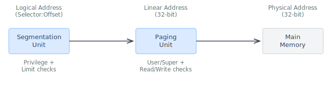
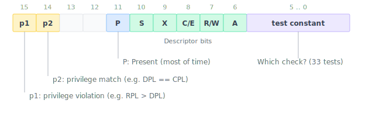
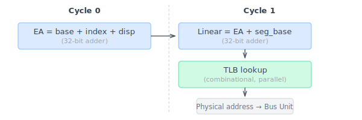
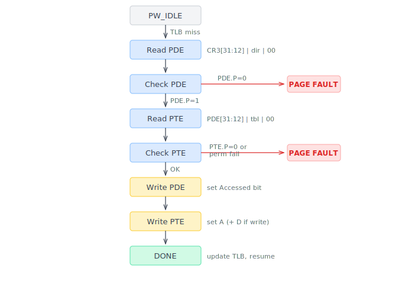

<!-- <style>
  pre code { font-size: 0.85em; }
  code { font-size: 0.85em; }
</style> -->

I'm building an 80386-compatible core in SystemVerilog and blogging the process. In the [previous post](/posts/2026/80386_barrel_shifter/), we looked at how the 386 reuses one barrel shifter for all shift and rotate instructions. This time we move from real mode to protected and talk about **protection**.

The 80286 introduced "Protected Mode" in 1982. It was not popular. The mode was difficult to use, lacked paging, and offered no way to return to real mode without a hardware reset. The 80386, arriving three years later, made protection usable -- adding paging, a flat 32-bit address space, per-page User/Supervisor control, and Virtual 8086 mode so that DOS programs could run inside a protected multitasking system. These features made possible Windows 3.0, OS/2, and early Linux.

The x86 protection model is notoriously complex, with four privilege rings, segmentation, paging, call gates, task switches, and virtual 8086 mode. What's interesting from a hardware perspective is how the 386 manages this complexity on a 275,000-transistor budget. You cannot simply create multiple copies of "virtual machines" -- the transistor count doesn't allow it. Instead, the 386 employs dedicated units and a variety of techniques to implement protection: a dedicated PLA for privilege checking, a hardware state machine for page walks, segment and paging caches, and microcode for everything else.

<!--more-->

## The protection problem

The first thing a multi-tasking operating system needs from hardware is **isolation**: multiple programs must share one processor without being able to read, write, or jump into each other's memory. The 80386 achieves this through memory protection -- two independent address translation layers.



*Segmentation* maps a logical address (a 16-bit selector plus a 32-bit offset) to a 32-bit linear address, enforcing privilege and limit checks along the way. *Paging* then translates that linear address to a physical address, adding a second layer of User/Supervisor and Read/Write protection. The two layers are independent: segmentation is always active in protected mode, while paging is optional (controlled by CR0.PG).

The 386 supports four privilege rings (0 through 3), though in practice nearly all operating systems use just two: ring 0 for the kernel and ring 3 for user programs. Three privilege levels interact on every segment access: CPL (Current Privilege Level), DPL (Descriptor Privilege Level), and RPL (Requested Privilege Level).

The main rule for data access is `max(CPL, RPL) ≤ DPL`. For code transfers, the rules get considerably more complex -- conforming segments, call gates, and interrupt gates each have different privilege validation logic. If all of these checks were done in microcode, each segment load would need a cascade of conditional branches: is it a code or data segment? Is it conforming? Is the RPL valid? Is the DPL valid? Is the segment present? This would greatly bloat the microcode ROM and add cycles to every protected-mode operation.

The 386 engineers solved this with a dedicated hardware unit.

## A centralized protection unit

<figure>

<figcaption style="text-align: center;">The 80386 die. The Protection Test Unit is highlighted in red.<br>
<small>Base image: <a href="https://commons.wikimedia.org/wiki/File:Intel_80386_DX_die.JPG">Intel 80386 DX die</a>, Wikimedia Commons</small></figcaption>
</figure>

Intel documentation describes the 386's **Protection Test Unit** as a component that "implements fast testing of complex memory protection functions." It is mostly composed of a PLA (Programmable Logic Array), referred to as Test PLA by Intel, that is physically visible by its regular appearance on the die. This single piece of combinational logic replaces what would otherwise be hundreds of multi-cycle conditional branches in the microcode. Instead of testing privilege rules sequentially, the microcode issues a single **protection test operation**, and the PLA evaluates all applicable rules in parallel, producing a complete decision in one evaluation: continue, fault, or redirect to a gate handler.

### Snoop, test, redirect

Here's how a protection test works. The microcode feeds three things to the Test PLA:

1. **Descriptor attributes**: The Type, DPL, S (system/user), and Present bits from the segment descriptor being loaded, held in a register called PROTUN. In a few cases, the Test PLA takes the 16-bit selector (segment register value) as input instead.
2. **Privilege state**: CPL, RPL, and their relationships, preprocessed by a small circuit called the "Tiny PLA" into two normalized bits (privilege violation, privilege match).
3. **Test constant**: A 6-bit identifier from the microcode that tells the PLA *what kind* of check to perform.

These are packed into a 16-bit state vector:



The Test PLA evaluates all 148 product terms against this input and produces an 18-bit output:

- **Bits [13:2]**: A 12-bit microcode redirect address. `0x000` means "test passed, continue." Any other value hijacks the microcode sequencer -- to a fault handler (e.g., `0x85D` for #GP, `0x870` for #NP) or to a gate dispatch routine (e.g., `0x5BE` for a 386 call gate).
- **Bits [17:14]**: Four control flags -- set the descriptor's Accessed bit, mark validation passed, request a limit check, or signal a stack operation.

There are about 33 distinct test constants, covering every protection scenario on the 386. Each activates a different subset of the 148 product terms, encoding the specific privilege rules for that scenario. To give a feel for what the PLA does concretely, here are the possible outcomes for two tests:

**TST\_DES\_CALL (0x15)** -- used by far CALL to classify the target descriptor:

| State | PLA output | Meaning |
|-------|-----------|---------|
| User segment, code, privilege OK, present | → 0x5D5 (PASSED) + set A-bit | Valid code segment, proceed |
| User segment, code, privilege OK, not present | → 0x870 (#NP) | Segment not present fault |
| System descriptor (S=0) | → 0x5B8 (GATE\_HANDLER) | It's a gate -- dispatch by type |
| Privilege violation or wrong type | → 0x000 (no match) | Falls through to #GP |

**TST\_SEL\_RET (0x02)** -- used by far RET to detect cross-privilege returns:

| State | PLA output | Meaning |
|-------|-----------|---------|
| RPL == CPL (same privilege) | → 0x000 (continue) + limit check flag | Same-privilege return |
| RPL > CPL (outer ring) | → 0x686 (RETF\_OUTER\_LEV) | Cross-privilege return path |
| RPL < CPL (inner ring -- illegal) | → 0x85D (#GP) | Privilege violation |

## Making it generic: the PTSAV/PTOVRR callback

Nearly every protection-related instruction -- far CALL, far JMP, far RET, INT, IRET, MOV to segment register, task switch -- needs to load a segment descriptor from the GDT or LDT. The 386 microcode centralizes this into a shared subroutine called `LD_DESCRIPTOR`, which reads the 8-byte descriptor from memory and feeds the high DWORD (containing Type, DPL, S, and P bits) to the Test PLA for validation.

But different callers need different validation rules. A `MOV DS, AX` needs to reject call gates but accept data segments. A `CALL FAR` needs to accept call gates *and* code segments. How can one shared subroutine perform different validation?

The answer is essentially hardware-level dependency injection. Before calling LD_DESCRIPTOR, the caller saves its desired test constant into a hardware latch using a micro-op called **PTSAV** (Protection Save). Within LD_DESCRIPTOR, another micro-op called **PTOVRR** (Protection Override) retrieves and fires the saved test.

Here's how a segment register load uses it:

```asm
; MOV DS, r32 (protected mode)
580            DES_SR  TST_DES_SIMPLE PTSAV1      DLY SPTR ; save test constant 0x10; set DS pointer
581                    LD_DESCRIPTOR  LCALL                ; call LD_DESCRIPTOR subroutine
582  DSTREG -> SLCTR   TST_SEL_NONSS  PTSELE      DLY      ; test selector (in LCALL delay slot)
```

And here's how a far CALL uses a different test constant through the same subroutine:

```asm
; Far CALL (protected mode)
5AC            DES_CS  TST_DES_JMP    PTSAV7      DLY SPTR ; save test constant 0x15; set CS pointer
5AD                    LD_DESCRIPTOR  LCALL                ; same subroutine
5AE  COUNTR -> SLCTR   TST_SEL_CS     PTSELE               ; test selector (in LCALL delay slot)
```

The only difference is the test constant: 0x10 for a data segment load, 0x15 for a far call target. 

## Making it fast: 3-cycle delay slots

The 386 microcode sequencer has a **one-cycle pipeline delay**: when a jump or `RNI` (run next instruction) is decoded, the micro-instruction immediately after it has already been fetched and will execute before the jump takes effect. This "delay slot" is a basic property of the sequencer, and the microcode is written to fill it with useful work rather than waste a cycle on a bubble. The examples in the PTSAV section above show this: at 582/5AE, the micro-instruction after LCALL executes before the subroutine begins.

The Test PLA extends this idea further. It operates asynchronously with respect to the sequencer. After a protection test fires, the PLA needs time to evaluate and produce its redirect address. Instead of stalling, the 386 allows the **next three micro-instructions** to execute before the redirect takes effect -- and the microcode is carefully written to use these delay slots productively. This is tremendously confusing when reading the microcode for the first time (huge credit to the disassembly work by [reenigne](https://www.reenigne.org/blog/about/)). But Intel did it for performance.

Here's a concrete example from far return (`RETF`). The microcode needs to determine whether this is a same-privilege or cross-privilege return, because the two cases require very different handling. Following execution order (not address order):

```asm
; RETF (protected mode) — execution flows DOWN this listing
;
; Step 1: Call LD_DESCRIPTOR and fire the privilege test
681                    LD_DESCRIPTOR  LCALL       ; jump to subroutine at 5C9
682  COUNTR -> SLCTR   TST_SEL_RET    PTSELE DLY  ; (delay slot of LCALL, executed before 5C9) 
                                                  ; fire privilege test
                                                  ;   → PLA result takes effect 3 cycles later

; Step 2: The 3 delay slots — these execute inside LD_DESCRIPTOR
;         while the PLA is still evaluating
5C9  SLCTR     DESSDT  4              IN=+        ; delay slot 1: compute descriptor address
5CA                                   rd D        ; delay slot 2: read high DWORD from memory
5CB                    -4         DLY IN+=        ; delay slot 3: IND points to low DWORD
                                                  ;   → PLA result takes effect NOW
...

; Step 3a: Same-privilege (PLA returned 0x000 = continue)
;          LD_DESCRIPTOR continues normally at 5CC...
;          Eventually returns to the RETF caller here:
683  COUNTR            TMPC           PASS   SDEL ; write descriptor to cache
684            PAGER5  JMP_FAR_DONE   LJUMP  SPCR ; done — set up far return

; Step 3b: Cross-privilege (PLA redirected to 0x686)
;          IND is already primed by the 3 delay slots above!
686                    LD_DESCRIPTOR2 LCALL rd D  ; read low DWORD (IND ready)
687  OPR_R  -> PROTUN  TST_DES_SIMPLE PTOVRR UNL  ; validate descriptor
```

The key is the test TST_SEL_RET on line 682. It compares the RPL of the return CS selector (saved on the stack by the original CALL) against the current CPL. If RPL == CPL, the PLA returns 0x000 (continue) and LD_DESCRIPTOR finishes normally -- same-privilege return. If RPL > CPL, the caller is returning to a less-privileged ring, so the PLA redirects to 0x686 (RETF_OUTER_LEV) -- the cross-privilege path that must also restore the caller's stack. If RPL < CPL, something is wrong, and the PLA redirects to #GP.

Either way, the delay slots do useful work: they compute the descriptor address and start reading it from memory. By the time the PLA verdict arrives, the hardware is already prepared for whichever path is selected. No cycles are wasted.

The tradeoff is complexity. The microcode must be carefully arranged so that the instructions in delay slots are either useful setup for both paths, or at least harmless if the redirect fires. Not every case is as clean as RETF. When a PLA redirect interrupts an LCALL, the return address is already pushed onto the microcode call stack (yes, the 386 has a microcode call stack) -- the redirected code must account for this stale entry. When multiple protection tests overlap, or when a redirect fires during a delay slot of *another* jump, the control flow becomes hard to reason about. During the FPGA core implementation, protection delay slot interactions were consistently the most difficult bugs to track down.

### When delay slots aren't enough: RPT as a stall

The 3-delay-slot scheme works when there is useful work to fill those three cycles. But some instructions genuinely need the protection result before they can proceed. `LAR` (Load Access Rights) and `VERR` (Verify Read), for example, exist solely to query protection status -- there is no useful setup to overlap with.

The 386 solves this by repurposing `RPT` (Repeat). Normally, RPT implements loops -- it re-executes a micro-instruction while decrementing a counter, as we saw in the [multiplication post](/posts/2026/80386_multiplication_and_division/). But when a protection test is in flight, the hardware suppresses RPT's counter-decrement and turns it into a pure **stall**: the sequencer freezes until the PLA result arrives.

```asm
; LAR/LSL/VERR/VERW (verification instructions)
70E  DSTREG -> SLCTR  TST_SEL_LLVV  PTSELA DLY   ; fire protection test on selector
70F  SLCTR     DESSDT 4             SNOFLT IN=+  ; set up descriptor address
710                                 BITS32 RPT   ; ← stall here until PLA result arrives
711  SLCTR2 -> TMPE   8             LDBSRU rd D  ; read descriptor (after stall lifts)
```

When the PLA result arrives, the stall lifts and execution resumes -- either continuing forward (test passed) or redirecting to a fault handler.

## Speeding up virtual memory

The segmentation and paging scheme of x86 processors has been discussed extensively elsewhere (see the [OSDev wiki](https://wiki.osdev.org/Paging), the [Writing an OS in Rust](https://os.phil-opp.com/paging-introduction/) series, or the [Intel 386 Programmer's Reference Manual](https://css.csail.mit.edu/6.858/2014/readings/i386.pdf), Chapter 5). Here I'll focus on what the actual silicon does to make it fast.

### The fast path: 1.5 cycles from EA to physical address

Virtual memory is conceptually simple but potentially devastating to performance. Every memory access must go through segmentation (add segment base, check limit) and then paging (look up the page table). Naively, paging alone requires two additional memory reads per access -- one for the page directory entry, one for the page table entry.

Intel's 1986 ICCD paper *Performance Optimizations of the 80386* reveals how tightly this was optimized. The entire address translation pipeline -- effective address calculation, segment relocation, and TLB lookup -- completes in **1.5 clock cycles**:



The segmentation unit performs two operations simultaneously: adding the segment base to produce the linear address and comparing the effective address against the segment limit. Both use dedicated 32-bit adder/subtractor circuits.

The TLB lookup is **combinational** -- it evaluates in the same half-cycle as the limit check, requiring no additional clock. The common case (TLB hit, no page boundary crossing) adds zero overhead to a memory access. This is why the **Segment Descriptor Cache** (left) and **Page Cache** (TLB, top-left) together occupy such substantial die area -- they are the fast path that makes protected mode competitive with real mode.

### The TLB

To avoid the two memory reads on every access, the 386 includes a **32-entry Translation Lookaside Buffer (TLB)** organized as 8 sets with 4 ways each. Each entry stores the virtual-to-physical mapping along with the combined PDE+PTE permission bits.

32 entries may sound small by modern standards (current x86 processors have thousands of TLB entries), but it covers 128 KB of memory -- enough for the working set of most 1980s programs. A TLB miss is not catastrophic either; the hardware page walker handles it transparently in about 20 cycles.

The TLB is flushed entirely on any write to CR3 (the page directory base register). There is no per-entry invalidation on the 386 -- that arrived with the 486's `INVLPG` instruction.

### The slow path: hardware page walks

How often does the "slow path" actually trigger? With 32 TLB entries covering 128 KB, Intel claimed a 98% hit rate for typical workloads of the era. That sounds impressive, but a 2% miss rate means a page walk every 50 memory accesses -- still quite frequent. So the 386 overlaps page walks with normal instruction execution wherever possible. A **dedicated hardware state machine** performs each walk:



What surprised me during the implementation is that this entire walk is **fully hardware-driven** -- no microcode involvement at all. The state machine reads the page directory entry, reads the page table entry, checks permissions, and writes back the Accessed and Dirty bits, all autonomously. Since it's hardware-driven, it runs in parallel with the microcode and needs its own memory bus arbitration -- the paging unit must share the bus with both data accesses from the microcode and prefetch requests from the instruction queue.

The A/D bits exist entirely for the operating system's benefit. The Accessed bit tells the OS which pages have been recently used, enabling page replacement algorithms to choose pages to evict when memory runs low. The Dirty bit tells the OS which pages have been modified and must be written back to disk before eviction; clean pages can simply be discarded and re-read from disk later.

### Contrast: segment descriptor A-bit writeback

Both page table entries and segment descriptors have an Accessed bit that the hardware must set on use -- but the mechanisms are strikingly different.

For pages, as we just saw, the walker sets A/D bits entirely in hardware. The microcode sequencer never even knows it happened.

For segments, the job is split between hardware and microcode. When LD_DESCRIPTOR fires its protection test at 5CD, the Test PLA OR's the A-bit (bit 8 of the descriptor high DWORD) into a temporary register called PROTUN. Then the microcode at `PROT_TESTS_PASSED` takes over and writes the modified value back to the GDT or LDT in memory:

```asm
; PROT_TESTS_PASSED — write back descriptor with Accessed bit set
5D5  SIGMA  -> TMPC    4              DLY  IN+=  ; IND += 4 (point back to high DWORD)
5D6  PROTUN -> OPR_W                  WR W       ; write PROTUN (with A-bit) to GDT/LDT
5D7  TMPB      DESPTR  0       BITSDE DLY  SDEH  ; wait for write; set cache high DWORD
```

Three microcode cycles for the writeback alone. That's acceptable because segment loads are already expensive multi-cycle operations, and the designers likely expected them to be infrequent -- most programs load their segments once at startup and never touch them again. Page translations happen on *every* memory access, so the same approach would be ruinous. Hence the fully autonomous hardware walker.

## Virtual 8086 mode

The 80386 introduced Virtual 8086 (V86) mode -- allowing real-mode DOS programs to run inside protected mode under OS supervision. While not full virtualization in the modern sense, V86 was the first practical hardware-assisted mechanism on x86 for running legacy software in a protected environment.

How does V86 work at the hardware level? When the `VM` bit (bit 17) of EFLAGS is set, the processor enters a hybrid state: it is still in protected mode with paging and privilege rings active, but most instructions execute as if the processor were in real mode. Segment addresses are computed as `selector << 4` with a fixed 64 KB limit, just like the 8086.

Besides the Test PLA, the 386 has another PLA called the **Entry PLA** that maps opcodes to microcode entry points. One of its input bits is a "protected mode" flag. Many instructions have both a real-mode and a protected-mode entry point -- for instance, `MOV ES, reg` maps to address 009 (a single microcode line) in real mode, but to 580 (which initiates a full descriptor load with protection tests) in protected mode. The trick that makes V86 work is to define this flag as:

```
entry_p_bit = PE & ~VM
```

When VM=1, the protected-mode bit goes low and the Entry PLA selects real-mode entry points -- `MOV ES, reg` takes the one-line path. Meanwhile, CPL is hardwired to 3 whenever VM=1, so the V86 task always runs at the lowest privilege level, under full paging protection. The OS can use paging to virtualize the 8086's 1 MB address space, even simulating A20 address line wraparound by mapping pages to the same physical frames.

### A winding road to enter V86

V86 mode is entered through `IRETD` when the VM bit is set in the stacked EFLAGS. The microcode detects this with a conditional jump:

```asm
; IRETD — check if returning to V86 mode
67E                    IRETd_V86      LJMPVM       ; jump if VM=1 in stacked EFLAGS
```

The V86 return path is one of the longest microcode sequences in the 386. It pops **nine DWORDs** from the stack -- EIP, CS, EFLAGS, ESP, SS, ES, DS, FS, GS -- compared to three for a normal IRET. The microcode then sets up fixed access rights for every segment register:

```asm
; IRETd_V86 — set up V86 segment state
643  0                 3              SHIFT  DLY IN+D ; SIGMA = 3 << 13 = 0x6000 (DPL=3)
644  OPR_R  -> TMPB                          UNL RD D ; TMPB = popped SS; read ES
645  SIGMA             0x8200         OR     DLY IN+D ; SIGMA = 0xE200 (V86 access rights)
...
64C  TMPC      DES_CS                            SAR  ; CS.access_rights = 0xE200
64D  COUNTR    DES_CS                            SBRM ; CS.base = selector << 4
64E  MDTMP     DES_CS                            SLIM ; CS.limit = 0xFFFF
```

Every V86 segment gets the same treatment: access rights `0xE200` (Present, DPL=3, writable data segment), base = selector shifted left by 4, and limit = 64 KB. The microcode loops through all six segment register caches using a counter, applying the same fixed descriptor to each one. This is pure real-mode emulation, enforced at ring 3 with full paging protection underneath.

### Trap-and-emulate: IOPL-sensitive instructions

Real-mode programs freely execute `CLI` and `STI` to control interrupts, `PUSHF` and `POPF` to manipulate flags, `INT n` for DOS and BIOS calls, and `IN`/`OUT` for hardware I/O. In normal protected mode, these instructions are privilege-checked -- they execute normally if the caller has sufficient privilege, and fault otherwise. The 386 can't simply let V86 tasks execute them freely -- a DOS program disabling interrupts would bring down the whole system -- but trapping on every `INT 21h` call would make V86 impractically slow.

The solution is **trap-and-emulate**, the same principle later generalized in hardware virtualization extensions. V86 mode adds a special rule: since V86 tasks always run at CPL=3, if the OS sets IOPL < 3, instructions that affect interrupt state -- `CLI`, `STI`, `PUSHF`, `POPF`, `INT n`, `IRET` -- generate #GP(0) instead of executing normally. The OS's V86 monitor catches each #GP fault, emulates the instruction in software, and resumes the V86 task.

In microcode, the privilege check reduces to a single conditional jump:

```asm
; CLI/STI — check I/O privilege
7F7                    CLI_STI        JIO_OK       ; jump to handler if CPL ≤ IOPL
; fall through to #GP(0) if CPL > IOPL
```

`JIO_OK` ("jump if I/O OK") tests whether `CPL ≤ IOPL`. The same check gates `PUSHF`, `POPF`, `INT n`, and `IRET`. The monitor then emulates each instruction as appropriate: maintaining a virtual interrupt flag per V86 task, reflecting software interrupts through the real-mode interrupt vector table, virtualizing I/O accesses, and so on.

## Conclusion

The 386's protection architecture is a study in engineering tradeoffs on a tight transistor budget. The designers put dedicated hardware where it paid off most:

- **The Test PLA** resolves complex privilege decisions in a single evaluation using 148 product terms, with a 3-delay-slot pipeline to overlap checks with useful work. The PTSAV/PTOVRR mechanism lets one shared subroutine serve dozens of callers with different validation rules.
- **The page walker** is a simple but effective state machine that handles TLB misses transparently, running in parallel with the microcode and driving its own bus access.
- **Microcode** handles the stateful, multi-step operations -- stack switches, descriptor loading, V86 frame management -- that are too irregular for fixed hardware.
- **V86 mode** dedicates an entire processor mode to backward compatibility, using fixed descriptor access rights and IOPL-based trapping to run unmodified 8086 code under full protection.

This layered approach -- hardware for the fast path, microcode for the complex path -- is a recurring theme in the 386 design.

There are many topics we haven't covered: interrupts, exceptions, task switching, and seldom-visited corners like call gates. I'll try to address them in future posts.

As an aside: the early 386's `POPAD` instruction has a famous bug. EAX is written in the RNI (run-next-instruction) delay slot via an indirect register file access -- the only instruction that does this. When the next instruction uses a base+index addressing mode, the register file write from POPAD collides with the EA calculation's register file read, corrupting the address. A fitting example of how complex optimizations can lead to problems.

Thanks for reading. You can follow me on X ([@nand2mario](https://x.com/nand2mario)) for updates, or use [RSS](/feed.xml).

Credits: This analysis of the 80386 draws on the microcode disassembly and silicon reverse engineering work of [reenigne](https://www.reenigne.org/blog/), [gloriouscow](https://github.com/dbalsom), [smartest blob](https://github.com/a-mcego), and [Ken Shirriff](https://www.righto.com). Jim Slager's [1986 ICCD paper](https://ieeexplore.ieee.org/document/1674632) on 386 performance optimizations provided key details on the address pipeline.
