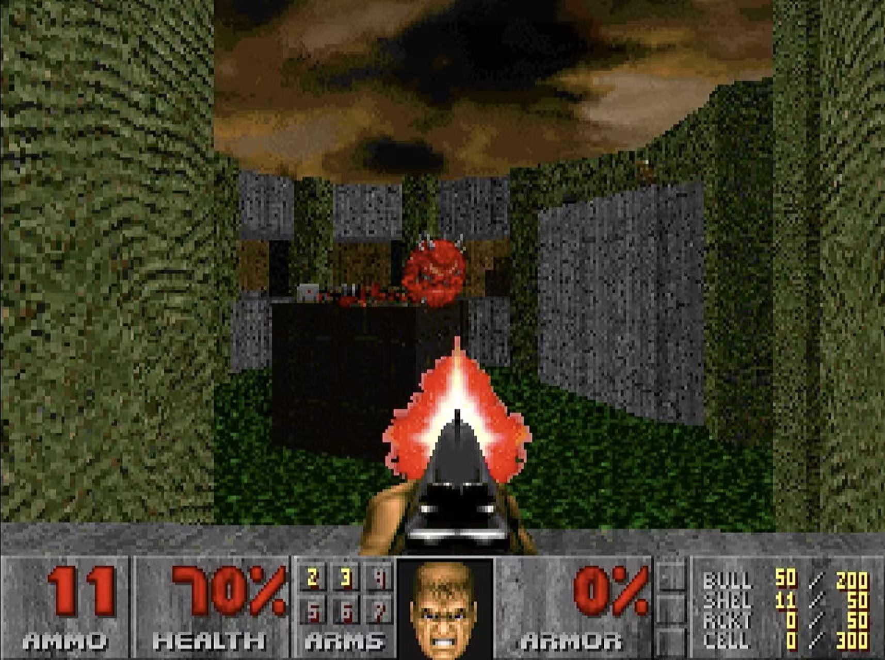
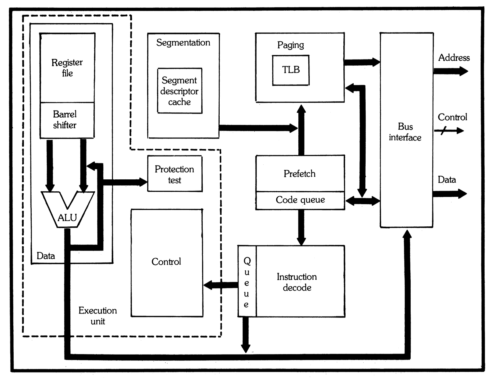
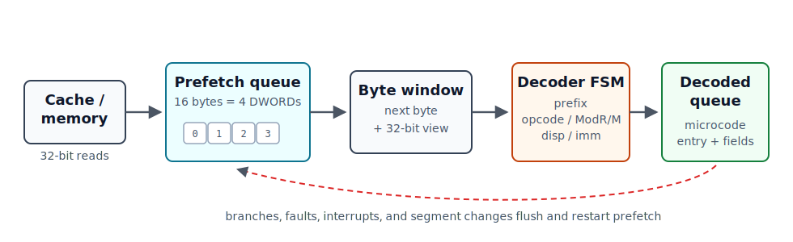
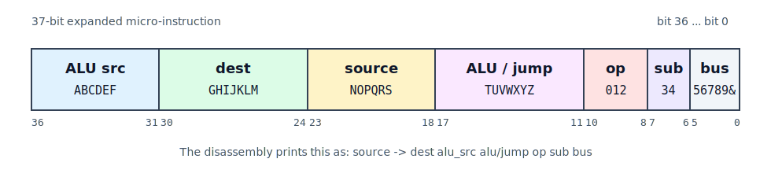
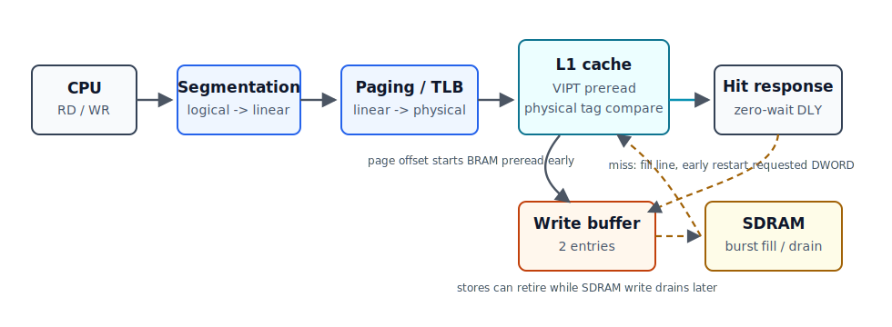

This is the fifth installment of the [80386 series](/tags/386/). The FPGA CPU is now far enough along to run real software, and this post is about how it works. [z386](https://github.com/nand2mario/z386) is a 386-class CPU built around the original Intel microcode, in the same spirit as [z8086](/posts/2025/z8086/).

The core is not an instruction-by-instruction emulator in RTL. The goal is to recreate enough of the original machine that the recovered 386 control ROM can drive it. Today z386 boots DOS 6 and DOS 7, runs protected-mode programs like DOS/4GW and DOS/32A, and plays games like Doom and Cannon Fodder. Here are some rough numbers against ao486:

| Metric | z386 | ao486 |
| --- | ---: | ---: |
| Lines of code (cloc) | 8K | 17.6K |
| ALUTs | 18K | 21K |
| Registers | 5K | 6.5K |
| BRAM | 116K | 131K |
| FPGA clock | 85MHz | 90MHz |
| 3DBench FPS | 34 | 43 |
| Doom (original) FPS, max details | 16.5 | 21.0 |

In current builds, z386 performs like a fast (~70MHz) cached 386-class machine, or a low-end 486. It runs at a much higher clock than historical 386 CPUs, but with somewhat worse CPI (cycles per instruction). The current cache is a 16 KB, 4-way set-associative unified L1, chosen partly to keep the clock high. Real high-end 386 systems often used larger external caches, typically in the 32 KB to 128 KB range.

<figure style="width: 100%; max-width: 680px; margin: 28px auto 32px;">

<figcaption style="text-align: center;">Doom II running on z386.</figcaption>
</figure>

Much of this 386 microarchitecture archaeology has already been covered in the previous four posts: the [multiplication/division datapath](../80386_multiplication_and_division/), the [barrel shifter](../80386_barrel_shifter/), [protection and paging](../80386_protection/), and the [memory pipeline](../80386_memory_pipeline/). z386 tries to be both an educational reconstruction and a usable FPGA CPU. It keeps many 386-like structures: a 32-entry paging TLB, a barrel shifter shaped like the original, ROM/PLA-style decoding, the Protection PLA model, and most importantly the 37-bit-wide, 2,560-entry microcode ROM. At the same time, it uses FPGA-friendly shortcuts where they make sense, such as DSP blocks for multiplication and the small fast L1 cache.

In this post, I will fill in the rest of the design: instruction prefetch, decode, the microcode sequencer, cache design, testing, how z386 differs from ao486, and some lessons from the bring-up.

<!--more-->

## From z8086 to z386

A little background first. Last year I wrote [z8086](https://github.com/nand2mario/z8086), an original-microcode-driven 8086 based on [reenigne's disassembly work](https://www.reenigne.org/blog/8086-microcode-disassembled/). That project showed that building a working CPU around recovered microcode was possible. Near the end of the year I learned that 80386 microcode had recently been extracted and that reenigne was working on a disassembly. He generously shared that work with me, and z386 started from there.

The 386 is a very different problem from the 8086. The instruction set is larger, the internal state is much richer, and the machine has to enforce protection, paging, privilege checks, and precise faults. More importantly, the 80386 micro-operations are denser and more contextual. If the 8086 microcode reads like a straightforward C program, the 386 microcode reads more like hand-tuned assembly: short, subtle, and full of assumptions about hidden hardware.

That puzzle took about four months of evenings and weekends. The result is not a perfect 386 yet, but it is now far enough along to run real protected-mode DOS software.

## z386 - high-level view

At a high level, the 386 is organized around eight major units. z386 follows the same division closely enough that the original Intel block diagram is still a useful map.

<figure style="width: 100%; max-width: 680px; margin: 28px auto 32px;">

<figcaption style="text-align: center;">The 80386 as eight cooperating units.<br>
<small>Source: Intel, <i>The Intel 80386 - Architecture and Implementation</i>, Figure 8.</small></figcaption>
</figure>

The diagram actually maps quite well to the actual 386 die shot, although the relative positions of the units are different.

<figure style="width: 100%; max-width: 680px; margin: 28px auto 32px;">

<figcaption style="text-align: center;">The same eight-unit organization on the 80386 die.<br>
<small>Base image: <a href="https://commons.wikimedia.org/wiki/File:Intel_80386_DX_die.JPG">Intel 80386 DX die</a>, Wikimedia Commons.</small></figcaption>
</figure>

Here is what those units do in z386:

**1. Prefetch unit.** Keeps a 16-byte code queue filled from memory. Branches, faults, interrupts, and segment changes can flush and restart it.

**2. Decoder.** Consumes instruction bytes, tracks prefixes, recognizes ModR/M and SIB forms, gathers immediates and displacements, and maps instructions to microcode entry points.

**3. Microcode sequencer.** Fetches expanded microcode words, handles jumps, delay slots, faults, and run-next-instruction behavior.

**4. ALU and shifter.** Implements arithmetic, logic, flags, bit operations, shifts, rotates, multiplication, and division support.

**5. Segmentation unit.** Computes logical-to-linear addresses, applies segment bases and limits, and stores the hidden descriptor-cache state.

**6. Protection unit.** Recreates the 386 Protection PLA behavior for selector and descriptor validation.

**7. Paging unit.** Handles TLB lookup, page walks, Accessed/Dirty updates, page faults, and the transition from linear to physical addresses.

**8. BIU/cache/memory path.** Connects CPU memory operations to paging, cache, SDRAM, ROM, I/O, and the surrounding PC system.

This organization is quite different from the tidy pipelines usually shown for modern RISC-style CPUs. The 386 is better thought of as several large, partly independent state machines that overlap. Prefetch can run while the execution unit is busy. Decode can prepare later instructions. Address translation can start before the bus is needed. Protection tests can redirect the sequencer a few cycles later. Intel's papers describe up to six instructions being in different phases of processing at once, but the execution unit still consumes one micro-instruction per cycle. Unlike the 486 and later processors, which reorganized the design into a finer-grained pipeline aimed at one instruction per clock, the 386 still needs at least two microcode cycles for even simple register-register instructions.

Previous posts covered units 4 through 8 in some depth. Here let's start with the front end: prefetch, decode, and the microcode sequencer.

## Instruction prefetch

The original 8086 can move one byte at a time from its instruction queue into the execution side. For the 386, the bandwidth math changed. Jim Slager's ICCD 1986 paper, "Performance Optimizations of the 80386", gives a useful back-of-the-envelope calculation: the average 80386 instruction is about four bytes long, and the weighted average instruction takes about four clocks, so steady-state execution needs about one byte of code per clock.

In practice, the prefetcher needs burst bandwidth above that average. It has to smooth over variable-length instructions, taken branches, and data cycles that steal bus slots from prefetch. The external bus can support this: it can read four bytes every two clocks, or two bytes per clock. The 386 prefetch unit therefore fills a 16-byte code queue with 32-bit fetches, taking advantage of the full non-multiplexed 32-bit bus.

<figure style="width: 100%; max-width: 680px; margin: 28px auto 32px;">

<figcaption style="text-align: center;">The z386 front end keeps byte-at-a-time structure decode, but exposes a wider window for displacement and immediate fields.</figcaption>
</figure>

The next question is the interface between the prefetcher and the instruction decoder. The 8086 side is again byte-at-a-time. On the 80386, the interface is more subtle: the structure-deciding part of decode still proceeds byte by byte, while literal fields such as displacement and immediate data can be consumed in 1-, 2-, or 4-byte chunks.

This is a small but important difference from the 8086 model. A 386 instruction may contain prefixes, an opcode, a ModR/M byte, a SIB byte, a displacement, and an immediate. The prefix/opcode/ModR/M part controls what the instruction is, so reading it one byte at a time keeps the logic compact. But once the decoder knows that the next four bytes are just a displacement, there is no architectural reason to spend four separate cycles collecting them. To implement this, z386 provides two views of the code queue: the next byte, and a 32-bit window starting at the current byte offset.

## Decode

x86 instruction decoding is hard because the instruction boundary is not obvious. There may be several prefixes, then an opcode, maybe a `0F` escape opcode, maybe a ModR/M byte, maybe a SIB byte, then displacement and immediate fields whose sizes depend on mode bits and earlier bytes. A decoder has to discover the structure of the instruction while it is still reading it.

The decoder input is the byte stream from the prefetch queue, plus current mode state: operand-size default, address-size default, protected-mode state, accumulated prefixes, and whether the instruction is in the `0F` extended-opcode space. The output is not just an opcode. Slager's paper describes the 386 instruction unit as producing a 111-bit decoded instruction word and inserting it into a three-entry instruction queue. That decoded word is the contract between the front end and the execution side.

Conceptually, the decoded word contains the execution entry point and everything the microcode should not have to rediscover from raw bytes: opcode, prefix state, operand/address size, ModR/M and SIB bytes, immediate and displacement values, instruction length, selected source and destination register fields, segment override, memory-form bits, and special control flags such as stack operation or flag-update behavior. z386 represents this as a decoded-instruction record and pushes it into a small FIFO for the microcode sequencer.

To build that word, the decoder is a state machine supported by two PLA-style tables. The Control PLA answers the structural question: what comes next? It classifies the current byte as a prefix, an opcode that is complete, an opcode that needs ModR/M, or an opcode with an immediate-size class. In the ModR/M state, the same PLA helps decide whether SIB and displacement bytes follow.

The Entry PLA answers the execution question: where does the microcode start? The first pass uses operand size, opcode, REP state, protected-mode state, and the `0F` escape flag. Some opcodes need a second pass after ModR/M is known, because the ModR/M `reg` field or memory/register form selects the final routine.

For example, decode of `8B 44 24 08` in 32-bit mode is not one lookup. The decoder learns the instruction's meaning as it goes:

| Byte | Meaning | Decoder action |
| --- | --- | --- |
| `8B` | `MOV r32, r/m32` | Control PLA says ModR/M follows. Entry PLA first pass says this is the `MOV r,rm` class. |
| `44` | ModR/M: `mod=01`, `reg=000`, `r/m=100` | Select destination register `EAX`, mark memory form, and run the Entry PLA second pass. Because this is memory `MOV r,rm`, the final microcode entry is `0x019`. |
| `24` | SIB: scale 1, no index, base `ESP` | Capture SIB and select the effective-address base form. |
| `08` | disp8 | Capture displacement `+8`, compute instruction length 4, and push the decoded record. |

The resulting decoded entry says, in effect: opcode `8B`, ModR/M `44`, SIB `24`, displacement `8`, operand/address size 32-bit, destination register `EAX`, memory operand based on `ESP+8`, instruction length 4, and microcode entry `0x019`. The microcode engine can then start at `0x019` without re-reading the raw byte stream.

The PLA structure keeps decode compact: a few dense ROM/PLA tables are much smaller than large groups of separate gates. There are still open questions here. z386 uses the Control PLA lines needed by the current decoder, but many recovered lines are still unused or only partly understood. Understanding more of the PLAs may let the decoder become smaller and faster.

## Microcode sequencer - the control program

z386 uses the original Intel 386 microcode as its main control program. The ROM decides which internal values move, when the ALU runs, when memory cycles start, when the sequencer branches, and when the next x86 instruction may begin. The RTL does not implement `ADD`, `IRET`, or `SGDT` instructions as large behavioral blocks. It implements the hardware that the microcode expects to control.

Each micro-instruction is 37 bits wide. Reenigne divided each word into these fields:

<figure style="width: 100%; max-width: 680px; margin: 28px auto 32px;">

<figcaption style="text-align: center;">The 37-bit microcode word as used by the z386 disassembly.</figcaption>
</figure>

```
source  -> dest    alu_src        alu/jump op  sub bus
```

The source and destination fields select internal registers and datapath endpoints. The ALU source and ALU/jump fields choose an ALU operand, ALU operation, or branch target. The op/sub fields encode special sequencer and size behavior. The bus field starts reads, writes, prefetch flushes, descriptor-cache operations, and address-pipeline operations.

A simple register-register move shows why the 386 has a two-cycle minimum:

```
003  SRCREG                           PASS    RNI          0
004  SIGMA  -> DSTREG
```

The first micro-instruction selects the source register and passes it through the ALU, while also marking the instruction as `RNI`, or run next instruction. The second micro-instruction is the delay slot that writes `SIGMA` to the destination register. On a 486-style pipeline, that second action would look more like a writeback stage overlapped with later instruction work. On the 386, it is still a serialized microcode cycle. Thus two cycles for a register-to-register move.

The same one-cycle delay applies to microcode control flow in general. Instructions run back-to-back: when the sequencer sees `RNI`, it starts preparing the next decoded instruction, but the following micro-instruction still executes first as the current instruction's final cycle. The microcode usually puts useful work there, such as a register writeback, a `DLY` wait, or a final bus operation.

Microcode branches also have a delay slot. A jump, call, or return changes the future micro-address, but the micro-instruction immediately after the branch still executes. This is why reading the 386 microcode as straight-line assembly can be misleading: the line after a branch always executes.

The Protection PLA can redirect the sequencer, but its result arrives after three cycles, so three micro-instructions can execute before the redirect takes effect. The previous [protection post](../80386_protection/) covered the `LD_DESCRIPTOR` example, where a selector test redirects a far return while the delay slots already execute inside the shared descriptor-loading subroutine. This is powerful because useful setup work happens while the PLA is deciding, but it also creates control flow where a few instructions from a subroutine may execute before a redirect lands somewhere else.

`RNI` itself has three variants, all related to instruction termination. `RNI` is the normal form: finish the current microprogram and begin the next decoded instruction after the delay slot. `RNi` is conditional: it only terminates if it is executing in a delay slot. The string and loop microcode uses this form so the same micro-instruction can either continue the loop body or terminate cleanly on an exit path. `RnI` terminates the instruction, and inhibits maskable interrupts until the following instruction completes; this is needed after stack-segment updates such as `MOV SS` and `POP SS`, where the next instruction is normally expected to update `SP` or `ESP` without interruption.

Many microcode names are specifically designed to support generic routines. `EIP`, `eIP`, and `IP` all refer to the EIP register but differ in how they apply code-segment and operand-size rules. Similarly, `EAX` and `eAX_AL` are not interchangeable. These distinctions matter because the microcode relies on them to reuse the same routine across CPU modes and operand sizes.

## Cache

The original 386 has no on-chip L1 cache, but it is not a pre-cache design. Intel expected high-performance systems to use external cache controllers such as the 82385 and SRAM caches. Early z386 could run from SDRAM directly, but 3DBench showed high CPI and heavy contention between instruction prefetch and data reads. So I added an L1 cache to make the FPGA memory system behave more like the fast local-memory systems the 386 was designed to work with.

<figure style="width: 100%; max-width: 680px; margin: 28px auto 32px;">

<figcaption style="text-align: center;">The z386 memory path starts the cache preread from the linear page offset, then compares physical tags when paging finishes.</figcaption>
</figure>

| Parameter | z386 cache |
| --- | --- |
| Size | 16KB |
| Line size | 16 bytes, 4 DWORDs |
| Associativity | 4-way set associative |
| Replacement | PLRU |
| Policy | unified I+D, read-allocate, write-through |
| Write buffer | 2 entries |
| Fill | SDRAM burst fill, early restart |
| Lookup | VIPT preread, physical tag compare |
| Hit latency | zero-wait hit response after preread |

The goal was not to build the largest possible cache. SDRAM latency in this system is noticeable but not enormous: roughly 6-7 cycles to the first word, and about 15 cycles to read a full 16-byte line as a burst. A small, fast cache that preserves a high core clock is more useful than a larger cache that adds cycles or hurts Fmax. The main job is to remove common prefetch/data contention and make frequent reads look close to zero-wait-state local cache hits.

That led to a [VIPT-style lookup](https://en.wikipedia.org/wiki/CPU_cache#Address_translation), short for virtually indexed, physically tagged. The page offset bits are the same before and after address translation, so z386 can use the linear address to start the tag and data BRAM preread one cycle before the physical address is available. On the next cycle, the cache compares the physical tag against the registered tags and returns the selected data word. Both tag and data arrays are synchronous, which maps cleanly to FPGA block RAM and keeps the hit path short. James Bottomley's [Understanding Caching](https://www.linuxjournal.com/article/7105) has a compact explanation of why VIPT lets address translation and cache lookup proceed in parallel.

The downside is size. To avoid synonym problems, the VIPT index must fit inside the 4KB page offset. With 16-byte lines and 4-way associativity, that naturally gives a 16KB cache: 4KB of indexable data per way, times four ways. That is smaller than many external caches in high-end 386 systems, but it works well for z386 because the hit latency and Fmax matter more than maximizing capacity.

Unified I+D is important because the 386-style prefetch unit and data accesses share the memory path. A hit avoids SDRAM traffic entirely, which removes both latency and prefetch/data contention. The write buffer lets stores retire without waiting for SDRAM when possible. On a read miss, the fill starts at the beginning of the 16-byte line and streams in four DWORDs. The requested DWORD is forwarded to the CPU as soon as it appears in the burst, while the rest of the line continues filling.

## Testing

I expected the 386 to be harder than z8086 because protected mode is much more complicated, and that turned out to be true. It took about two months to write most of the first version, then about two more months to make it run Doom. The hard part was not writing a lot of RTL. It was finding the small contracts that BIOSes, memory managers, DOS extenders, and games depend on.

The most important base test suite is the real-mode [SingleStepTests/80386](https://github.com/SingleStepTests/ProcessorTests), by [gloriouscow](https://github.com/dbalsom). It is a thorough single-instruction fuzz test: run one instruction, compare registers, flags, memory, and exceptions against a reference. This catches a huge number of real-mode mistakes before any BIOS or DOS image is involved.

I liked that approach enough to build a protected-mode counterpart using 86Box as the reference: [SingleStepTests_80386_protected](https://github.com/nand2mario/SingleStepTests_80386_protected). Protected-mode single-step tests are valuable because many 386 features are too specific to debug conveniently inside a full boot: `IRET`, `LSS`, `SGDT`, `LAR`, selector loads, call gates, interrupt gates, page faults, privilege checks, and VM86 transitions.

I also added hand-written protected-mode programs for cases that are hard to express as one isolated instruction: call gates, cross-privilege calls, interrupt gates, trap gates, `STI` and `MOV SS` interrupt shadows, hardware interrupt wakeup from `HLT`, real/protected-mode transitions, VM86 interrupt stack behavior, prefetch flush loops, and stale ModR/M state.

After those focused tests, `test386.asm` provides a broader and longer compatibility run. Then the test target becomes real software. SeaBIOS is useful because it can be rebuilt to print debug information over an I/O port, making early boot much less opaque. FreeDOS, DOS 6/7, HIMEM, EMM386, DOS/4GW, DOS/32A, Doom, FastDoom, and other games then become full-system integration tests.

DOS extenders were especially painful. DOS/4GW took roughly two weeks of tracing and disassembly before z386 could get through enough of its protected-mode setup. I used Ghidra to understand parts of the extender, but in hindsight an open-source extender would have been easier to instrument. DOS/32A and EMM386 later became better debugging targets because their behavior could be correlated with listings, memory maps, and repeatable traces.

There is still much more to test. Windows does not work yet, and protected-mode coverage is not complete. But the methodology should stay the same: Verilator simulation, waveform tracing, reference traces, and focused tests for every bug that can be reduced.

## z386 and ao486

There is already a mature FPGA x86 core: ao486. The interesting difference is not just 386 versus 486; it is the style of machine being implemented. z386 follows the coarse-grained 386 organization, while ao486 is closer to the finer-stage 486 pipeline.

| Topic | z386 / 386 style | ao486 / 486 style |
| --- | --- | --- |
| Main organization | Large cooperating units | Finer-grained pipeline stages |
| Control model | Original 386 microcode ROM drives reconstructed hardware | Staged command flow implements x86 behavior |
| Front end | 16-byte raw prefetch queue, 3-entry decoded-instruction queue | 32-byte raw prefetch queue and instruction aligner feeding D1/D2-style pipeline stages |
| Memory model | Segmentation, paging, cache, and bus timing contracts | Same architectural pieces, different implementation |
| Performance risk | Coarse steps, high CPI, and Fmax pressure | Pipeline hazards, forwarding, and stage scheduling |

## Current Status

z386 is still a work in progress, but it has reached the point where real software is the main test case. It already runs on multiple FPGA families, including Altera Cyclone V and Gowin GW5A.

Roughly, the project timeline has looked like this:

- **January.** Parsed the control ROM, reproduced the Control PLA and Entry PLA, built the first z386 core, then pushed through real-mode instruction coverage: instruction queue, ALU, ModR/M and SIB addressing, stack operations, shifts, strings, multiply/divide, interrupts, fault handling, and the real-mode single-step / `test386.asm` suites.
- **February.** Built the protected-mode core: segmentation, paging, TLB and page walker, descriptor loading, Protection PLA tests, call gates, interrupt gates, page faults, VM86 support, A/D bit write-back, and the 86Box-based protected-mode test generator. By the end of the month, SeaBIOS and FreeDOS were running in full-system simulation.
- **March.** Moved from CPU tests into hardware and system work: SDRAM, VGA/HDMI, keyboard, IDE, Sound Blaster DMA, cache/CPI experiments, timing cleanup, HIMEM/unreal-mode debugging, and the first real DOS/game workloads such as 3DBench and Speed600.
- **April.** Focused on Doom, DE10-Nano/MiSTer, and timing closure: DOS/4GW and DOS/32A fixes, Sound Blaster audio, L1 cache experiments, DE10-Nano boot, 75-85MHz timing sweeps, MiSTer HPS/IDE/BIOS integration, DOS 7.1 + EMM386 debugging, and ALU timing optimizations.

## Thoughts

There is a reasonable argument that the 386 is [Intel's most important CPU](https://www.xtof.info/intel80386.html). Not the cleanest, not the fastest for its time, and not the most elegant. But it got the hardware-software contract mostly right: a 32-bit x86 with protected mode, paging, and good backward compatibility. [Heise makes a similar point](https://www.heise.de/en/news/40-Years-of-80386-Intel-s-Most-Important-Product-10778053.html): what we now call x86 really starts to look like itself with the 80386.

That is the part I appreciate more after building z386. The 386 is the point where protected mode became both useful and performant. The segmentation model is still there, but it can support a flat 4GB address space. Protected mode is now usable enough for serious systems. Compatibility is still good, but the machine is much more capable. That combination gave software a long runway. DOS extenders, Windows, OS/2, Unix ports, and Linux could all use different pieces of the same hardware.

The other lesson is how much value there is in recovered microcode. Microcode is not a schematic. It does not tell you details about the gates. But it tells you what the hardware was expected to do. It names internal registers, exposes shared routines, and makes otherwise invisible contracts visible. When a short micro-op name turns out to mean something very specific, implementing it correctly feels like finding another piece of the original machine.

That is what makes the project fun. z386 is part CPU implementation, part archaeology, and part logic puzzle. Every time a BIOS, memory manager, or DOS extender gets a little further, it is evidence that another part of the design has been reconstructed.

## Credits

The analysis of the 80386 in this post draws on the microcode disassembly and silicon reverse engineering work of [reenigne](https://www.reenigne.org/blog/), [gloriouscow](https://github.com/dbalsom), [smartest blob](https://github.com/a-mcego), and [Ken Shirriff](https://www.righto.com).
