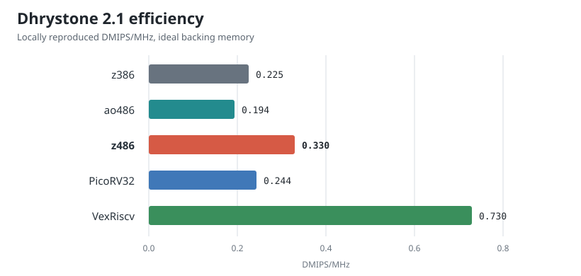

## Dhrystone evaluation

Doom is the performance target that matters most for this project, but it is a
poor tool for separating pipeline efficiency from clock rate and system
behavior. I therefore also ran Dhrystone 2.1 across z386, ao486, z486,
PicoRV32, and VexRiscv.

The benchmark uses the conventional VAX 11/780 normalization:

```text
DMIPS/MHz = iterations * 1,000,000 / (cycles * 1757)
```

All builds use `-O3 -fno-inline`, no link-time optimization, and no explicit
`register` declarations. The x86 cores execute the same i386 binary produced by
GCC 11.4. PicoRV32 and VexRiscv execute the same C source as RV32IM, built by
GCC 10.2. Memory responds at the earliest legal cycle. z386 and z486 retain the
release 8 KB instruction and 8 KB data caches; ao486 retains its native cache
organization. Results are fitted from 100, 1,000, and 10,000 iteration runs to
remove fixed marker cost.

| Core | Cycles/iteration | CPI | DMIPS/MHz | Cyclone V ALMs |
| --- | ---: | ---: | ---: | ---: |
| z386 | 2,526.4 | 4.101 | 0.225 | 15,545 |
| ao486 | 2,934.0 | 4.556 | 0.194 | 15,190 |
| **z486** | **1,725.0** | **2.800** | **0.330** | **21,906** |
| PicoRV32 | 2,336.1 | 4.172 | 0.244 | - |
| VexRiscv | 780.1 | 1.393 | 0.730 | - |

The ALM column is limited to the comparable x86 cores. These are standalone
seed-1 fits on the DE10-Nano Cyclone V using identical z486_MiSTer production
settings. The z486 number includes its experimental x87; without x87, the
integer core uses 16,329 ALMs, only 5.0% more than z386.

<figure style="width: 100%; max-width: 820px; margin: 28px auto 32px;">

<figcaption style="text-align: center;">Locally reproduced Dhrystone 2.1 efficiency. Higher is better. x86 and RISC-V use different binaries, so the RISC-V results are architectural context rather than an ISA-neutral ranking.</figcaption>
</figure>

z486 needs 31.7% fewer cycles per iteration than z386 and 41.2% fewer than
ao486. In normalized terms it is 46% faster per MHz than z386 and 70% faster
per MHz than ao486. At the tested MiSTer clocks, that corresponds to 28.05
DMIPS for z486 at 85 MHz, 19.15 for z386 at 85 MHz, and 17.46 for ao486 at
90 MHz. [3] [4] [5]

Changing z486's backing-memory model from the earliest legal response to a
five-cycle first read, one-cycle burst gap, and three-cycle write busy time
changes the fitted result only from 1,725.0 to 1,729.9 cycles per iteration
(0.3%). Once warm, this Dhrystone image fits in the split caches; the score is
primarily measuring the frontend and execution pipeline rather than SDRAM.

VexRiscv demonstrates how much easier this workload is for a compact RISC
pipeline: the local no-cache RV32IM build reaches 0.730 DMIPS/MHz. That is
still below the project's published 1.21 DMIPS/MHz for its full no-cache
configuration, which also assumes its documented benchmark and memory setup.
PicoRV32 reaches 0.244 DMIPS/MHz locally. Its project reports 0.516 with the
look-ahead memory interface and 0.305 without it. These gaps are a useful
warning that Dhrystone is highly sensitive to compiler and memory-interface
details, even before comparing different ISAs. [1] [2]

The ao486 retirement counter is taken at a different pipeline boundary, so its
CPI should not be compared as precisely as cycles per iteration or DMIPS/MHz.
All benchmark result checks passed, and the fitted cycle slopes have an
R-squared value above 0.9999999.

The complete runner records source and binary hashes, compiler versions,
iteration fits, cache settings, Quartus assignments, and fitted resources in
machine-readable JSON under `27.dhrystone_eval`. The local numbers should
therefore be treated as reproducible measurements; upstream frequency numbers
remain attributed reference data.

[1]: https://github.com/YosysHQ/picorv32#evaluation-timing-and-utilization-on-xilinx-7-series-fpgas
[2]: https://github.com/SpinalHDL/VexRiscv#area-usage-and-maximal-frequency
[3]: https://github.com/MiSTer-devel/ao486_MiSTer#core-speed-and-options-and-drivers
[4]: https://github.com/nand2mario/z386
[5]: https://github.com/nand2mario/z486_MiSTer/releases/tag/20260813
