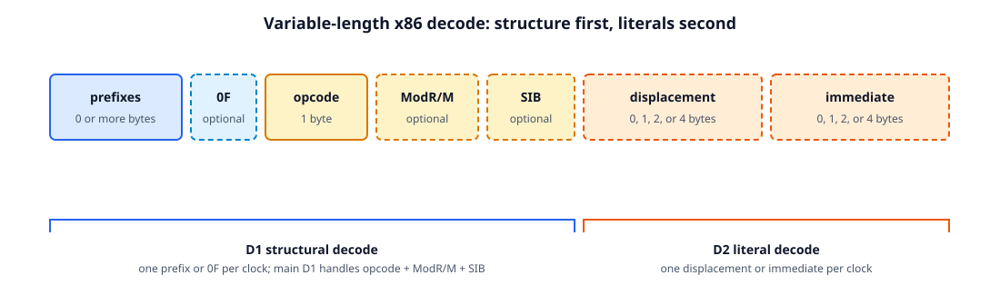
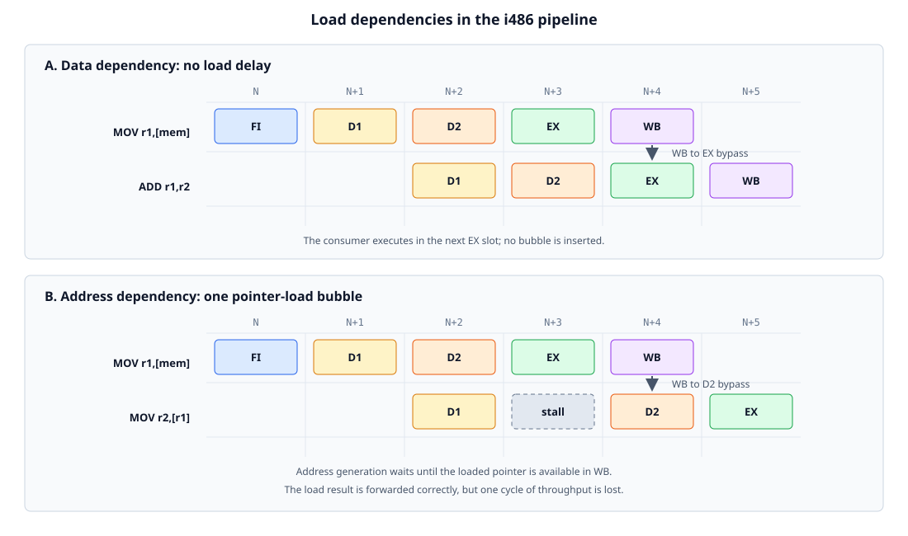
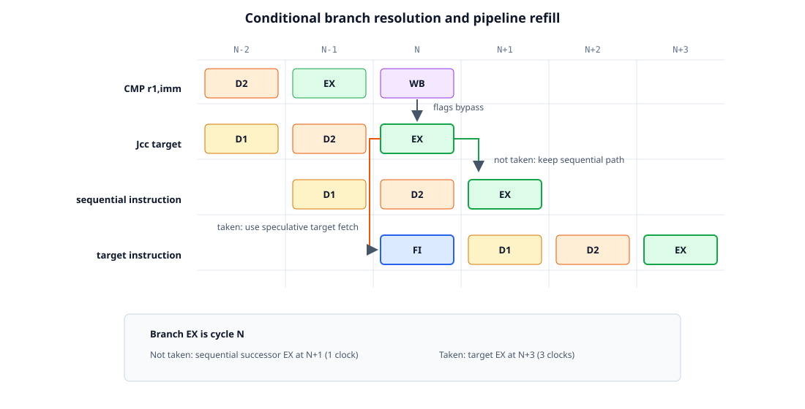
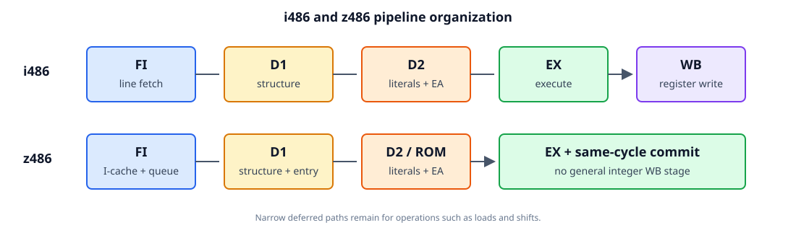
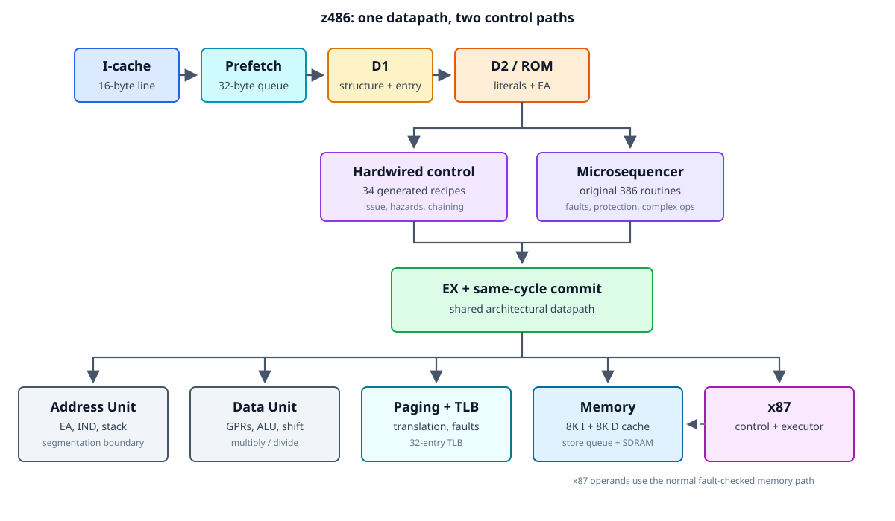
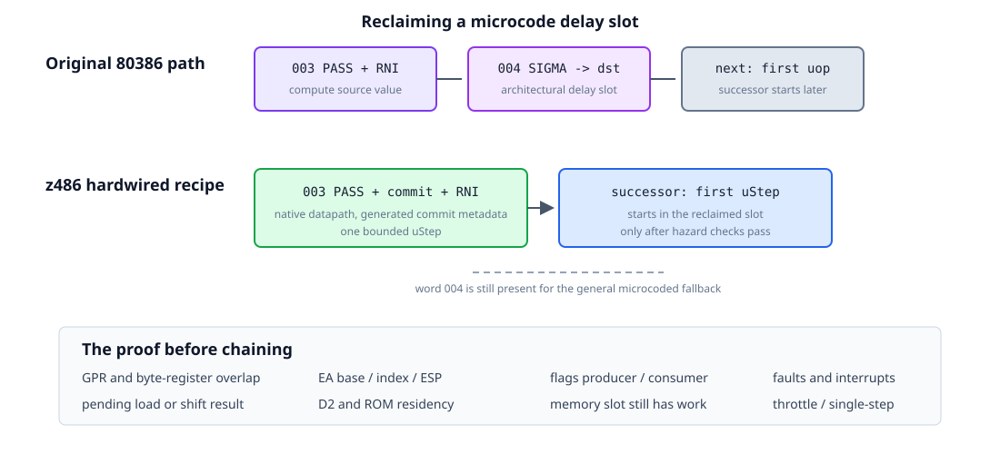
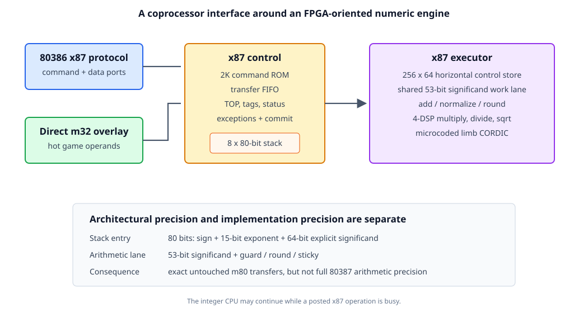
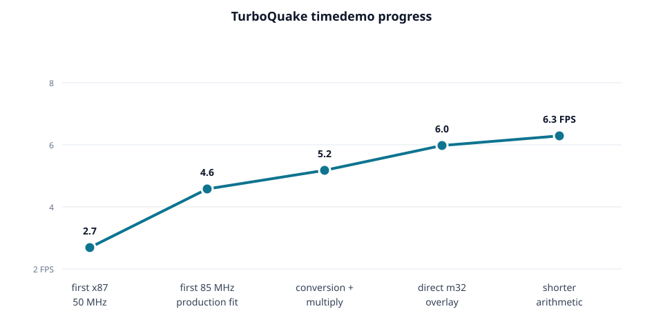
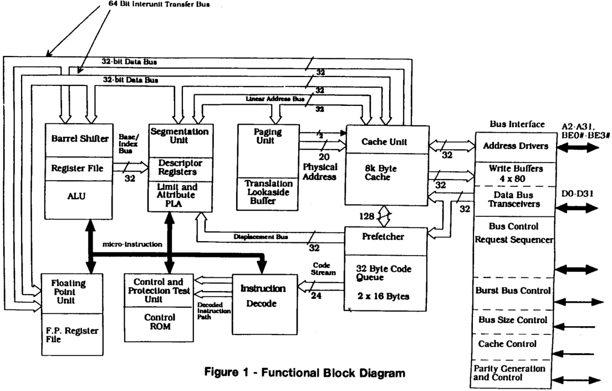
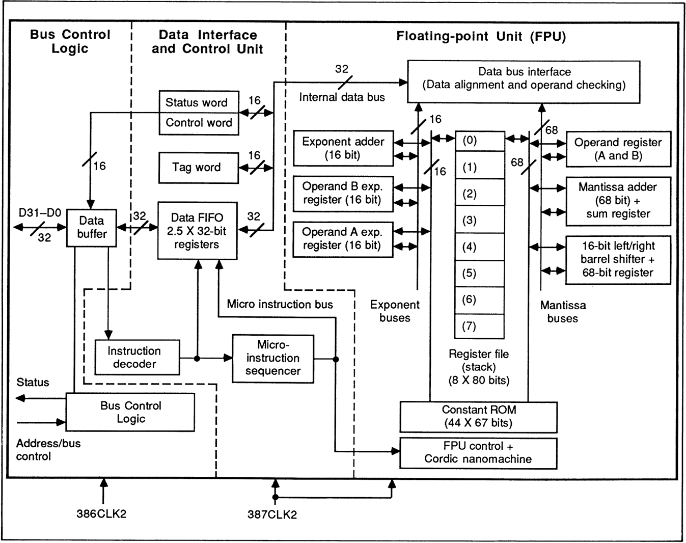

I released [z386](https://github.com/nand2mario/z386), an open-source 80386 CPU
core, in May and added the 80386
[early-start](../80386_early_start/) optimization in June. Early start overlaps
address generation for one instruction with completion of its predecessor. It
was an important 386 performance feature, but it also previewed the more
systematic i486 pipeline. The
[MiSTer core](https://github.com/nand2mario/z486_MiSTer) needed more
performance, so I continued in that direction and added further 486-class
mechanisms.

The result is [z486](https://github.com/nand2mario/z486), an open-source,
80486-class pipelined x86 CPU written in SystemVerilog. It combines hardwired,
pipelined execution for common instructions with microcode for complex
architectural behavior.

z486 is not an i486 clone. Its design draws on three i486-inspired elements:

1. a pipelined D1/D2 frontend;
2. hardwired execution of common instructions, with microcode
   retained for complex instructions; and
3. an experimental integrated x87 unit implementing the subset exercised by
   Quake.

On the same MiSTer system, the current core runs the Doom timedemo at **29.1
FPS** at maximum detail, compared with **21.0 FPS** on ao486. This is roughly
486DX2-66-class performance for the measured workload. Dhrystone reaches
**0.330 DMIPS/MHz**, versus **0.225** for z386 and **0.194** for ao486. These
results show that a practical pipelined x86 CPU with broad architectural
support, including x87, can fit on a mid-range FPGA.

<!--more-->

## The i486 five-stage pipeline

A finite-state or microcoded CPU limits combinational depth by performing
decode, address generation, memory access, ALU work, and commit in separate
cycles. This supports a high clock frequency but gives simple instructions a
high cycles-per-instruction (CPI) count. Combining all work into one cycle
reduces CPI but creates long paths through wide multiplexers and interconnect.
Pipelining separates the work with registers and overlaps successive
instructions.

Variable-length x86 instructions require a different stage division from the
[classic RISC pipeline](https://en.wikipedia.org/wiki/Classic_RISC_pipeline),
commonly written as `IF-ID-EX-MEM-WB`. The i486 uses five stages:

| Stage | Main work |
| --- | --- |
| **FI** | Fetch a 16-byte line into the instruction queue. |
| **D1** | Decode prefixes, opcode, ModR/M structure, instruction length, and D2 actions. |
| **D2** | Capture displacement or immediate data and calculate an effective address. |
| **EX** | Execute ALU or microcode work; access cache and TLB for memory instructions. |
| **WB** | Write an ALU or load result into the register file. |

The two decode stages replace the single RISC ID stage, and cache access occurs
in EX rather than in a separate MEM stage. Microcoded instructions can use several EX cycles. One-clock throughput is
therefore the common case, not a property of every instruction.

Intel's functional block diagram, reproduced with the
[references](#further-information-and-references), shows how internal buses
connect decode, address generation, translation, cache access, and execution.

### Decoding variable-length x86 instructions

By the time the i486 was designed, x86 instructions already had a complex,
variable-length encoding. Prefixes, two-byte opcodes, ModR/M and SIB bytes,
displacements, and immediates are all optional, and some fields cannot be
located until earlier fields have been interpreted. Earlier x86 frontends used
sequential decode machinery that could take several clocks. The i486 instead
divides decode into two explicit pipeline stages: D1 determines instruction
structure and boundaries, while D2 captures literals and generates addresses.

<figure style="width: 100%; max-width: 900px; margin: 28px auto 32px;">

<figcaption style="text-align: center;">D1 identifies instruction structure and boundaries; D2 consumes literals and computes the effective address.</figcaption>
</figure>

In the common case, D1 decodes the opcode, ModR/M, and SIB together. It also
determines the instruction length and tells the aligner where both the next
instruction and the current instruction's literals begin. Prefixes are
processed one byte per clock, and a `0F` escape consumes another D1 clock.

D2 consumes one 1- to 4-byte displacement or immediate per clock. In parallel,
it reads the base and index registers and calculates the effective address.
Separate structural and literal ports in the prefetch queue let D1 work on one
instruction while D2 works on its predecessor.

Common forms complete D2 in one clock. Two cases extend D2:

* an instruction with both a displacement and an immediate uses two D2 clocks;
* an address containing base, displacement, and scaled index can use a second
  D2 clock for the second addition.

This is also the pipelined version of the 386's early-start idea. On the 386,
the instruction queue presents address operands during the final cycle of the
previous instruction. On the i486, D2 is an explicit stage where the next
instruction performs the same work while its predecessors occupy EX and WB.

The extra cycles are a deliberate area and timing tradeoff. Allowing both
decoders to select every field from every possible byte position in the
prefetch queue would require large alignment networks. The bounded D1 and D2
windows keep common instructions fast without making worst-case alignment part
of the clock-critical datapath.

### Loads, forwarding, and the pointer-load delay

Overlapping instructions introduce data hazards when a successor needs a
result that its predecessor has not yet written to the register file. Consider
a load followed immediately by an ALU operation:

```asm
mov eax, [esi]
add ebx, eax
```

When `ADD` reaches EX, the load result is in WB but may not yet be visible
through a normal register-file read. Stalling until the write completes would
create a data-load delay.

On the i486, given a cache hit, forwarding makes the value available to an
ordinary dependent ALU instruction in the same cycle. Consequently, the i486
has no general data-load delay.

<figure style="width: 100%; max-width: 940px; margin: 28px auto 32px;">

<figcaption style="text-align: center;">An ordinary consumer receives load data through WB-to-EX forwarding. An address consumer stalls until WB aligns with D2. Redrawn from Crawford, reference 3, Figures 4 and 5.</figcaption>
</figure>

The exception is a successor that uses the loaded register as an **address base
or index**:

```asm
mov eax, [esi]
mov ebx, [eax]
```

The second `MOV` needs `EAX` in D2 to calculate the effective address that its
memory access will use in EX. This is one stage earlier than an ALU consumer
needs the value. When the second instruction first reaches D2, the load is
still in EX and its result is unavailable. D2 must stall for one clock, then
receive the value when the load advances to WB. Intel called this the
**pointer-load delay**; today it is commonly described as an
address-generation interlock, or AGI.

Eliminating this delay would require an earlier and larger bypass network. The
i486 instead accepts a one-cycle bubble for pointer dependencies.

### Branch timing

The i486 evaluates a conditional branch in EX while speculatively fetching the
target. A not-taken Jcc costs one clock because the sequential pipeline is
already present. A taken Jcc, JMP, or near CALL takes three clocks from branch
EX to target EX.

<figure style="width: 100%; max-width: 940px; margin: 28px auto 32px;">

<figcaption style="text-align: center;">Branch EX evaluates the condition and starts target FI. The sequential path reaches EX after one clock; the taken target reaches EX after three. Redrawn from Crawford, reference 3, Figure 6.</figcaption>
</figure>

[Crawford reports](https://ieeexplore.ieee.org/document/63682/) that Intel
evaluated a more aggressive two-cycle taken-branch design, but it would have
made not-taken branches slower and required significantly more cache machinery.
The published instruction mix showed only about a one-percent overall
advantage. The implemented three-cycle-taken, one-cycle-not-taken policy fit
the rest of the pipeline better.

## The z486 pipeline

Using the i486 pipeline as a guide, z486 retains its FI, D1, D2, and EX stage
division. The main difference is at the back end: ordinary integer results
commit on the EX edge rather than passing through a general WB stage.

<figure style="width: 100%; max-width: 900px; margin: 28px auto 32px;">

<figcaption style="text-align: center;">z486 follows the i486 frontend organization but combines ordinary integer execution and commit.</figcaption>
</figure>

The implementation maps this stage flow onto hardwired and microcoded control
paths that share the same address, data, memory, protection, and floating-point
units. The RTL is also more modular than z386. Address generation, integer
execution, memory, hardwired control, and microsequencing were extracted into
separate modules, leaving `z486.sv` primarily as pipeline integration and
cross-unit glue. The resulting top-level module is about one-third shorter than
z386's: 2.6K lines versus 3.9K.

<figure style="width: 100%; max-width: 900px; margin: 28px auto 32px;">

<figcaption style="text-align: center;">The implemented z486 organization. Hardwired and microcoded instructions share the same datapath.</figcaption>
</figure>

The frontend uses a 32-byte prefetch queue filled one 16-byte instruction-cache
line at a time. Like the i486 queue, it provides separate ports for structural
and literal decode: a registered 64-bit D1 window and a 32-bit literal window.
Prefixes and `0F` consume extra structural cycles. An opcode and optional
ModR/M normally complete in one D1 clock, while SIB parsing can use a retained
sub-cycle. A one-entry registered skid buffer lets D1 run ahead when D2 is
occupied without requiring a deep decoded-instruction queue.

D1 resolves the microcode entry and launches it into the synchronous control
store. The first control word is therefore available in D2 alongside the
decoded instruction and its literals. D2 performs effective-address work and
hazard checks; `i_issue` is the single event that transfers the completed D2
instruction into EX.

This organization keeps two expensive operations out of the same cycle:

* D2 calculates and relocates the effective address to a linear address;
* the next part of the memory path translates it and accesses the physically
  indexed, physically tagged cache.

The release MiSTer configuration has separate 8 KB instruction and 8 KB data
caches, both four-way set associative with 16-byte lines. The data cache is
write-through with a three-entry store queue. The i486 instead has one unified
8 KB cache and completes a cache-hit load in one clock by overlapping virtual
indexing with translation. z486 has twice the total L1 capacity, but its simpler
physically indexed, physically tagged organization serializes translation and
cache access. A best-case integer load therefore takes two clocks rather than
the i486's one. Getting VIPT to work is future work.

### Write-back organization

z486 differs from the i486 at the back end. Ordinary GPR, EIP, ESP, EFLAGS, and
internal-register results commit on the EX clock edge; there is no general WB
stage.

This is an FPGA-specific tradeoff. Preserving dependency timing with a full WB
stage requires a broad bypass network: younger instructions need pending WB
values in EX and, for address dependencies, one stage earlier in D2. In earlier
experiments, the additional routing and operand-mux delay cost more than moving
commit out of the EX critical paths saved. z486 therefore retains only narrow,
operation-specific deferred state, such as a shifter result or a pending load
commit.

## Hardwiring common instructions

Pipelining does not automatically remove the original 386 microcode's
two-cycle minimum for simple operations. Register `MOV`, for example, is:

```asm
003  SRCREG                           PASS    RNI
004  SIGMA  -> DSTREG
```

The first word passes the source through the ALU and announces
run-next-instruction (RNI). Because the sequencer has an architectural delay
slot, the second word still executes and writes the result. Running this
sequence unchanged would retain a two-cycle EX retirement rate despite the
faster frontend.

The i486 controls frequent instructions with hardwired logic while retaining
microcode for complex cases. z486 follows the same division: hardwired and
microcoded control both drive the shared integer datapath.

### Recipes and uSteps

The generation script `scripts/ucode_optimize.py` produces metadata for **34
hardwired instruction recipes**. Each recipe contains one to three active
**uSteps**. A uStep combines a native microcode word with generated fields for
D2 work, architectural commit, delay-slot handling, and hazards.

For `MOV r,r`, the optimized word still uses the original PASS datapath, but a
generated destination encoding commits the ALU result on the same edge. The
hardwired recipe therefore completes the same work in one active slot.

<figure style="width: 100%; max-width: 900px; margin: 28px auto 32px;">

<figcaption style="text-align: center;">A recipe folds the delay-slot effect into the RNI word, reclaiming one execution slot.</figcaption>
</figure>

### Chaining

Once a delay slot is proven redundant, z486 may start the next hardwired
instruction in it. This is called **chaining**. It applies to both one- and
multi-uStep recipes: a one-uStep recipe can launch its registered successor at
issue, while a multi-uStep recipe can launch the queue head when its final RNI
word is approaching. Repeated one-uStep chains provide sustained
one-instruction-per-clock execution.

Before chaining, the control unit checks:

* source, destination, and byte-register overlap;
* flags producer/consumer dependencies;
* effective-address base, index, and ESP dependencies;
* pending load and shift destinations;
* D2 and control-store residency;
* whether a memory or stack slot still contains real work; and
* faults, interrupts, traps, single-step, and CPU throttling.

### Memory, stack, and branches

Recipes are not limited to register operations:

* `MOV r,[m]` prepares the address in D2 and uses a two-uStep load recipe,
  retaining a real result slot;
* stores and PUSH keep their memory slot because acceptance and ESP update are
  architectural work;
* safe not-taken Jcc can fold into the predecessor boundary;
* taken Jcc and JMP use the D2-computed relative target in one bounded branch
  uStep; and
* near CALL combines redirect, posted return-address store, and ESP commit.

The current best-case instruction timing is:

| Instruction class | 80386 | i486 | z486 |
| --- | ---: | ---: | ---: |
| `MOV r,r` / `ADD r,r` | 2 | 1 | **1** |
| `MOV r,[m]` | 4 | 1 | **2** |
| `MOV [m],r` | 2 | 1 | **1** |
| `ADD r,[m]` | 5 | 2 | **3** |
| Jcc not taken | 3 | 1 | **1** |
| Jcc taken | about 9 | 3 | **3** |
| JMP taken | about 9 | 3 | **3** |
| near CALL | about 9 | 3 | **4** |
| `XCHG [m],r` | 5 | 5 | **5** |

The main remaining gap is memory latency: z486's PIPT data cache takes two
clocks for a load hit. A timing-safe VIPT design is one possible route to the
i486's one-clock load.

Instructions without a hardwired recipe continue through the general
microsequencer. Task switching, call gates, privilege transitions, descriptor
updates, nested faults, unusual prefixes, and other complex behavior therefore
retain the original microcode routines and their delay-slot assumptions.

## Integrated x87 floating-point unit

z486 includes an experimental integrated x87 floating-point unit. It is not yet
a complete x87 implementation, but it implements enough of the instruction
set to run Quake and TurboQuake. Its organization follows
the major boundaries of the original 80387, whose block diagram appears in the
[references](#further-information-and-references): command and stack control,
a microcoded numeric executor, shared significand arithmetic, and a separate
CORDIC engine for transcendental functions.

* `x87_bridge` converts the 80386 command/data-port protocol into registered
  ready/valid transfers;
* `x87_control` owns command decode, the stack, TOP, tags, status, exceptions,
  and architectural commit;
* `x87_executor` runs a generated 256-word horizontal control store over
  shared conversion and arithmetic resources; and
* a qualified direct-m32 overlay removes the long 386 command/data transfer
  loop from common game instructions while preserving normal paging and fault
  checks.

<figure style="width: 100%; max-width: 880px; margin: 28px auto 32px;">

<figcaption style="text-align: center;">The current z486 x87. It follows the 80387's control/FPU division, but uses FPGA block RAMs and DSPs.</figcaption>
</figure>

The integer-only z386 core already occupied about 15,000 ALMs, while a complete
PC configuration with caches, memory control, and peripherals exceeded 25,000.
The Cyclone V on the DE10-Nano provides 41,910 ALMs, so a conventional FPU
could easily exhaust the remaining capacity or make the design impractical to
place and route. Three implementation choices keep the unit within this limited
area budget:

1. **Horizontal microcode and shared arithmetic.** A synchronous 256-word by
   64-bit control store sequences the numeric executor. Each horizontal word
   independently controls flow, operand preparation, classification, the
   add/subtract and shift routes, iterative engines, rounding state, result
   packing, commit, and CORDIC scratch accesses. This replaces a large decoded
   operation selector with direct control of the state updated by each step.
   Addition, normalization, conversion, and rounding share a 68-bit work
   register and adder. Division and square root reuse iterative datapaths, while
   the infrequent transcendental instructions use a microcoded, limb-oriented
   CORDIC engine.

2. **Reduced internal precision.** The architectural stack and transfer paths
   retain raw 80-bit temporary-real values, preserving untouched `FLD m80` to
   `FSTP m80` round trips and save/restore data. Arithmetic decodes an operand
   into a 15-bit exponent and a 53-bit significand, with separate guard, round,
   and sticky state. The add/subtract path carries those 53 retained bits plus
   overflow and rounding positions in a 57-bit active slice of the shared work
   register. This keeps the 80387 exponent range but provides binary64-class
   precision rather than the 80387's full 64-bit significand. Results produced
   by arithmetic therefore have reduced precision even when stored as m80.

3. **DSP-based multiplication.** The two 53-bit significands are split into
   27- and 26-bit limbs. Four 27-by-27 products map onto Cyclone V DSP blocks
   and are assembled into an exact 106-bit intermediate product. This avoids a
   large LUT multiplier while retaining all bits needed by the common rounder.

With these measures, the FPU hierarchy uses about 5,100 ALMs in the 85 MHz
release fit. The complete z486 PC build, including the FPU and peripherals,
uses 35,686 of the DE10-Nano's 41,910 ALMs.

Performance was optimized iteratively as well. In an early TurboQuake
render-window profile, x87 instructions accounted for about 23% of retired
instructions but 61% of instruction-attributed cycles. The numeric executor
was active during only about 40% of those x87 cycles; command dispatch, operand
transfer, stack access, launch, and retirement consumed the rest. Performance
work therefore addressed both sides of the CPU/FPU boundary: faster conversion
and arithmetic schedules, a direct m32 path for common memory operands, and
shorter command sequencing.

<figure style="width: 100%; max-width: 800px; margin: 28px auto 32px;">

<figcaption style="text-align: center;">TurboQuake progress at major x87 milestones. The gains came from both arithmetic and CPU/coprocessor scheduling.</figcaption>
</figure>

The first complete x87 build ran TurboQuake at 2.7 FPS at 50 MHz. The current
release reaches about 6.3 FPS at the 85 MHz board clock.

<!-- Performance Evaluation -->



## Verification

Verification for a pipelining CPU is harder than a sequential one as there is
more parallelism. A value may belong to the wrong instruction, a fault may
cancel EX while leaving a younger commit active, or a cache operation may race
with a store or DMA snoop. Validation therefore covers both instruction
semantics and inter-stage ordering.

The current validation stack includes:

* directed single-instruction tests;
* 9,410 real-mode and 1,220 protected-mode singlestep cases;
* protected-mode integration programs and the `test386` suite;
* focused instruction/data cache race tests;
* x87 command, stack, executor, TestFloat, and CPU integration tests;
* differential x87 traces against QEMU and a retired reference executor;
* deterministic Doom and Quake snapshots with RAM hashes;
* full-system DOS, Windows 3.1, Doom, Quake, demos, and game simulations; and
* five-seed Quartus comparisons followed by physical MiSTer testing.

## Related work and future work

[ao486](https://github.com/alfikpl/ao486) is the closest related open-source
design and the CPU behind the established ao486 MiSTer core. It implements a
486SX-class integer processor with broad software compatibility, but no
integrated x87. ao486 implements the 486 architecture directly; z486 instead
evolved from a microcoded 386 core, adding a pipelined frontend, generated
hardwired recipes for common instructions, and an application-focused x87.
Because both run the same PC software on the same FPGA platform, their
whole-system Doom results are more informative than area alone.

Open RISC-V cores cover a larger design space, from multi-cycle
[PicoRV32](https://github.com/YosysHQ/picorv32) to configurable pipelined
[VexRiscv](https://github.com/SpinalHDL/VexRiscv). They provide useful
Dhrystone and FPGA-efficiency reference points, but are not area-equivalent
alternatives: the x86 cores also implement variable-length decode, segmented
and paged protection, legacy execution modes, and a much larger compatibility
surface.

Potential work includes:

* improving sustained cache-hit load throughput;
* reclaiming more redundant instruction-boundary slots through measured,
  timing-safe chaining;
* completing the remaining 486 and x87 instructions;
* moving x87 arithmetic toward the full 64-bit significand of the 80387;
* improving 85 MHz timing margin while retaining current CPI and area; and
* continuing compatibility work driven by DOS and Windows games and applications.

## Further information and references

These notes collect the diagrams, historical sources, reverse-engineering work,
benchmark configurations, and implementations discussed in this article.

1. **Intel i486 functional block diagram.** The diagram shows that the i486
   pipeline comprises more than five abstract stage names. The
   register file, decoders, control ROM, address units, TLB, cache, execution
   units, and internal buses were arranged to overlap decode, address
   generation, translation, and execution. That organization is the main
   architectural reference for z486's integer pipeline.

    <a href="intel_80486_block_diagram.png" title="Open the full-size Intel i486 block diagram"></a>
    <small style="display: block; text-align: center; margin: 0 auto 30px;">Intel i486 functional block diagram. Click for the full image. Source: Fu, Saini, and Gelsinger, <i>Performance and Microarchitecture of the i486 Processor</i>, Figure 1; reference 5 below.</small>

2. **Intel 80387 block diagram.** The 80387 drawing exposes the boundaries
   hidden by the x87 instruction set: bus control, command sequencing, the
   register stack, exponent logic, mantissa datapath, barrel shifter, and
   CORDIC engine. z486 preserves the broad control/datapath split while mapping
   storage and arithmetic onto FPGA block RAM and DSP resources.

    <a href="intel_80387_block_diagram.png" title="Open the full-size Intel 80387 block diagram"></a>
    <small style="display: block; text-align: center; margin: 0 auto 30px;">Intel 80387 block diagram. Click for the full image. Source: Perlmutter and Yuen, <i>The 80387 and Its Applications</i>, Figure 2; reference 6 below.</small>

3. John H. Crawford, [“The i486 CPU: Executing Instructions in One Clock Cycle”](https://doi.org/10.1109/40.46766), *IEEE Micro*, 1990. This describes the five-stage pipeline, hardwired instructions, D1/D2 split, and one-cycle execution target.
4. John H. Crawford, [“The Execution Pipeline of the Intel i486 CPU”](https://ieeexplore.ieee.org/document/63682/), Compcon Spring, 1990. This gives a complementary description of pipeline timing and interlocks.
5. B. Fu, A. Saini, and P. Gelsinger, “Performance and Microarchitecture of the i486 Processor,” ICCD, 1989. The i486 block diagram in note 1 is Figure 1 of this paper.
6. David Perlmutter and Alan Kin-Wah Yuen, “The 80387 and Its Applications,” *IEEE Micro*, 1987. The 80387 block diagram in note 2 is Figure 2 of this paper.
7. John F. Palmer, [“The Intel 8087 Numeric Data Processor”](https://doi.org/10.1109/AFIPS.1980.108), 1980. This describes the stack architecture and the original numeric-coprocessor organization inherited by later x87 designs.
8. reenigne, [“80386 microcode disassembled”](https://www.reenigne.org/blog/80386-microcode-disassembled/). Its extraction and disassembly work made the original z386 microcode-driven control path possible.
9. The [PicoRV32 evaluation notes](https://github.com/YosysHQ/picorv32#evaluation-timing-and-utilization-on-xilinx-7-series-fpgas) document the upstream Dhrystone configurations and published scores cited for comparison.
10. The [VexRiscv area and frequency results](https://github.com/SpinalHDL/VexRiscv#area-usage-and-maximal-frequency) document its published Dhrystone and implementation configurations.
11. The [ao486_MiSTer documentation](https://github.com/MiSTer-devel/ao486_MiSTer#core-speed-and-options-and-drivers) records its core clock and system configuration. Its Dhrystone and Doom results in this article were reproduced locally.
12. The [z386 repository](https://github.com/nand2mario/z386) contains the earlier 80386-oriented core used as the architectural and performance baseline.
13. The [z486 repository](https://github.com/nand2mario/z486) contains the CPU RTL, tests, design documentation, and reproducible Dhrystone evaluation framework.
14. The [z486_MiSTer repository](https://github.com/nand2mario/z486_MiSTer) contains the complete MiSTer system, while the [20260813 release](https://github.com/nand2mario/z486_MiSTer/releases/tag/20260813) records the 85 MHz release configuration evaluated here.
