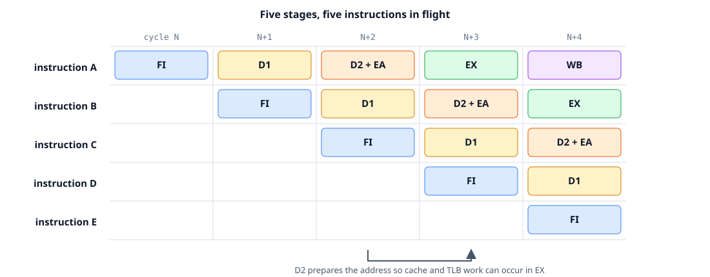

In June I added the 80386 [**early-start**](../80386_early_start/)
optimization to [z386](https://github.com/nand2mario/z386). Early start lets the address unit
begin work on the next memory instruction during the final cycle of the current
instruction. It was one of the most effective performance features of the 386,
but while implementing it I realized that it was also a preview of the much more
systematic pipeline in the 486.

That led to a larger experiment: how far could I push the same core toward a
486-style design while keeping the original 80386 microcode as a correctness
foundation? Two months later, the result is
[z486](https://github.com/nand2mario/z486), an open-source, 80486-class,
pipelined x86 CPU written in SystemVerilog.

z486 is not a transistor-level clone of Intel's i486. It combines three ideas:

1. a faster D1/D2 frontend inspired by the i486 pipeline;
2. hardwired execution of common instructions, with the original 386
   microcode retained for complex instructions; and
3. an experimental integrated x87 unit, sufficient to run Quake.

On the same MiSTer system, the current core runs the Doom timedemo at **29.1
FPS** at maximum detail, compared with **21.0 FPS** on ao486. In Dhrystone it
reaches **0.330 DMIPS/MHz**, versus **0.225** for z386 and **0.194** for ao486.
The more interesting result, though, is architectural: a recovered 386 control
program can be turned into a practical pipelined FPGA CPU without replacing it
with a large behavioral instruction engine.

<!--more-->

## Why a pipeline?

There are two straightforward ways to build a CPU, and each is incomplete by
itself.

A small finite-state or microcoded machine can do one piece of an instruction
per clock: decode, calculate an address, read memory, run the ALU, and finally
write the result. The clock can be fast because each state contains little
logic, but even a simple instruction takes several clocks.

At the other extreme, a designer can put all of that work in one clock. The CPI
looks excellent on paper, but the combinational path becomes long. On an FPGA,
wide multiplexers and interconnect delay quickly push the maximum clock rate
down.

Pipelining is the useful middle ground. It divides instruction work into stages
separated by registers. Each instruction still takes several stages to travel
through the machine, but different instructions occupy different stages at the
same time. Once full, the pipeline can finish one instruction per clock even
though the latency of an individual instruction is longer.

That description sounds like the familiar five-stage RISC pipeline, but x86
adds a complication: instruction length, operand count, addressing mode, and
even the presence of later fields are variable. The i486's central design
achievement was not merely adding pipeline registers. It was finding a useful
division of work for an instruction set that does not naturally divide into
fixed fields.

## The i486 five-stage pipeline

Intel's i486 pipeline has five stages:

| Stage | Main work |
| --- | --- |
| **FI** | Fetch a 16-byte line into the instruction queue. |
| **D1** | Decode prefixes, opcode, ModR/M structure, instruction length, and D2 actions. |
| **D2** | Capture displacement or immediate data and calculate a memory address. |
| **EX** | Execute ALU or microcode work; access cache and TLB for memory instructions. |
| **WB** | Write an ALU or load result into the register file. |

The cache-line fetch is amortized across several instructions. Prefixes and a
`0F` escape add D1 cycles, and complex addressing or two literals can add D2
cycles. Complex instructions can also spend several clocks in EX under
microcode control. The ideal one-clock throughput applies to the common case,
not to every possible x86 instruction.

<figure style="width: 100%; max-width: 900px; margin: 28px auto 32px;">

<figcaption style="text-align: center;">The i486 pipeline. D2 is both the second decode stage and the address-generation stage.</figcaption>
</figure>

Intel's functional block diagram, reproduced with the
[references](#further-information-and-references), shows how internal buses
connect decode, address generation, translation, cache access, and execution.

### Why D2 matters

D1 answers “what is this instruction?” D2 answers “what data and address does
it need?” This split is particularly well matched to x86.

D1 can inspect up to three structural bytes in the ordinary case. It determines
instruction length and tells the aligner where both the next instruction and
the current instruction's literal fields begin. D2 then consumes one 1- to
4-byte displacement or immediate per clock. At the same time, it reads the
base/index operands and starts effective-address calculation.

There are two important escape valves:

* an instruction with both a displacement and an immediate uses two D2 clocks;
* an address containing base, displacement, and scaled index can use a second
  D2 clock for the second addition.

The worst x86 form therefore does not set the cycle time for every instruction.
Common forms fit one D2 clock; uncommon forms spend another clock.

This is also the pipelined version of the 386's early-start idea. On the 386,
the instruction queue presents address operands during the final cycle of the
previous instruction. On the i486, D2 is an explicit stage where the next
instruction can perform that work while its predecessor is in EX or WB.

### Loads, forwarding, and the pointer-load delay

On a cache hit, the i486 performs TLB lookup and cache lookup in parallel in
EX. The result is written in WB, but forwarding makes it available to an
ordinary dependent ALU instruction in the same cycle. This is why the i486 has
no general data-load delay.

There is one important exception. If the next instruction needs the loaded
register as an **address base or index**, it needs that value in D2, one stage
before EX. D2 must stall for a clock and then receive the value from WB. Intel
called this the pointer-load delay; today it is commonly described as an
address-generation interlock, or AGI.

This is a pragmatic trade. Eliminating every possible delay would require a
larger and earlier bypass network. Intel instead optimized ordinary data use
and accepted a one-cycle bubble for the narrower pointer dependency.

### Branches are another trade

The i486 evaluates a conditional branch in EX while speculatively fetching the
target. A not-taken Jcc costs one clock because the sequential pipeline is
already present. A taken Jcc, JMP, or near CALL takes three clocks from branch
EX to target EX.

Intel evaluated a more aggressive two-cycle taken-branch design, but it would
have made not-taken branches slower and required significantly more cache
machinery. The published instruction mix showed only about a one-percent
overall advantage. The implemented three-cycle-taken, one-cycle-not-taken
policy fit the rest of the pipeline better.

That kind of decision is central to CPU design. The goal is not to minimize
every row of an instruction timing table independently; it is to minimize total
execution time subject to area, frequency, and software behavior.

## The z486 pipeline

z486 uses the i486 pipeline as a guide, not a specification. The current
macro-instruction flow is:

```text
I-cache -> prefetch -> D1 -> D2 / ROM -> EX + same-cycle commit
```

There is one architectural D2 stage. D1 resolves the instruction structure and
microcode entry. It directly launches that entry into the synchronous control
store when D2 is free. D2 owns the decoded skeleton, literal capture, the ROM
word, effective-address work, and issue hazards. `i_issue` is the single
D2-to-EX transfer event.

<figure style="width: 100%; max-width: 900px; margin: 28px auto 32px;">

<figcaption style="text-align: center;">The implemented z486 organization. Hardwired and microcoded instructions share the same datapath.</figcaption>
</figure>

The frontend uses a 32-byte prefetch queue filled one 16-byte instruction-cache
line at a time. It exposes a registered 64-bit D1 window and a separate 32-bit
literal window. Prefixes and `0F` consume extra structural cycles; opcode plus
optional ModR/M normally completes in one D1 cycle, while SIB parsing may use a
retained sub-cycle. There is one registered skid successor rather than a deep
decoded-instruction queue.

This organization keeps two expensive operations out of the same cycle:

* D2 calculates and relocates the effective address to a linear address;
* the next part of the memory path translates it and accesses the physically
  indexed, physically tagged cache.

The release MiSTer configuration has separate 8 KB instruction and 8 KB data
caches, both four-way set associative with 16-byte lines. The data cache is
write-through with a three-entry store queue. This PIPT organization is simpler
and has proven much easier to make correct than the VIPT experiments, but it
also explains the largest remaining timing difference from the i486: a best
case integer load takes two clocks rather than one.

### Why z486 has no general WB stage

The integer core also differs from the i486 at the back end. Ordinary GPR,
EIP, ESP, EFLAGS, and internal-register results commit on the same edge as EX.
There is no general architectural WB stage.

That choice is specific to the FPGA. A full WB stage needs either a second GPR
write port or arbitration between EX and WB, plus forwarding from WB back to
EX and D2. In earlier experiments that network cost more routing and mux delay
than it saved. z486 keeps narrow deferred state only for operations that
actually need it, such as a shifter result or a pending memory-load commit.

The result is not a textbook i486 clone. It is a pipeline shaped by the same
workload, but mapped to Cyclone V block RAMs, DSPs, LUTs, and routing.

## Hardwiring common instructions

Pipelining the frontend and memory path is not sufficient. The original 386
microcode still uses at least two microinstructions for simple operations. For
example, register `MOV` is:

```asm
003  SRCREG                           PASS    RNI
004  SIGMA  -> DSTREG
```

The first word passes the source through the ALU and announces run-next-
instruction. Because the 386 sequencer has an architectural delay slot, the
second word still executes and writes the result. If z486 simply ran this
unchanged, its frontend could deliver instructions quickly but EX would still
retire them at the old two-cycle rate.

Intel's solution in the i486 was to control the most frequent instructions
directly with hardwired logic while retaining microcode for complex cases.
z486 follows the same division, but does so without building a second integer
engine.

### Recipes and uSteps

`scripts/ucode_optimize.py` generates metadata for **34 hardwired instruction
recipes**. A recipe describes one to three useful **uSteps**, selected mainly
by the decoded microcode entry. It also records the D2 work, commit class,
delay-slot policy, and hazards.

For `MOV r,r`, the optimized word still uses the original PASS datapath, but a
generated destination encoding commits the ALU result on the same edge. The
old word `004` remains present for the general fallback; hardwired execution
knows that its work has already happened and can reclaim the slot.

<figure style="width: 100%; max-width: 900px; margin: 28px auto 32px;">

<figcaption style="text-align: center;">A recipe folds the useful delay-slot effect into the RNI word. Chaining uses the reclaimed slot only after dependency checks.</figcaption>
</figure>

This is deliberately different from replacing `MOV` with a large behavioral
SystemVerilog case. The native microcode word still selects operands and ALU
work. The normal Data Unit performs the commit. The generated recipe provides
only the missing pipeline policy.

### Chaining

Once a delay slot is proven redundant, z486 may start the next hardwired
instruction in it. This is called **chaining**. It is the mechanism that turns
one-uStep recipes into sustained one-instruction-per-clock execution.

Before chaining, the control unit checks:

* source, destination, and byte-register overlap;
* flags producer/consumer dependencies;
* effective-address base, index, and ESP dependencies;
* pending load and shift destinations;
* D2 and control-store residency;
* whether a memory or stack slot still contains real work; and
* faults, interrupts, traps, single-step, and CPU throttling.

This is not general out-of-order scheduling. It is a bounded proof that one
known successor can occupy a slot whose original operation has been removed.
If any check fails, the instruction uses the normal sequencer.

### Memory, stack, and branches

Recipes are not limited to register operations:

* `MOV r,[m]` prepares the address in D2 and uses a two-uStep load recipe,
  retaining a real result slot;
* stores and PUSH keep their memory slot because acceptance and ESP update are
  architectural work;
* safe not-taken Jcc can fold into the predecessor boundary;
* taken Jcc and JMP use the D2-computed relative target in one bounded branch
  uStep; and
* near CALL combines redirect, posted return-address store, and ESP commit.

The current best-case instruction timing shows both the success and the
remaining gaps:

| Instruction class | 80386 | i486 | z486 |
| --- | ---: | ---: | ---: |
| `MOV r,r` / `ADD r,r` | 2 | 1 | **1** |
| `MOV r,[m]` | 4 | 1 | **2** |
| `MOV [m],r` | 2 | 1 | **1** |
| `ADD r,[m]` | 5 | 2 | **3** |
| Jcc not taken | 3 | 1 | **1** |
| Jcc taken | about 9 | 3 | **3** |
| JMP taken | about 9 | 3 | **3** |
| near CALL | about 9 | 3 | **4** |
| `XCHG [m],r` | 5 | 5 | **5** |

These are controlled cache-hit microbenchmarks measured from instruction
execution boundary to instruction execution boundary. They are not whole-
program CPI. Loads and CALL remain obvious targets, while register ALU,
stores, LEA, Jcc, and JMP already reach the i486 best case.

### Microcode remains the compatibility engine

Hardwired execution is an optimization layer, not a new definition of x86.
Task switching, call gates, privilege transitions, descriptor updates, nested
faults, unusual prefixes, and other complex behavior still use the recovered
80386 routines and their original delay-slot assumptions.

This hybrid is important. A fully hardwired implementation tends to duplicate
subtle architectural rules in many instruction handlers. A purely microcoded
implementation is compact and understandable, but leaves common instructions
slow. Generated recipes improve the measured hot paths while preserving one
general mechanism for the difficult parts of the architecture.

There is a historical line from this approach to later x86 processors. The
original Pentium put two related integer pipelines side by side and paired
instructions under restrictions. P6 went further: it translated x86
instructions into internal micro-operations, renamed registers, scheduled the
operations out of order, and retired them in order. z486's recipes are much
smaller and strictly in order, but they address the same underlying problem:
the architectural instruction is too irregular to be the most convenient unit
of execution.

## Adding a math coprocessor

The integer pipeline made z486 fast at DOS software, but a 486DX-class machine
also needs floating point.

The x87 lineage began with the 8087. It let the integer CPU recognize ESC
instructions and cooperate with an external numeric processor. The original
market was scientific, engineering, and computer-aided-design software; a
decade later, the same floating-point machinery became important to real-time
3D games. The 80287 and 80387 extended the model, and the i486DX finally
integrated the floating-point unit on the CPU die.

The encoding reserves the eight primary opcodes `D8` through `DF` as ESC
instructions. The opcode and ModR/M fields jointly select the numeric
operation and either a stack-register operand or a memory format. This gives
x87 a large instruction space without disturbing the integer encoding, but it
also leaves the integer CPU responsible for decoding addresses and moving
memory operands.

The interface is unusual by modern standards but elegant for the time. The
programmer sees an eight-entry stack, `ST(0)` through `ST(7)`. Memory values are
loaded into an 80-bit temporary-real format, arithmetic works on the stack, and
results may be stored back as integer, single, double, extended, or packed BCD
formats. Memory arithmetic instructions combine a load and arithmetic
operation, reducing code size and stack traffic.

The coprocessor can also run in parallel with the integer CPU. The CPU performs
addressing and memory transfers; the numeric unit owns stack state and
arithmetic. A later wait or dependent x87 operation synchronizes them.

The original 80387 block diagram in the
[references](#further-information-and-references) shows its control, stack,
mantissa, microcode, and CORDIC boundaries.

### The z486 x87 implementation

z486 keeps those ownership boundaries but maps them to FPGA resources:

* `x87_bridge` converts the 80386 command/data-port protocol into registered
  ready/valid transfers;
* `x87_control` owns command decode, the stack, TOP, tags, status, exceptions,
  and architectural commit;
* `x87_executor` runs a generated 256-word horizontal control store over
  shared conversion and arithmetic resources; and
* a qualified direct-m32 overlay removes the long 386 command/data transfer
  loop from common game instructions while preserving normal paging and fault
  checks.

<figure style="width: 100%; max-width: 880px; margin: 28px auto 32px;">

<figcaption style="text-align: center;">The current z486 x87. It follows the 80387's control/FPU division, but uses FPGA block RAMs and DSPs.</figcaption>
</figure>

The architectural stack stores raw 80-bit values, so untouched `FLD m80` and
`FSTP m80` round trips retain all bits. Arithmetic currently uses a 53-bit
significand plus guard, round, and sticky bits. That matches double-precision
significand width but not the full 64-bit temporary-real arithmetic of a real
80387. Full gradual underflow behavior and some instruction families are also
still missing.

This is why the feature is described as **experimental x87 support**, not full
80387 compatibility. The design target was enough numerics to run real 3D game
code within the remaining Cyclone V area.

The horizontal control store is important for that area target. Instead of a
single large operation selector feeding a giant case statement, each control
word directly enables the state owners needed by that step. Add/normalize/
round share a work lane. A 53-by-53 multiply is divided into four 27-by-27 DSP
products. Divide and square root are iterative. Transcendentals use a
microcoded limb-oriented CORDIC engine because those operations are rare in
the measured Quake workload.

The performance work illustrates why application traces matter. In one
TurboQuake render window, x87 instructions were about 23% of retired
instructions but about 61% of instruction-attributed cycles. At first it
looked as if the arithmetic unit must be the entire problem. More detailed
profiling showed that protocol sequencing and operand transfer consumed more
idle time than the arithmetic executor itself. This led to the direct m32 path
and shorter command scheduling, not merely a faster multiplier.

<figure style="width: 100%; max-width: 800px; margin: 28px auto 32px;">

<figcaption style="text-align: center;">TurboQuake progress at major x87 milestones. The gains came from both arithmetic and CPU/coprocessor scheduling.</figcaption>
</figure>

The first complete x87 build ran TurboQuake at 2.7 FPS at 50 MHz. The current
release reaches about 6.3 FPS at the 85 MHz board clock. A deterministic
`R_RenderView` snapshot also provides a faster optimization target: the latest
arithmetic schedule reduced it from 12,945,407 to 12,452,347 cycles, or 3.81%,
with an exact final RAM hash.

## FPGA implementation

The current release configuration uses 34,775 of the Cyclone V's 41,910 ALMs
(83%), 3.12 Mbits of block memory, and 33 DSP blocks. Separate 8 KB instruction
and data caches account for part of the block memory; the integer and x87
control stores also map into M10Ks.

The released core runs the CPU domain at 85 MHz using a board-qualified seed.
The conservative 50 MHz profile closes static timing with positive slack. This
distinction matters: FPGA place-and-route varies by seed, and a bitstream that
works on one board above the reported timing limit is an engineering result,
not a portable timing guarantee.



## Verification

Pipelining turns old bugs into timing-dependent bugs. A value can be correct
but belong to the wrong instruction; a fault can cancel EX but leave a younger
hardwired commit alive; a cache line can be correct until a simultaneous store
or DMA snoop arrives. For that reason, the optimization loop has been as
important as the datapath design.

The current validation stack includes:

* directed single-instruction tests;
* 9,410 real-mode and 1,220 protected-mode singlestep cases;
* protected-mode integration programs and the `test386` suite;
* focused instruction/data cache race tests;
* x87 command, stack, executor, TestFloat, and CPU integration tests;
* differential x87 traces against QEMU and a retired reference executor;
* deterministic Doom and Quake snapshots with RAM hashes;
* full-system DOS, Windows 3.1, Doom, Quake, demos, and game simulations; and
* five-seed Quartus comparisons followed by physical MiSTer testing.

The most difficult failures have rarely been isolated arithmetic errors. They
have been ordering errors: a younger hardwired instruction committing during a
fault, an interrupt replaying an x87 command, a cache tag alias above 32 MB, or
a CPU throttle splitting what had to remain an atomic recipe pair. Those are
exactly the problems a pipeline creates, and exactly why a microcode-compatible
fallback and long-running software tests remain necessary.

## Related work and what comes next

[ao486](https://github.com/alfikpl/ao486) remains the main mature open-source
486-class FPGA core and the reference PC core used by MiSTer. It implements a
486SX-class CPU and has broad software compatibility, but no integrated x87.
z486 takes a different route: recovered 386 microcode for complex architectural
behavior, generated hardwired recipes for hot instructions, and an
application-focused x87.

Open RISC-V cores offer a much larger design space, from tiny multi-cycle
[PicoRV32](https://github.com/YosysHQ/picorv32) to configurable pipelined
[VexRiscv](https://github.com/SpinalHDL/VexRiscv) and wider out-of-order cores.
The interesting difference is not that x86 cannot be pipelined; the i486
settled that question in 1989. It is that variable-length decode, architectural
edge cases, and decades of binary compatibility make the control problem much
larger.

The next useful z486 work is less dramatic than adding another pipeline:

* improve sustained load throughput without returning to the buggy VIPT
  experiments;
* reduce the remaining CALL, PUSH/POP, string, and load timing gaps;
* complete missing x87 instructions and improve arithmetic precision;
* recover more static-timing margin at the 85 MHz target; and
* continue compatibility work driven by real DOS and Windows software.

The Pentium-era direction would be superscalar issue. P5 can be viewed, at a
high level, as two related i486-style integer pipelines with pairing rules;
P6 translates x86 instructions into internal uops and schedules them in a much
more general machine. Both are attractive future experiments, but the current
DE10-Nano is already over 80% full. For now, there is still substantial work in
making one x86 pipeline better.

## Further information and references

These notes collect the diagrams, historical sources, reverse-engineering work,
benchmark configurations, and implementations discussed in this article.

1. **Intel i486 functional block diagram.** This diagram is useful because it
   shows that the i486 pipeline was more than five abstract stage names. The
   register file, decoders, control ROM, address units, TLB, cache, execution
   units, and internal buses were arranged to overlap decode, address
   generation, translation, and execution. That organization is the main
   architectural reference for z486's integer pipeline.

    <a href="intel_80486_block_diagram.png" title="Open the full-size Intel i486 block diagram"></a>
    <small style="display: block; text-align: center; margin: 0 auto 30px;">Intel i486 functional block diagram. Click for the full image. Source: Fu, Saini, and Gelsinger, <i>Performance and Microarchitecture of the i486 Processor</i>, Figure 1; reference 5 below.</small>

2. **Intel 80387 block diagram.** The 80387 drawing exposes the boundaries
   hidden by the x87 instruction set: bus control, command sequencing, the
   register stack, exponent logic, mantissa datapath, barrel shifter, and
   CORDIC engine. z486 preserves the broad control/datapath split while mapping
   storage and arithmetic onto FPGA block RAM and DSP resources.

    <a href="intel_80387_block_diagram.png" title="Open the full-size Intel 80387 block diagram"></a>
    <small style="display: block; text-align: center; margin: 0 auto 30px;">Intel 80387 block diagram. Click for the full image. Source: Perlmutter and Yuen, <i>The 80387 and Its Applications</i>, Figure 2; reference 6 below.</small>

3. John H. Crawford, [“The i486 CPU: Executing Instructions in One Clock Cycle”](https://doi.org/10.1109/40.46766), *IEEE Micro*, 1990. This is the clearest concise account of the five-stage pipeline, hardwired instructions, D1/D2 split, and one-cycle execution target.
4. John H. Crawford, [“The Execution Pipeline of the Intel i486 CPU”](https://ieeexplore.ieee.org/document/63682/), Compcon Spring, 1990. This gives a complementary description of pipeline timing and interlocks.
5. B. Fu, A. Saini, and P. Gelsinger, “Performance and Microarchitecture of the i486 Processor,” ICCD, 1989. The i486 block diagram in note 1 is Figure 1 of this paper.
6. David Perlmutter and Alan Kin-Wah Yuen, “The 80387 and Its Applications,” *IEEE Micro*, 1987. The 80387 block diagram in note 2 is Figure 2 of this paper.
7. John F. Palmer, [“The Intel 8087 Numeric Data Processor”](https://doi.org/10.1109/AFIPS.1980.108), 1980. This describes the stack architecture and the original numeric-coprocessor organization inherited by later x87 designs.
8. reenigne, [“80386 microcode disassembled”](https://www.reenigne.org/blog/80386-microcode-disassembled/). Its extraction and disassembly work made the original z386 microcode-driven control path possible.
9. The [PicoRV32 evaluation notes](https://github.com/YosysHQ/picorv32#evaluation-timing-and-utilization-on-xilinx-7-series-fpgas) document the upstream Dhrystone configurations and published scores cited for comparison.
10. The [VexRiscv area and frequency results](https://github.com/SpinalHDL/VexRiscv#area-usage-and-maximal-frequency) document its published Dhrystone and implementation configurations.
11. The [ao486_MiSTer documentation](https://github.com/MiSTer-devel/ao486_MiSTer#core-speed-and-options-and-drivers) records its core clock and system configuration. Its Dhrystone and Doom results in this article were reproduced locally.
12. The [z386 repository](https://github.com/nand2mario/z386) contains the earlier 80386-oriented core used as the architectural and performance baseline.
13. The [z486 repository](https://github.com/nand2mario/z486) contains the CPU RTL, tests, design documentation, and reproducible Dhrystone evaluation framework.
14. The [z486_MiSTer repository](https://github.com/nand2mario/z486_MiSTer) contains the complete MiSTer system, while the [20260813 release](https://github.com/nand2mario/z486_MiSTer/releases/tag/20260813) records the 85 MHz release configuration evaluated here.
