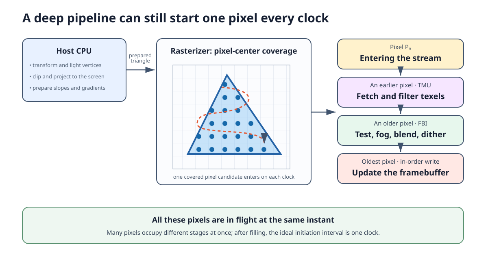
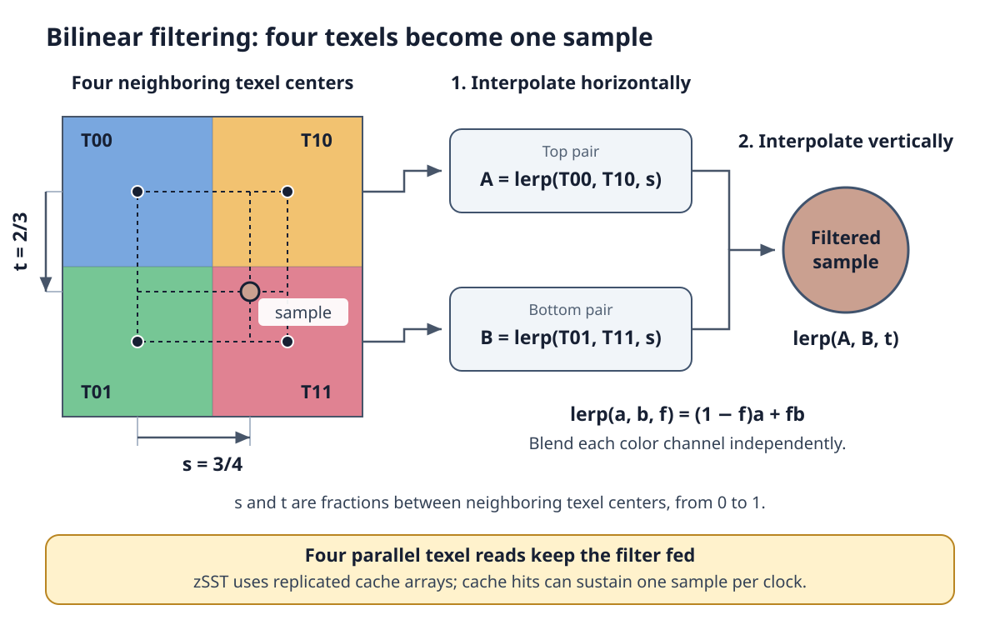
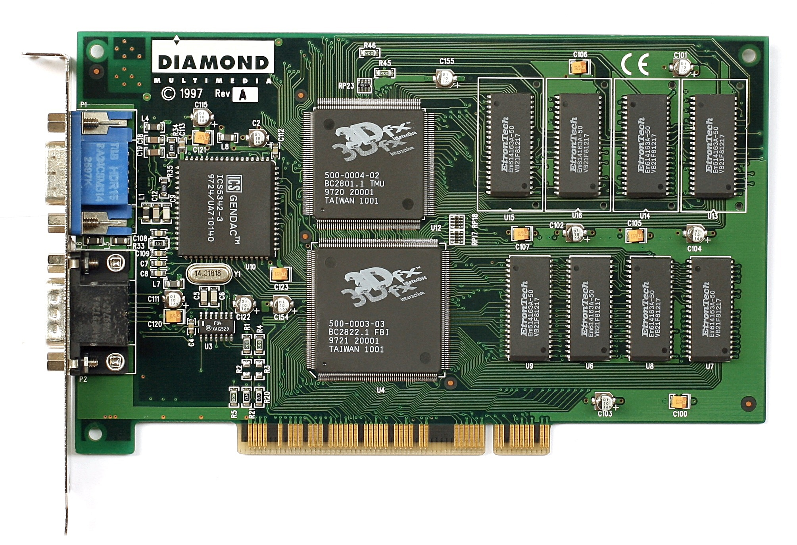
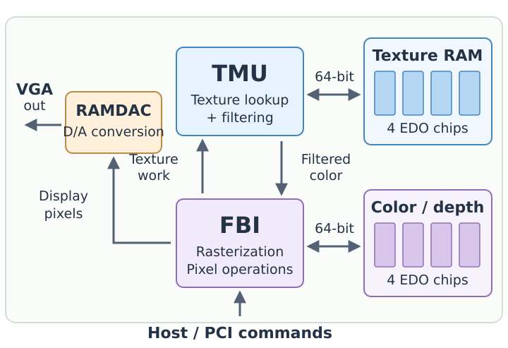
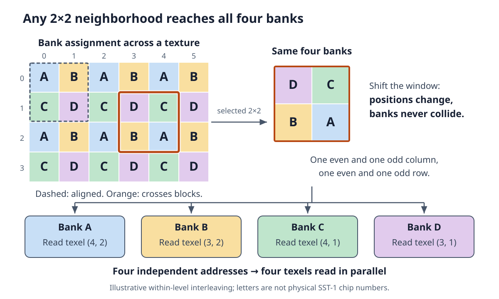
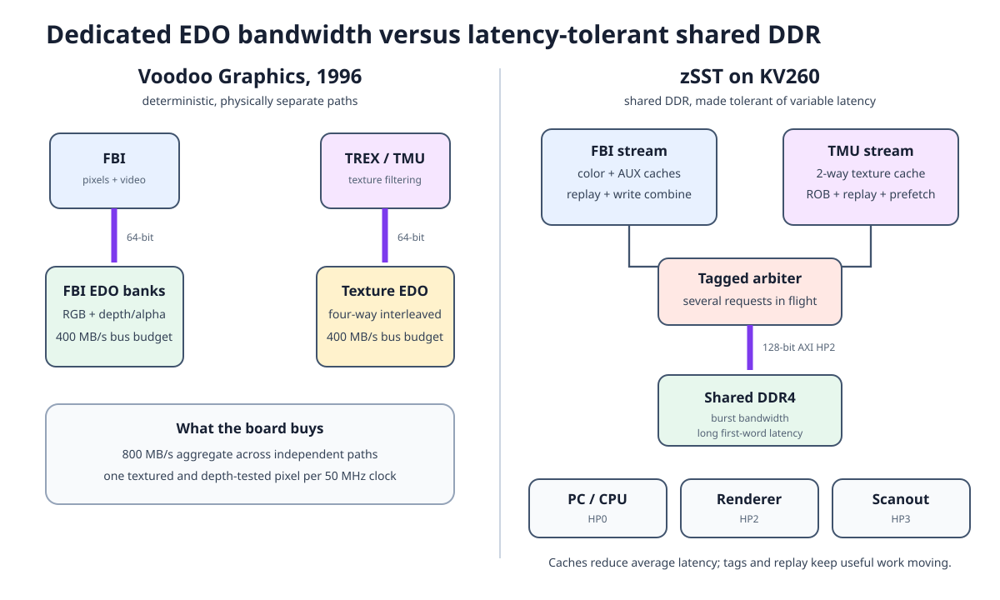
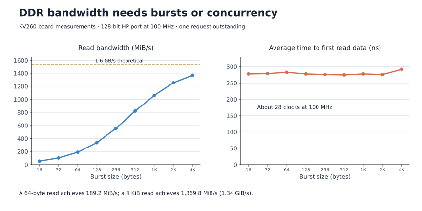
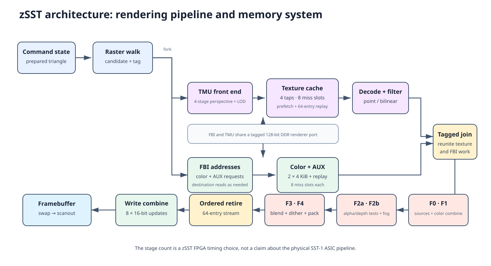

I've spent the last month adding features and improving performance in
[z486_MiSTer](https://github.com/nand2mario/z486_MiSTer), mostly working through
games from the first half of the 1990s. Looking a few years ahead brought me
to another change I wanted to explore: the arrival of 3D graphics cards.

The first one that left a strong impression on me was the Voodoo. The game was
*Need for Speed II SE*. Smooth textures, fog, and the speed of the whole thing
made it feel like a new generation of PC gaming. Could I recreate that on an FPGA
now that the z486 CPU exists?

The result of this detour is [zSST](https://github.com/nand2mario/zSST), a
SystemVerilog implementation of the 3dfx Voodoo Graphics, or SST-1.
Combined with my z486 CPU and the surrounding PC hardware, it forms
[z486 XL](https://github.com/nand2mario/z486_XL): a DOS PC with Voodoo graphics
running in the programmable logic of a Xilinx KV260 board. Tomb Raider now runs
with its original 3dfx renderer.

<!--more-->

<div id="demo-images" style="display: flex; flex-wrap: wrap; gap: 16px; align-items: start; margin: 28px 0;">
<figure style="flex: 1 1 260px; min-width: 0; margin: 0;">

<figcaption style="text-align: center;">zSST rendering the Utah teapot in simulation.</figcaption>
</figure>
<figure style="flex: 1 1 260px; min-width: 0; margin: 0;">

<figcaption style="text-align: center;">Tomb Raider on the complete FPGA PC.</figcaption>
</figure>
</div>

zSST implements most of the central Voodoo features: prepared triangles,
texture filtering and mipmapping, depth and alpha tests, fog, blending,
dithering, framebuffer access, and buffer swaps. It supports both the
fixed-point and floating-point setup interfaces. Hardware game testing is
still concentrated on Tomb Raider; broader compatibility and later Voodoo
generations are work for another day.

The CPU and renderer run at 100 MHz on the
[KV260](https://www.amd.com/en/products/system-on-modules/kria/k26/kv260-vision-starter-kit.html).
That board has enough logic, DSP blocks, on-chip memory, and DDR bandwidth for
the combined design. The DE10-Nano does
not have room for this graphics addition. The KV260 uses its onboard DDR;
there is no external SDRAM module to add.

## Starting from the programming model

Fortunately, there is plenty of material to work from. 3dfx released the Glide source
in 1999, before NVIDIA acquired its core graphics assets in December 2000.
The surviving [Glide source](https://github.com/sezero/glide) and
[SST-1 specification](https://bitsavers.computerhistory.org/components/3dfx/Voodoo1_SST-1_Spec_r1.61_199912.pdf)
explain how software prepares triangles, configures the pixel pipeline, and
manages textures and framebuffers.

The specification is a behavioral target, rather than a circuit diagram.
It tells what should happen when software writes a register, but leaves
many implementation choices open. [86Box](https://github.com/86Box/86Box)
provides useful references for complicated rendering behavior. The earlier
[MAME Voodoo work](https://aarongiles.com/programming/war-mame/) is another
part of this preservation history.
[SpinalVoodoo](https://github.com/fayalalebrun/SpinalVoodoo) supplied particularly
useful Glide traces and reference screenshots for testing.

## From triangles to 3D, one pixel per clock

Voodoo Graphics turns triangles into pixels, leaving much of the 3D work to
the host CPU. Its command interface is surprisingly compact: five main
command registers drive the accelerator.

| Register | Action |
| --- | --- |
| `triangleCMD` | Start rendering a prepared triangle. |
| `ftriangleCMD` | Start a triangle through the floating-point setup interface. |
| `nopCMD` | Flush the pipeline; optionally reset the statistics counters. |
| `fastfillCMD` | Clear a clipped rectangle of color and/or depth data. |
| `swapbufferCMD` | Switch the displayed buffer, immediately or synchronized to vertical retrace. |

Both triangle commands launch the same rendering pipeline. Other registers
hold coordinates, gradients, and render state, while memory-mapped regions
provide texture uploads and direct framebuffer access. The main drawing
primitive is simply a prepared triangle.

For game developers, Glide presents a friendlier interface:

```c
void grDrawTriangle(const GrVertex *a, const GrVertex *b, const GrVertex *c);
```

Before this call, the host CPU transforms the 3D geometry, computes vertex
lighting, clips it, and projects it onto the screen. Glide then prepares the
screen-space triangle and its parameter gradients—the increments used to
interpolate values across its surface—and writes the triangle command to
start rendering. Unlike later GPUs such as the GeForce 256, SST-1 has no
hardware transform-and-lighting engine.

That still leaves plenty of work for the accelerator. The rasterizer finds
which pixel centers lie inside the triangle and interpolates their color,
depth, and texture coordinates. The texture unit fetches and filters texels;
the framebuffer unit combines colors, applies visibility tests and fog,
blends with the existing image, and writes the result.

<figure style="margin: 28px auto;">

<figcaption style="text-align: center;">A pixel takes several stages to finish, while new pixels can keep entering.</figcaption>
</figure>

The original card divides this work between two ASICs: the **FBI**, or Frame
Buffer Interface, and **TREX**, the texture mapping unit, usually called the
TMU. At a 50 MHz graphics clock, the advertised peak is one textured,
depth-tested output pixel per clock: 50 million pixels per second.

One pixel per clock does not mean that a pixel finishes in one clock. It means
that different stages can work on different pixels simultaneously: while one
pixel is being textured, an earlier one can be blended and another written
out. Once the pipeline is full, it can ideally accept and finish a pixel
every clock, provided memory keeps up.

That is the appeal of a fixed-function pipeline. A software renderer executes
many instructions for each pixel; dedicated hardware overlaps that work across
a steady stream of pixels. Voodoo brought richly textured 3D games to life at
a fluid 30 FPS or more—a big part of what made it so popular.

## Building the pixel pipeline

Compared with an x86 CPU, the arithmetic path is pleasantly regular. Let's
follow a pixel from its interpolated parameters through texturing and color
operations to the framebuffer, starting with how the numbers are represented.

### Fixed point behind a floating-point interface

Floating-point arithmetic is central to modern GPU programming. SST-1 sits at
an interesting transition: software can submit floating-point values, but the
rendering machinery largely operates in fixed point—integers with an implicit
scale factor.

| Setup value | Fixed-point register format |
| --- | --- |
| Screen X and Y | 12.4 |
| Red, green, blue, alpha | 12.12 |
| Depth Z | 20.12 |
| Texture S/W and T/W | 14.18 |
| Reciprocal W | 2.30 |

Here `12.4` means twelve bits before the binary point, including the sign,
and four fractional bits. A screen coordinate of 10.5 is therefore stored as
the integer 168: multiply by 16 to encode it, divide by 16 to recover the
value. Those fractional bits let the rasterizer handle vertices between pixel
centers.

The `fvertex`, `fstart`, and floating-point gradient registers accept IEEE
single-precision values. SST-1 converts them into its internal fixed-point
representation, and zSST follows that contract. Once the triangle is prepared,
advancing along a scanline mostly means adding a precomputed increment to each
interpolated parameter. Much of the pixel-by-pixel work becomes simple integer
addition.

### Four texels for one pixel

For perspective-correct texturing, the TMU interpolates S/W, T/W, and 1/W,
then divides the first two by the third to recover texture coordinates. This
keeps a floor or wall texture in perspective as the surface recedes. The TMU
also selects a [mip level](https://en.wikipedia.org/wiki/Mipmap): a smaller
version of the texture for pixels that cover a larger area of its surface.
This reduces aliasing and shimmering in the distance.

Bilinear filtering then combines four neighboring texels—the pixels of the
texture—around the sample position. First blend the top pair horizontally,
then the bottom pair, and finally blend vertically between those two results.
The fractional position determines the weights, producing a smooth transition
between texel colors instead of an abrupt jump from one to the next.

<figure style="margin: 28px auto;">

<figcaption style="text-align: center;">Four texture reads produce one filtered sample.</figcaption>
</figure>

In zSST, a four-stage front end pipelines the perspective and level-of-detail
calculations. Address generation and cache lookup supply the texels, and two
registered decode stages turn their stored formats into colors for filtering
and texture combining. Palette-based and NCC-encoded textures need different
decoding rules, but ultimately feed the same pixel stream.

### Color, tests, fog, and blending

Once texture and framebuffer data are available, zSST's FBI pixel path uses
six registered stages:

| Stage | Main work |
| --- | --- |
| F0 | Select sources, check chroma key, prepare Z/W depth values. |
| F1 | Apply the color and alpha combine functions. |
| F2a | Test alpha/depth and look up the fog factor. |
| F2b | Apply fog. |
| F3 | Reconstruct destination color and perform alpha blending. |
| F4 | Convert to framebuffer precision, dither, and apply write masks. |

These stage boundaries are chosen to meet the FPGA's clock target. The SST-1 specification
describes the operations but does not reveal the original ASIC's exact
pipeline registers. Splitting fog lookup from fog application, for example,
keeps a long arithmetic path out of a single clock while retaining the ability
to accept one pixel per clock.

The result is written to the back buffer. A retrace-synchronized buffer swap
then displays the finished image without switching buffers halfway through scanout.
The original Voodoo was a 3D-only add-on, passing the ordinary VGA card's output
through when inactive. z486 XL makes the analogous selection between the PC's
VGA output and zSST's display output inside the FPGA system.

## The hard part: feeding it from memory

The zSST pixel pipeline proved relatively straightforward to implement,
at least compared with z486's CPU pipelines. Keeping it fed turned out to be
much harder. A bilinear sample needs four texels from separate addresses.
A depth-tested, blended pixel also needs the existing depth and color, followed
by writes of the new values. Performing those accesses one at a time quickly
destroys throughput. I ended up spending more time designing, tuning, and
debugging the memory system than the arithmetic pipeline.

### How the original card supplied the pixels

<figure id="voodoo-board" style="margin: 28px auto;">
<div style="display: flex; flex-wrap: wrap; gap: 16px; align-items: center;">
<a href="diamond-monster3d-voodoo1.jpg" style="flex: 1 1 280px; min-width: 0;"></a>
<a href="voodoo-board-schematic.svg" style="flex: 1 1 280px; min-width: 0;"></a>
</div>
<figcaption style="text-align: center;">
The board and its division of labor, with matching chip positions in both views. Connections are schematic; click either image to enlarge.<br>
<small>Photo: Konstantin Lanzet; crop: Pittigrilli, <a href="https://commons.wikimedia.org/wiki/File:KL_Diamond_Monster3D_Voodoo_1.jpg">Wikimedia Commons</a>.
Photo license: <a href="GFDL-1.2.txt">GFDL 1.2 or later</a>. Schematic: nand2mario.</small>
</figcaption>
</figure>

The division of labor is visible on this Diamond Monster 3D. The upper 3dfx
chip is the **TMU**, the lower one the **FBI**, each with four EDO RAM chips to
its right. The upper group holds textures; the lower group holds color and
depth/alpha buffers.

FBI and TMU each have a dedicated 64-bit memory path. On the texture side,
four-way interleaving lets the banks read independent addresses, supplying the
four neighbors for bilinear filtering in parallel. The
[specification (p. 13)](https://bitsavers.computerhistory.org/components/3dfx/Voodoo1_SST-1_Spec_r1.61_199912.pdf#page=13)
promises the same throughput as point sampling, without storing duplicate texels.

But what if two neighboring texels land in the same chip? The trick is to
distribute texels in a repeating two-dimensional pattern, rather than split
the image into four large regions. Assign a bank to each combination of even
or odd column and row, and the reason becomes clear:

<figure style="margin: 28px auto;">
<a href="texture-bank-interleave.svg"></a>
<figcaption style="text-align: center;">Moving the sample changes the banks' positions, not their number. Coordinates are (column, row); bank letters illustrate the principle, not physical SST-1 chip numbers.</figcaption>
</figure>

Every 2×2 window contains A, B, C, and D—even the orange window crossing both
horizontal and vertical block boundaries. Two consecutive columns have
opposite parity, as do two consecutive rows. All four combinations occur
exactly once, so each bank supplies one texel with no conflict.

Texture edges and small mip levels need a little more care. SST-1 uses
power-of-two texture dimensions, so wrapping preserves the alternating
pattern for dimensions of two or more. At clamped edges, or in mip levels
only one texel wide or high, some samples reuse the same texel. The central
insight remains: fast bilinear filtering depends on arranging memory so that
the arithmetic receives all its inputs together.

The FBI applies a similar idea to color and depth/alpha memory. Its interleaved
path supports a peak of one rendered pixel per clock, or two pixels per clock
for clears. Working on adjacent pixels together spreads the read/write cost
across a scanline. Fabien Sanglard's
[two-pixel explanation](https://fabiensanglard.net/3dfx_sst1/) offers a useful
reconstruction of this behavior, though the exact ASIC bank schedule is not
documented in the programming guide.

At 50 MHz, each 64-bit path has a theoretical bandwidth of 400 MB/s: 800 MB/s
in total, but reserved for different jobs. The TMU cannot borrow idle FBI
bandwidth, or vice versa. These dedicated buses and carefully arranged banks
remind me of the NES- and SNES-era designs I explored in projects such as
[SNESTang](/posts/2024/snes_design_0.3/): getting the most out of memory means
designing around exactly when and where each value is needed.

### What changes on an FPGA SoC

Voodoo's memory layout explains how it kept the pipeline busy, but I cannot
simply transplant that design to the KV260. The board has much more memory
bandwidth, yet no dedicated EDO memory attached to either rendering unit.
Instead, the FPGA accesses shared DDR through the Zynq processing system's
AXI ports. Linux, the FPGA PC, and display scanout all compete for that memory.
The goal is the same—keep the pixel pipeline fed—but the way to achieve it
has to change.

<figure style="margin: 28px auto;">

<figcaption style="text-align: center;">Original SST-1 has dedicated texture and framebuffer buses. zSST shares its renderer port and uses buffering to tolerate DDR latency.</figcaption>
</figure>

Our KV260 measurements show why bandwidth alone is not enough. A 128-bit port
at 100 MHz has a theoretical bandwidth of 1.6 GB/s. With one request outstanding,
a 4 KiB read reaches 1,370 MiB/s, but a 64-byte read reaches only 189 MiB/s.
The first data typically takes about 280 ns to arrive—roughly 28 clocks at
100 MHz—with occasional much longer waits.

<figure style="margin: 28px auto;">

<figcaption style="text-align: center;">Single-outstanding board measurements. Long bursts amortize latency; small requests need concurrency.</figcaption>
</figure>

A renderer that waits for each small read before issuing the next will spend
most of its time idle. zSST needs enough independent work in flight to cover
those waits.

### Caches, replay, and a reorder buffer

Keeping the pipeline fed requires both fewer DDR accesses and less time spent
waiting for them. The first step is **caching**. Nearby screen pixels often
sample overlapping parts of a texture, so recently fetched texels can be reused
from on-chip RAM. zSST's texture cache holds 8 KiB in 64-byte lines; each fetch
also brings in neighboring texels that subsequent pixels are likely to need.

A cache miss still takes many clocks, but independent texture samples need
not wait for it. zSST keeps up to eight cache-line fetches outstanding, using
a **replay queue** to park samples with missing data and retry them when it
arrives. Meanwhile, samples whose texels are already cached can proceed.
Prefetching gets a head start on future reads.

Now a later cache hit can finish before an earlier miss. A 64-entry
**reorder buffer**, or ROB, collects those results and releases them in their
original order. The principle is familiar from CPUs: do useful work during a
long wait, then restore order before passing the results downstream.

The framebuffer side uses separate 4 KiB color and depth/alpha read caches,
while write combiners pack neighboring 16-bit updates into 128-bit requests.
Here, ordering matters: blending or depth testing may need a value that an
earlier pixel has changed but not yet written to DDR. Forwarding supplies the
pending value directly. Framebuffer updates take effect in order, and state
changes that require completed work wait for it to drain. Memory requests can
overlap, but later pixels must still see the effects of earlier ones.

<figure style="margin: 28px auto;">

<figcaption style="text-align: center;">Caches reuse nearby data; queues overlap memory requests; ordered retirement preserves the result.</figcaption>
</figure>

FBI and TMU share the renderer's 128-bit AXI port, HP2. The PC uses HP0 and
display scanout uses HP3, keeping their request queues separate even though
all three ultimately share DDR.

## Evaluation results

I measure the renderer separately from the complete PC. The simulation
benchmark sends commands through zSST's front end and exercises the TMU, FBI,
shared arbiter, and a DDR timing model. Read data arrives after at least 26
clocks, with deterministic variation and occasional longer delays; writes are
also rate-limited. The full-renderer tests allow 32 outstanding reads.

At 100 MHz, zSST reaches 78.5 million pixels per second (MPix/s) for textured
triangles, and 72.8 MPix/s with depth testing and blending. Voodoo 1's published
estimates at its native 50 MHz are 43 and 37 MPix/s for comparable feature
sets. This is not an apples-to-apples benchmark: the triangle workloads differ,
and the original estimates also include fog, mipmapping, and Gouraud shading.
I do not have a Voodoo 1 to run the same test on both. The comparison shows
the approximate fill-rate range, not a measured speedup over the original card.

<figure style="margin: 28px auto;">

<figcaption style="text-align: center;">100 MHz zSST simulation versus the published 50 MHz SST-1 estimates. The tests cover similar feature classes, but use different workloads.</figcaption>
</figure>

High fill rates do not automatically translate into high game FPS. On the
board, Tomb Raider Level 2 produced 237 displayed buffer swaps in about 20
seconds—roughly 12 per second, measured from swaps rather than an engine FPS
counter. Preliminary measurements point to a CPU bottleneck: it still has to
run the game, prepare geometry, and submit commands. Shared DDR contention
may also contribute. There is plenty left to optimize in the complete machine.

For non-Voodoo games, the current 100 MHz z486 XL runs maximum-detail Doom at
38.5 FPS and Quake 1.06 at 8.1 FPS. That is roughly 20% faster than the 85 MHz
DE10-Nano build—about 23% for Doom and 19% for Quake. A 512 KiB write-back L2
cache in UltraRAM helps the CPU make better use of DDR.

In the integrated XCK26 build, zSST accounts for about 29,500 LUTs, 28,100
flip-flops, 14 RAMB36 blocks, 8 RAMB18 blocks, and 97 DSP slices. The combined
PC and graphics design meets timing at 100 MHz.

## Closing

The rewarding part is seeing original Glide software drive hardware I built
in RTL. I expected the rendering arithmetic to be the hard part; getting data
to it efficiently took more work. Voodoo's carefully interleaved EDO and
zSST's caches and queues solve the same problem under very different
constraints: a fast pixel pipeline is only useful when it has something to do.

Both [zSST](https://github.com/nand2mario/zSST) and
[z486 XL](https://github.com/nand2mario/z486_XL) are available open source.
If you already have a KV260, the
[z486 XL SD image](https://github.com/nand2mario/z486_XL/releases/tag/z486_XL_20260906)
provides the Linux support and application needed to launch your own DOS disk
images.

**Credits**: Thanks to
[SpinalVoodoo](https://github.com/fayalalebrun/SpinalVoodoo) for the Glide traces
and reference screenshots, and to [86Box](https://github.com/86Box/86Box) for
its implementation references. Fabien Sanglard's
[The story of the 3dfx Voodoo1](https://fabiensanglard.net/3dfx_sst1/) is an
excellent introduction to the original card's memory system.
