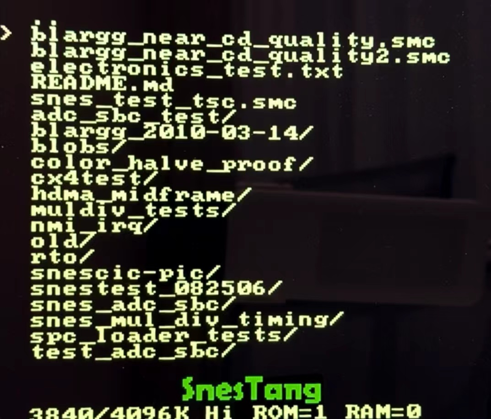
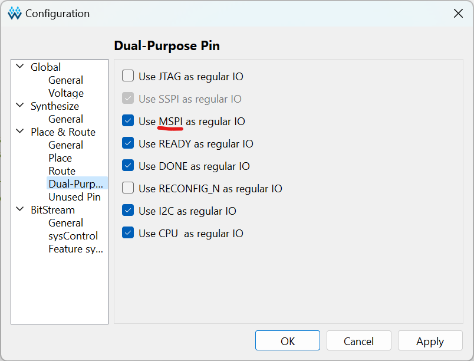
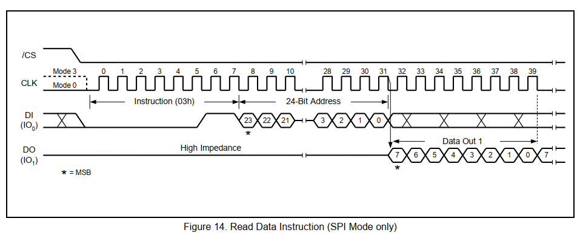
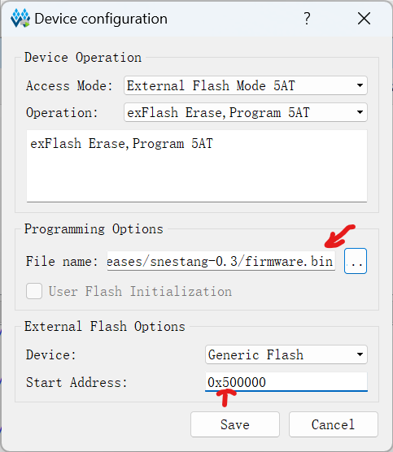

In [part 1](/posts/softcore_for_fpga_gaming), we discussed why we need a softcore for SNESTang, and how it can use SDRAM in a way that does not disrupt the gaming core. Now we need to provide a firmware program to to make the softcore useful, like displaying a menu. In this part, let's explore the building and loading of the RISC-V firmware to get the soft core to do useful work.

<!--more--> 


{width="400"}

## RISC-V and building the firmware

First, a few words about the choice of RISC-V. There are many softcore or soft SoC choices for FPGAs. We chose RISC-V mostly for the maturity of its toolchain. C compilers, binutils and other toolchain items are [readily available](https://xpack.github.io/dev-tools/riscv-none-elf-gcc/) for Windows, Linux and Mac. Not only are they well maintained, they also implement the extensibility of RISC-V very well. Here we choose RV32I, the smallest variant of RISC-V architecture. "I" means integer, meaning no hardware floating point support. We could have chosen the popular RV32IMC. The "M" extension supports multiplication and division instructions. The "C" extension supports shorter 16-bit-wide instruction words instead of uniform 32-bit-wide ones, in the style of ARM Thumb. These are nice things to have. But given the importance of small size for us, and our tolerance for slower speed, we opted for the smallest RV32I. The nice thing then, is that the RISC-V GCC picks up the slack, automatically providing things like multiplication and division routines, making the underlying architectural complexities transparent to the firmware developer, who simply develops in plain C.

Here is the commands to compile and link a C source file using the [xpack RISC-V GCC](https://xpack.github.io/dev-tools/riscv-none-elf-gcc/), using the RV32I architecture, and ILP32 ABI.

```
riscv-none-elf-gcc -mabi=ilp32 -march=rv32i -ffreestanding -c -o firmware.o firmware.c
riscv-none-elf-gcc -Wl,--build-id=none,-Bstatic,-T,baremetal.ld,--strip-debug -mabi=ilp32 -march=rv32i -ffreestanding -nostdlib -o firmware.elf firmware.o start.o -lgcc
```

There are additional details like the linker control script (`baremetal.ld`) and start-up stub (`start.o`). The interested reader can refer to source code linked to at the end of the article.

The bigger benefit of a standard toolchain is of course the utilization of open source libraries. For instance, the excellent [FatFS](http://elm-chan.org/fsw/ff/00index_e.html) library now provides FAT file system support for SNESTang, making it easy to finally supports exFAT for SD cards larger than 32GB.

## Loading the firmware

Now let us discuss the storage and loading of the firmware. The current version of SNESTang firmware, with a basic menu and FAT fs support, is a ~60KB binary file. So it fits nicely in the SDRAM space that is max 8MB. However, at boot time, the firmware has to come from somewhere.

One obvious place where the firmware can be stored is the SD card. It is feasible to implement a booting process for the SD card. After all, that is how most computers boot, from a disk storage device. If you look at the GRUB boot loader for Linux. It involves 3 stages. The hardware loads the GRUB 1st-stage in MBR (Master-Boot-Record, i.e. sector 0), which in turns loads the larger 2nd-stage. And the 2nd-stage finds the Linux kernel on disk and loads that into memory, and finally hands over control to the kernel. This 3 stage process is necessary because the MBR is very small and cannot hold enough code to finish the whole booting process. 

It turns out there is a simpler solution. The Tang Primer 25K board, and most other FPGA boards, use a SPI flash chip (referred to as the "configuration memory") to store the FPGA bitstream. When the board is powered up, the FPGA loads the bitstream from address 0 of the SPI flash. As for Tang Primer 25K, the bitstream is slightly less than 1MB in size, and the SPI flash is an 8MB one. Once the FPGA is booted, it technically no longer needs the SPI flash. And the nice thing is that there is support in the Gowin tools to allow usage of the rest of the flash space. So we will just store the firmware there as a continuous blob and load it into SDRAM once the FPGA is up. Other FPGAs like Xilinx also supports [user data in configuration memory](https://support.xilinx.com/s/question/0D52E00006hpKdoSAE/storing-user-defined-data-in-a-configuration-flash-memory?language=en_US) so this approach probably also applies.

The SPI flash pins are called "MSPI pins". First they need to be enabled.


{width="500" class="center"}

According to the [datasheet](https://www.winbond.com/hq/product/code-storage-flash-memory/serial-nor-flash/?__locale=en&partNo=W25Q64FW), SPI flash data can be streamed with the `03h` (READ) instruction,


{width="800" class="center"}

So we wrote a simple controller that sends a single READ command to the flash chip to read in the firmware bytes.

```verilog
SPI_Master spi (
  ...
  .i_TX_DV(spi_start), 
  .o_TX_Ready(spi_ready),
  .i_TX_Byte(data_in), 
  .o_RX_Byte(data_out)
);

always @(posedge clk) begin
    ...
    case (state) 
    2'd0: if (start) state <= 2'd1;
    2'd1: if (~spi_start && spi_ready) begin     // send READ (03h) command
        cnt <= cnt + 1;
        spi_start <= 1;
        case (cnt[2:0])
        3'd0: data_in <= 8'h03;
        3'd1: data_in <= ADDR[23:16];
        3'd2: data_in <= ADDR[15:8];
        3'd3: data_in <= ADDR[7:0];
        3'd4: begin
            // start receiving first byte
            state <= 2'd2;
            cnt <= 1;
            data_in <= 0;
        end
        default: ;
        endcase
    end
    2'd2: if (~spi_start && spi_ready) begin    // read back LEN bytes
        cnt <= cnt + 21'd1;
        if (cnt == LEN) begin
            state <= 2'd3;
            busy <= 0;
        end
        spi_start <= 1;
        dout <= data_out;
        dout_strb <= 1'b1;
    end
    ...
    endcase
end
```

Then we use the `dout` and `dout_strb` strobe signals to write the firmware to softcore SDRAM. When `busy` goes low, the softcore is ready to start.

The last piece of the puzzle is how we get the bits into the SPI flash. There are probably multiple ways to do it. But one straightforward way is just to use the Gowin Programmer. In the device configuration dialog for flash programming, there are options to specify an arbitrary binary file and an address in the flash memory. 


{width="400" class="center"}

So that is the only additional complexity for the end user, instead of one, she now flashes two files to the board.

## Conclusion

This concludes the two-part article. We explored the place of a RISC-V softcore in FPGA retro gaming, how to use SDRAM as its main memory, application of the RISC-V toolchain and finally firmware loading. In the end, I believe softcores provides a viable alternative to the hardened ARM core solution in MiSTer, and the discreet ARM MCU solution in MIST.

If you are curious to read the actual source code, the softcore and its peripherals are in the [iosys](https://github.com/nand2mario/snestang/tree/main/src/iosys) dir, and the SNESTang firmware is [here](https://github.com/nand2mario/snestang/tree/main/firmware).

