The Pentium Pro (P6) translates complex x86 instructions into simpler,
RISC-like micro-operations (µops), executes them out of order, and retires them
in program order. That combination made it a much more complex machine than
the 486 or original Pentium. The basic P6 pattern, including µop translation, register
renaming, out-of-order scheduling, and in-order retirement, continues in many
later Intel cores till today.

This page follows those µops through the P6's overlapping pipelines, from
fetching instruction bytes to committing results. The two main sources are
Shen and Lipasti's [*Modern Processor Design*, Chapter 7](https://www.waveland.com/browse.php?t=624)
and Intel's P6-era patents. The book gives the overall organization; the
patents add module interfaces and stage timing.

P6 has several concurrent pipelines. Its in-order front end feeds a queue; the
rename and allocation stages place µops into the reservation station and
reorder buffer. Execution, memory and result writeback overlap, while retirement
commits results in program order. Queues and result buses connect these paths.

[TOC]

The stage numbers group **1x** work around fetch/decode, **2x** around
rename/allocation and **3x** around dispatch/execution.

For a quick visual tour of the P6 chip, and its various blocks (RS, ROB, RAT, and ...), see
[P6 ROMs and PLAs](roms).

## Reading the pipeline diagrams

| Source | Content |
| --- | --- |
| [Chapter 7 §7.2.1 / Fig. 7.4](https://www.waveland.com/browse.php?t=624) | Whole machine, pipeline overview |
| [US5721855](https://patents.google.com/patent/US5721855A/en) Fig. 5, 9–11, 13, 15, 17a | IFU 11–14, ID 15–16 (and ID-side 17H/17L immediates), BAC 14–17, RAT/RS/ROB 21–22 |
| [Chapter 7 §§7.2.2–7.2.3, 7.4–7.5](https://www.waveland.com/browse.php?t=624) | RS 31–32, execution 33+, memory 40–43, writeback 81–83, retirement 91–93 |
| [US5721855](https://patents.google.com/patent/US5721855A/en) Figs. 14–17c, 23–24, 29–30 | RS, execution, ROB writeback, AGU/DCU/MOB and retirement half-cycle detail |
| [US5559974](https://patents.google.com/patent/US5559974A/en) | What 15/16 compute (Cuop + aliases → Auop) |
| [US5630083](https://patents.google.com/patent/US5630083A/en) | ILD marks and steering into 15 |
| [US5673427](https://patents.google.com/patent/US5673427A/en) Fig. 6 | Main/shadow queues, immediate bypass and post-queue integer constant ROM |

## Pipeline stages at a glance

The main blocks are the instruction fetch unit (IFU), instruction decoder
(ID), register alias table (RAT), reservation station (RS), reorder buffer
(ROB), real register file (RRF), and memory ordering buffer (MOB). The branch
target buffer (BTB) and branch address calculator (BAC) steer fetch before a
branch reaches an execution unit. Other names appear with their diagrams below.

| Stage | Name | Work |
| --- | --- | --- |
| 11 | NextIP | Pick the linear fetch address from sequential, BTB, BAC, JEU |
| 12 | ICache1 (and BTB start) | Start I-cache, ISB, IVC, ITLB, and the two-cycle BTB |
| 13 | ICache2/ILD (and BTB complete) | Continue cache read; mark instruction boundaries; receive BTB prediction |
| 14 | ICache3/Rotate (and write the IFBR) | Rotate a 16-byte marked window into the ID input buffer |
| 15 | ID0 — steer, XLAT, start MSROM | Steer bytes; XLAT PLA emits Cuops; field extractor supplies MAR fields |
| 16 | ID1 — alias mux and ID output queue | Resolve aliases into Auops and enqueue them |
| 17 | Branch decode | BAC validation, static prediction and RSB write; aligns with 21 |
| 20 | Exit ID queue | Dequeue up to three µops toward RAT/ALLOC (Chapter 7 Fig. 7.4 only) |
| 21 | RAT / ALLOC / RS1 / ROB1 | Rename, allocate ROB/RS/MOB, write RS PSrc/control (`21L`) |
| 22 | ROB read / RS2 | Read ROB/RRF sources; write RS data (`22L`); in-order → OoO |
| 31–32 | reservation-station schedule and dispatch | Select ready µops (`31H/31L`), then read/bypass operands and dispatch (`32H/32L`) |
| 33 and later | execution | Execute simple integer and AGU work; multicycle operations continue |
| 40–43 | memory and blocked-load retry | Wake and re-dispatch blocked loads (`40–41`); access DTLB and DCU (`42–43`) |
| 81–83 | result-bus scheduling and writeback | Arbitrate result buses (`81–82`); broadcast PDst, data, flags or events (`83`) |
| 91–93 | in-order retirement | Feed back the pointer (`91`), read/qualify oldest entries (`92`), then handle events/IP and write RRF (`93`) |

## The whole pipeline

<figure markdown="1">

[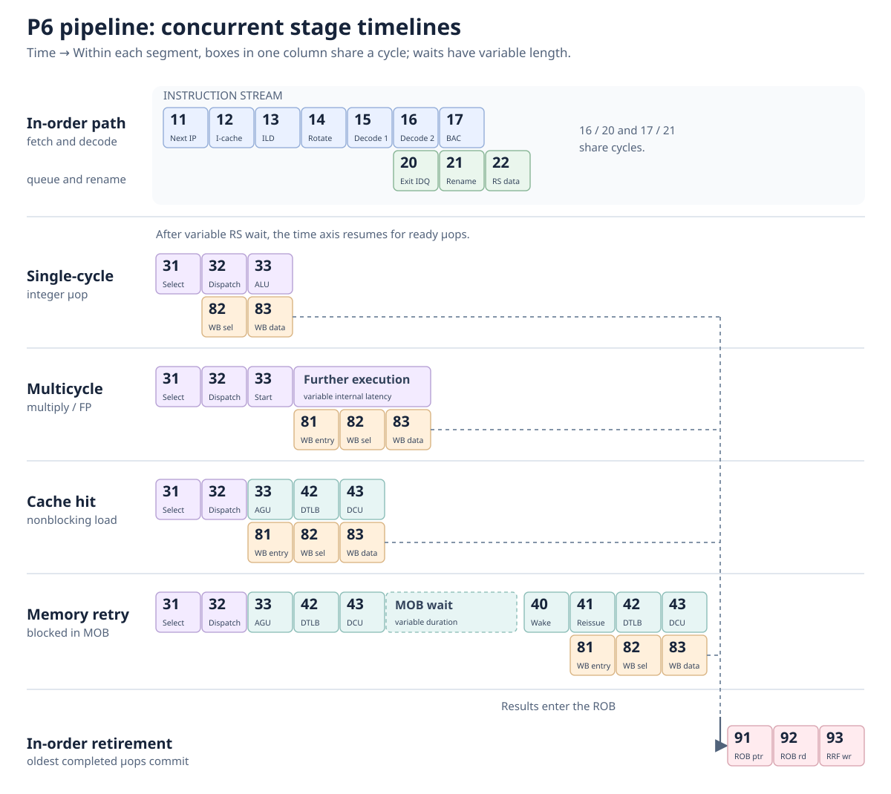](img/p6-pipeline-overview.svg)

<figcaption>P6 pipeline overview. Aligned boxes share a cycle within each segment; RS and MOB waits have variable length.</figcaption>

</figure>

Fetch, decode and rename proceed in order. The reservation station can hold a
µop while its operands or execution port are unavailable; memory operations
may also wait or retry. Writeback supplies the ROB, while retirement commits
completed work in program order. These paths overlap rather than following a
single fixed-length sequence.

## 11 NextIP

The IFU selects the linear address of the next cache access from competing
requests: sequential IP, a previous BTB prediction, a BAC correction, or a JEU
redirect ([US5721855 Fig. 5](img/us5721855-fig5.png); Chapter 7 §7.2.1 /
§7.3.1). It schedules that request for service in 12.

## 12 ICache1 (and BTB start)

The IFU uses the stage-11 address to access ISB, I-cache and IVC. In parallel
the ITLB translates linear→physical and reads the memory type, and the BTB
**starts** its access ([US5721855](https://patents.google.com/patent/US5721855A/en)
Fig. 5 text: pipestage 12 accesses the 32-byte **Instruction Streaming Buffer** (ISB)/I-cache/IVC and the BTB). A miss in
all instruction buffers starts an external fetch.

The BTB takes two clocks. Prediction status and target arrive by the end of
13, after the lookup starts in 12 (Chapter 7 §7.3.2).

## 13 ICache2/ILD (and BTB complete)

I-cache/buffer read continues. The ILD marks instruction boundaries (start,
end, invalid bytes, prefixes) on the bytes from 12. Predicted-branch marks from
the BTB are attached here and travel with the line into the IFBR
([US5721855](https://patents.google.com/patent/US5721855A/en)
Fig. 5: pipestage 13 is “mark instructions”; Chapter 7 §7.3.1: marks plus BTB
prediction marks by the end of 13). Speculative BTB history update is the
stage-13 BTB side (Chapter 7 §7.3.2).

The ILD marks **first opcode** and **last byte** positions ahead of the three
decoders, so steering need not discover all three variable-length boundaries
serially in stage 15. A predicted branch is attached to its last-byte mark,
which also lets ID check that the BTB's target belongs to a real instruction
boundary. See [Chapter 7 §7.3.3](https://www.waveland.com/browse.php?t=624)
and [US5630083](https://patents.google.com/patent/US5630083A/en).

## 14 ICache3/Rotate (and write the IFBR)

The fetched bytes and marks pass through the IFU buffer and rotator as an
instruction-aligned **16-byte window** offered to the ID (**Instruction Buffer & Rotator (IFBR)**) when it
has space ([US5721855 Fig. 5](https://patents.google.com/patent/US5721855A/en);
Chapter 7 §7.3.1).

The buffer retains the stream while ID takes several clocks to consume its
complete instructions. On a predicted-taken branch, ID can **grab** the
target's fetched block before it decodes the branch, keeping that block ready
for the rotator when the branch finally reaches a decoder. This is a separate
timing path from the sequential stream; it prevents a late target request from
turning every predicted branch into a fetch bubble
([Chapter 7 §7.3.3.2](https://www.waveland.com/browse.php?t=624)).

BAC work in 14 is only the BTB-detected call/return assist: send the RSB return
linear address to the BTB and update a TOS pointer
([US5721855 Fig. 11a](img/us5721855-fig11a.png)). The RSB **read** for
decoded CALL/RET is 16; the RSB **write** is 17. 14 is not the full return-stack
lookup.

<figure markdown="1">

[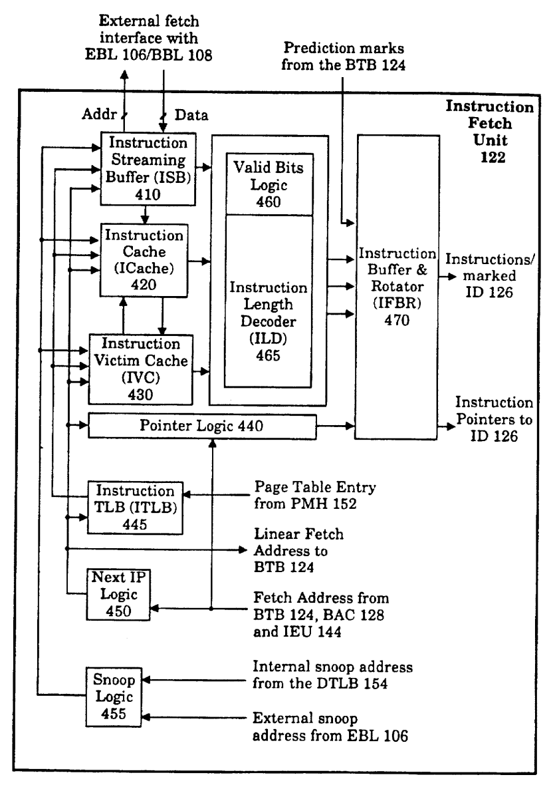](img/us5721855-fig4.png)

<figcaption>US 5,721,855, Figure 4 — Instruction fetch unit.</figcaption>

</figure>

<figure markdown="1">

[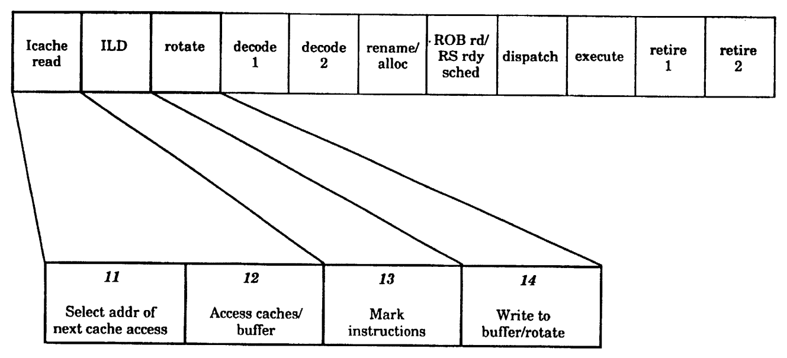](img/us5721855-fig5.png)

<figcaption>US 5,721,855, Figure 5 — instruction fetch stages 11–14.</figcaption>

</figure>

## 15 ID0 — steer, XLAT, start MSROM

Marked bytes in the ID input buffer (IFBR) are aligned and steered to decoder 0 and
the simple decoders. Fig. 9 splits the clock: **15H** steer the macroinstruction;
**15L** XLAT PLAs emit Cuop templates while field locators write immediates,
displacements and register fields into the macro-alias registers
([US5721855](https://patents.google.com/patent/US5721855A/en)
Fig. 9; [US5559974](https://patents.google.com/patent/US5559974A/en)).

MSROM is summoned in this first decode pipestage: form the micro-IP, start the
UROM read, and decode the previous triad’s sequencing for the next clock
([US5721855 Fig. 10](img/us5721855-fig10.png)).

[US5559974 Fig. 5](https://patents.google.com/patent/US5559974A/en)
adds the decoder-0 wiring that the stage diagram omits. Opcode bits address
four XLAT PLAs **and** an entry-point PLA in parallel. The entry PLA can start
the microcode sequencer; three Cuop lanes then select XLAT or UROM output,
while the fourth comes from XLAT. Separately, the field extractor decodes the
instruction bytes, prefixes and mode bits into macro-alias registers (MAR).
This separation explains why reading a Cuop template alone does not supply
its final register numbers, displacement or immediate value. The figure is a
patent embodiment; it does not itself reveal the contents of a particular chip's XLAT or
entry-point PLA.

<figure markdown="1">

[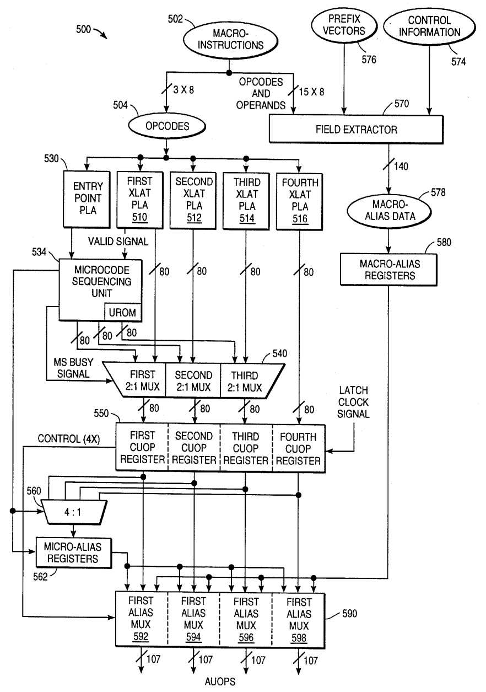](img/us5559974-fig5.png)

<figcaption>US 5,559,974, Figure 5 — Decoder-0 XLAT, entry PLA, MSROM and alias paths.</figcaption>

</figure>

BAC in 15 only latches the current instruction buffer and the BTB’s predicted
target (Fig. 11a).

<figure markdown="1">

[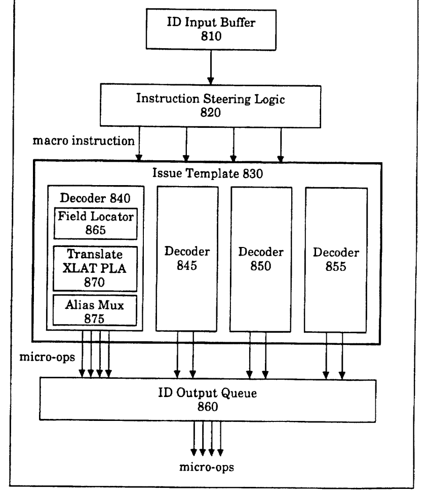](img/us5721855-fig8.png)

<figcaption>US 5,721,855, Figure 8 — Instruction decoder.</figcaption>

</figure>

<figure markdown="1">

[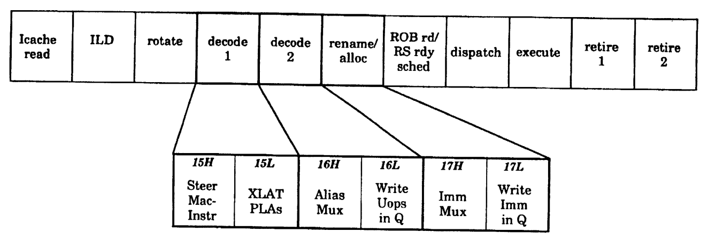](img/us5721855-fig9.png)

<figcaption>US 5,721,855, Figure 9 — instruction decode stages 15–17.</figcaption>

</figure>

<figure markdown="1">

[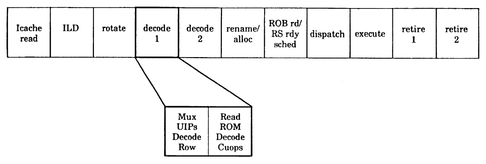](img/us5721855-fig10.png)

<figcaption>US 5,721,855, Figure 10 — microcode sequencing in the first decode stage.</figcaption>

</figure>

## 16 ID1 — alias mux and ID output queue

Alias multiplexers merge Cuops (XLAT or MS) with MAR/UAR fields to form Auops.
Those Auops are written into the ID output queue, which decouples decode from
rename ([US5721855](https://patents.google.com/patent/US5721855A/en)
Fig. 9: 16H alias mux, 16L write µops in Q; Chapter 7 Fig. 7.10 six-entry queue).
Fig. 5 of US5559974 also shows the micro-alias registers (UAR) taking selected
Cuop register fields and feeding them back into later alias muxes. MAR is
instruction-derived; UAR is microcode-flow-derived. This is a control/data
path through the decoder, not an extra scheduled execution µop.

Fig. 9 also shows **17H/17L** immediate mux/write into the same queue. That is
ID-side pipe 17 on the decode segment, concurrent with BAC 17 and rename 21.

BAC in 16 computes branch and fall-through VIP and reads the RSB (Fig. 11a).

## 17 Branch decode

The BAC inspects the decoded instruction: validate the BTB, static-predict an
unpredicted branch, write the RSB (Fig. 11a). On a BAC-detected mispredict it
flushes the in-order front end (11–16) and redirects IFU, without waiting for
JEU/retirement (Chapter 7 §7.2.1).

Stage 17 on the decode segment lines up with stage 21 on the rename segment.
It is not an additional decode pipeline stage.

<figure markdown="1">

[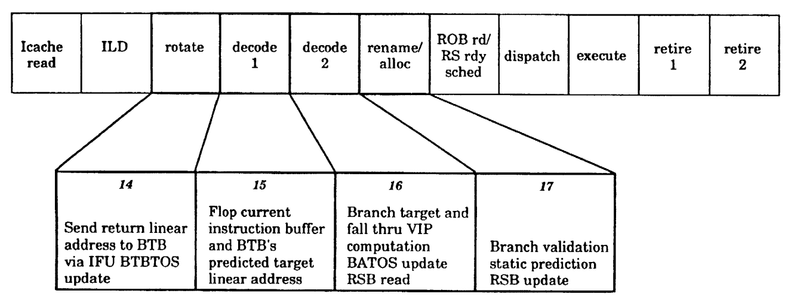](img/us5721855-fig11a.png)

<figcaption>US 5,721,855, Figure 11a — branch address calculation, stages 14–17.</figcaption>

</figure>

## 20 Exit ID queue

Figure 7.4 labels **20: Exit ID queue**. Up to three µops per clock leave the
six-entry queue toward RAT/ALLOC. US5721855 does not label a stage 20: its
Figure 9 shows queue writes in 16L–17L, and Figures 15 and 17a resume at
21H. Stage 20 names that hand-off, rather than another registered ID stage.

The Auop control and its immediate/displacement payload take parallel paths
across this handoff. [US5673427 Fig. 6](https://patents.google.com/patent/US5673427A/en)
shows the **main queue** sending up to three Auops into renaming, while a
**shadow queue** carries their 32-bit immediate candidates one clock later.
Both queues use corresponding slot controls; a stall must hold them together.
The immediate path can select a small Cuop literal, a MAR immediate or
displacement, a macro-branch address or a micro-branch address. At the shadow
queue output, an integer constant-ROM index can be expanded and selected in
place of the literal. This places only three constant-ROM read paths after the
queue instead of six before it. Renamed control and resolved immediates meet
as the µop enters the out-of-order core; the RAT does not rename constants.
The patent's queue widths and timing are a published embodiment, not proof
that the raw Cuop immediate field is itself a full 32-bit value.

<figure markdown="1">

[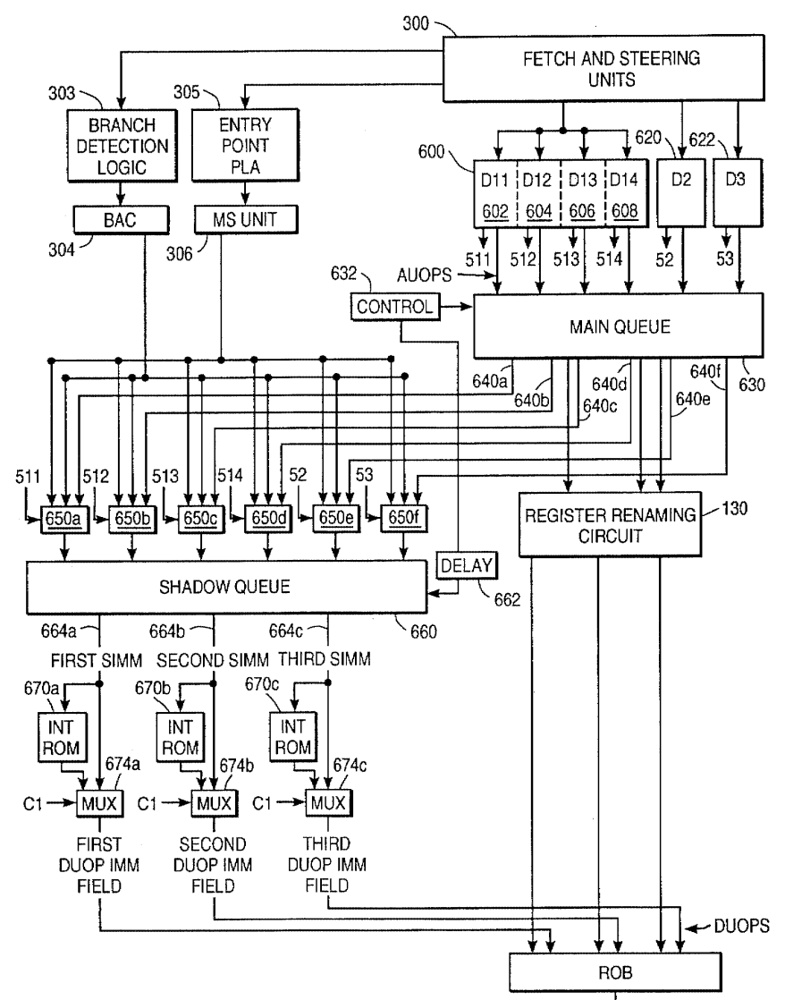](img/us5673427-fig6.png)

<figcaption>US 5,673,427, Figure 6 — Main/shadow queues and constant-ROM path.</figcaption>

</figure>

## 21 RAT / ALLOC / RS1 / ROB1

The RAT maps logical sources/destinations to ROB PSrc/PDst. The allocator
grants ROB entries and RS (and MOB) slots. Control and PDst tags are written
into those entries — Fig. 15 `21L` RS write PSrcs, Fig. 17a `21L` alloc write,
Fig. 13 `21H` array read / retirement override then `21L` table write.
An RAT entry distinguishes a speculative **ROB** source from a committed
**RRF** source with its RRF-valid selector. In the same three-µop rename group,
comparators override a table read with the nearest older lane's newly
allocated PDst when logical names match. Retirement can restore an RRF
mapping only if no younger writer now owns that name. The allocator gives
each µop a sequential ROB slot; its PDst becomes that µop's name through
RS, execution, result broadcast and retirement. See
[Chapter 7 §7.3.4](https://www.waveland.com/browse.php?t=624)
and [US5721855 Figs. 12–13](https://patents.google.com/patent/US5721855A/en).

<figure markdown="1">

[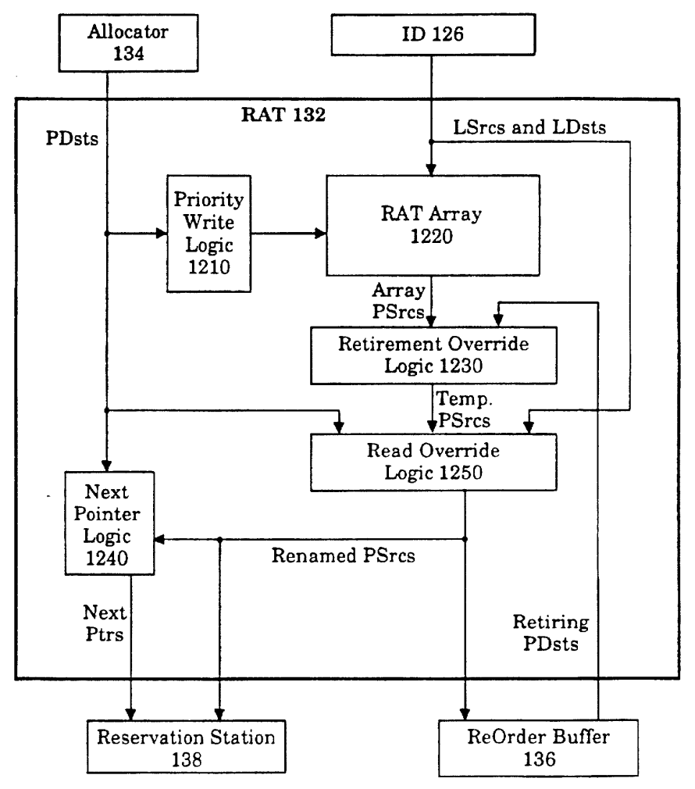](img/us5721855-fig12.png)

<figcaption>US 5,721,855, Figure 12 — Register alias table.</figcaption>

</figure>

<figure markdown="1">

[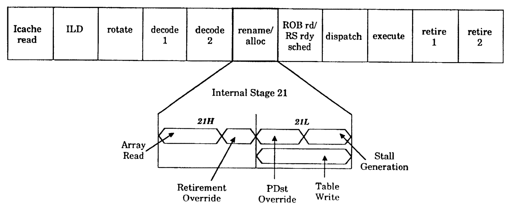](img/us5721855-fig13.png)

<figcaption>US 5,721,855, Figure 13 — Register alias table, stage 21.</figcaption>

</figure>

## 22 ROB read / RS2

PSrcs from 21 read committed data from the RRF or speculative data from the
ROB. Values and ready bits are written into the RS (`22L`). Fig. 15: 22H ROB
read, 22L RS write data. Fig. 17a: 22H ROB/RRF read, 22L RS write.
The RS entry already has its source identities and control from 21L; 22L
installs values that are available now. An incomplete ROB source leaves its
identity resident so a later matching PDst writeback can fill it. A coincident
writeback may supply the value by bypass instead of waiting for the array
read. The ROB entry itself holds retirement metadata written at allocation;
the RS need not carry every field required only at retirement.

After 22 the µop is in the RS and has a ROB row: the in-order → out-of-order
boundary (Chapter 7 §7.2.1; Fig. 7.4).

<figure markdown="1">

[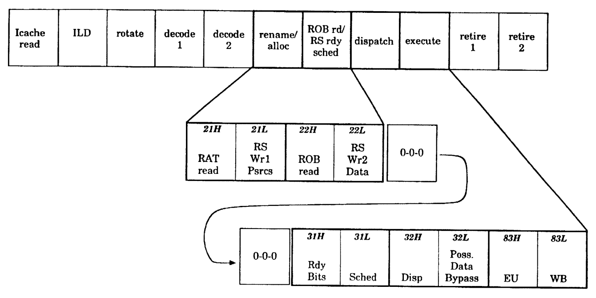](img/us5721855-fig15.png)

<figcaption>US 5,721,855, Figure 15 — Reservation station, stages 21–22.</figcaption>

</figure>

<figure markdown="1">

[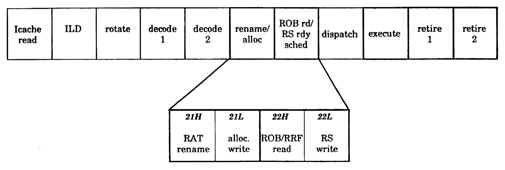](img/us5721855-fig17a.png)

<figcaption>US 5,721,855, Figure 17a — Reorder buffer, stages 21–22.</figcaption>

</figure>

## 31–32 — reservation-station schedule and dispatch

After stage 22, µops wait in the RS until their operands and execution
resources are ready. [Chapter 7 §7.4.1](https://www.waveland.com/browse.php?t=624)
describes a 20-entry RS whose control arrives from allocation/RAT and whose
source data arrive from ROB/RRF reads or matching result broadcasts. Its five
dispatch interfaces are **two execution-unit ports, two AGU ports and one store
data port**. Fig. 7.14 shows the port-to-unit mapping and bypass paths; a port
is an interface, not a promise that five arbitrary µops can execute together.

In **31**, source-valid CAM matches, unit availability, writeback capacity and
scheduling priority determine candidates. The patent places ready-bit work in
`31H` and scheduling in `31L`. In **32**, selected entries and operands are read,
late data may bypass the RS array, and the operations are dispatched. A row is
released after successful, uncanceled dispatch. The RS may predict the arrival
of load data early enough to schedule a dependent µop; if the load misses, the
dependent dispatch must be canceled and later retried. Thus 31–32 describe
work **after** a potentially long RS wait, not two clocks after every stage-22
insertion. [US5721855 Fig. 14](img/us5721855-fig14.png) makes the
hardware path explicit: each stored PSrc compares against broadcast PDst in a
CAM; matches drive operand capture or bypass. The entry-valid bit, operation,
controls, matches and unit arbitration produce a ready bit. The scheduler uses
ready bits and a priority pointer to select entries. Fig. 15 above locates
source installation and schedule/dispatch half-stages. See the
[patent description](https://patents.google.com/patent/US5721855A/en).

<figure markdown="1">

[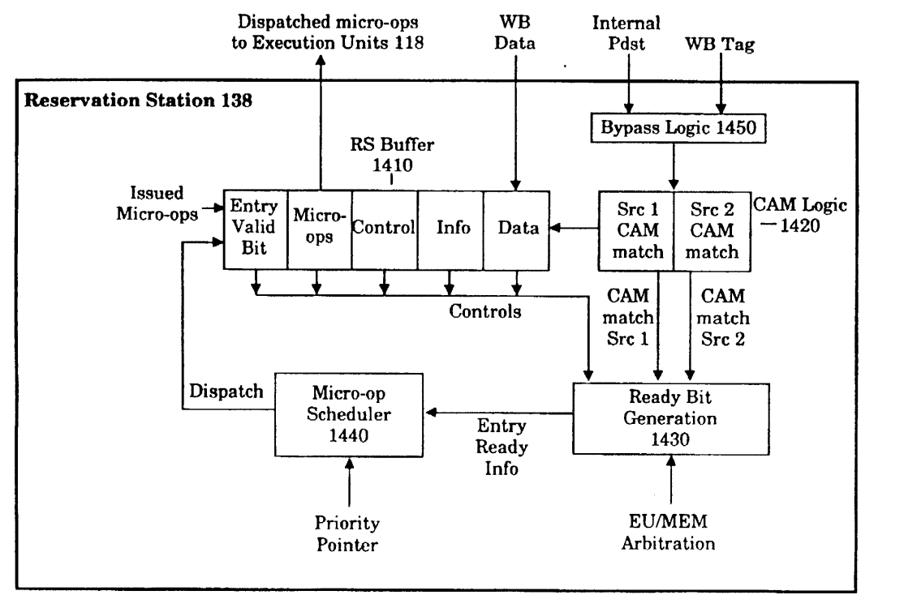](img/us5721855-fig14.png)

<figcaption>US 5,721,855, Figure 14 — RS buffer, source CAMs, ready bits and scheduler.</figcaption>

</figure>

## 33 and later — execution

A simple integer µop executes in **33**; its result is ready for writeback at
the end of that stage. The IEU's patent drawing aligns execution `83H` and
writeback `83L` with this same clock, rather than adding a separate universal
writeback clock. Multiply, divide and floating-point operations start from the
same RS dispatch but take further execution cycles before their result reaches
the writeback pipeline. See [Chapter 7 §7.2.2](https://www.waveland.com/browse.php?t=624),
[US5721855 Fig. 17b](https://patents.google.com/patent/US5721855A/en)
and [Fig. 23](https://patents.google.com/patent/US5721855A/en).
Fig. 23 shows the IEU interface explicitly: µop, operands, flags and PDst
arrive from the RS in 32; result data, flags and fault information return on
the writeback paths in 33/83.

For a memory µop, the AGU forms the linear address in **33** from the
effective-address operands and segment state. The DTLB, DCU and MOB then own
translation, cache access and ordering. Store address (STA) and store data
(STD) arrive on different RS interfaces and meet in the store buffers; they are
not an immediate architectural memory write. The AGU's stage-33 calculation
overlaps the start of the memory path, as shown in
[US5721855 Fig. 24a](https://patents.google.com/patent/US5721855A/en).
The patent splits AGU work further: stage 32 opcode/bypass selection, 33
linear/effective-address and protection calculation, 34 segment-limit and
alignment checks, and 35 fault reporting, aligned with memory 41–43. These
are overlapping pipelines, not three extra clocks before a cache hit.

<figure markdown="1">

[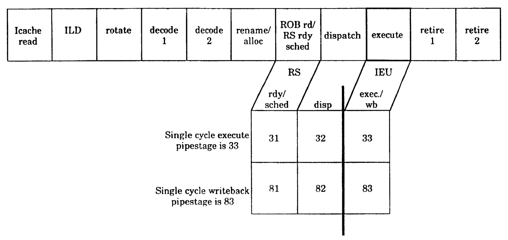](img/us5721855-fig23.png)

<figcaption>US 5,721,855, Figure 23 — integer execution from scheduling to result.</figcaption>

</figure>

<figure markdown="1">

[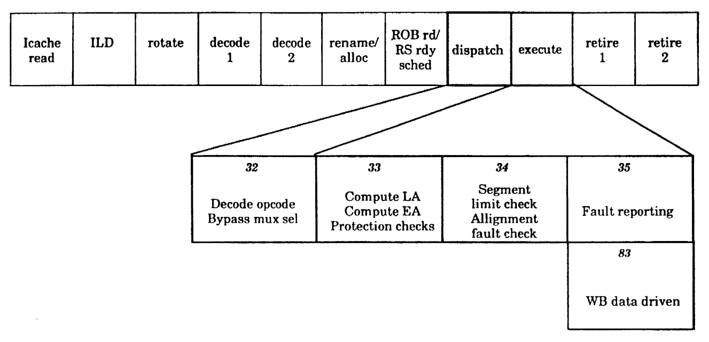](img/us5721855-fig24a.png)

<figcaption>US 5,721,855, Figure 24a — AGU address and fault pipeline.</figcaption>

</figure>

<figure markdown="1">

[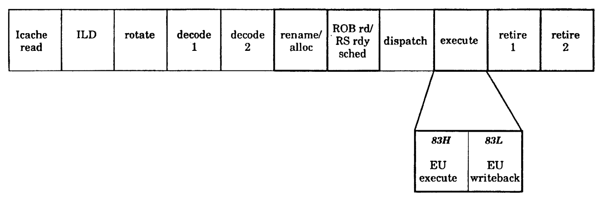](img/us5721855-fig17b.png)

<figcaption>US 5,721,855, Figure 17b — Execution and ROB writeback.</figcaption>

</figure>

## 40–43 — memory and blocked-load retry

On an unblocked load, the MOB bypasses its wait queue into the DCU path. The
AGU produces the address in **33**; the DTLB translates and the DCU begins its
lookup in **42**, with data returned on a hit in **43**. The patent additionally
labels **41** as DCU dispatch: its memory 41–43 path overlaps the AGU 33–35
path, rather than following all three AGU clocks. It describes a parallel
low-address tag read and DTLB translation in 42, then physical tag comparison
and data return. [Chapter 7 Fig. 7.4](https://www.waveland.com/browse.php?t=624)
compresses this hit path to 33→42→43; [US5721855 Fig. 29](https://patents.google.com/patent/US5721855A/en)
gives the finer stage-41 view.

On a miss or ordering/resource block, the MOB retains the load. **40** wakes
and schedules a blocked entry, **41** re-dispatches it, and **42–43** retry the
cache access. The interval before 40 is variable; it can include an L2/memory
fill or a store conflict. This is the separate nonblocking memory loop in
Fig. 7.4, not a fixed penalty applied to every load. The MOB also tracks stores,
but they become architecturally committed only at retirement; then it can send
senior store data to the cache in program order. See
[Chapter 7 §§7.2.2, 7.6](https://www.waveland.com/browse.php?t=624)
and [US5721855 Fig. 30](https://patents.google.com/patent/US5721855A/en).

Fig. 29 shows the cache-hit, miss, L2-return and store-dispatch paths on one
sheet. Fig. 30 shows why a blocked load does not occupy the RS until memory
responds: the MOB can schedule it again from its own buffer. A store's buffer
ownership continues after its STA/STD µops retire until the senior store is
actually sent to the DCU.

<figure markdown="1">

[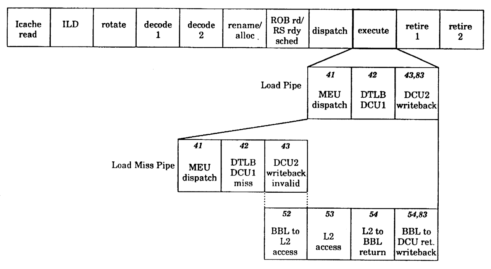](img/us5721855-fig29.png)

<figcaption>US 5,721,855, Figure 29 — DCU load, miss and store paths.</figcaption>

</figure>

<figure markdown="1">

[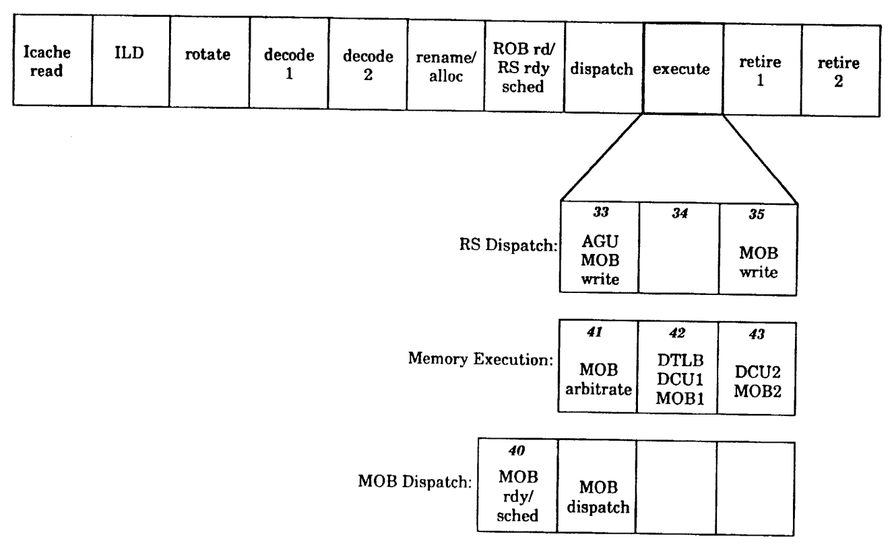](img/us5721855-fig30.png)

<figcaption>US 5,721,855, Figure 30 — MOB dispatch and blocked-load wakeup.</figcaption>

</figure>

## 81–83 — result-bus scheduling and writeback

The **81/82** labels in Fig. 7.4 distinguish the scheduling/arbitration of
memory/FP and integer result paths. They overlap the tail of execution; they
are not three additional clocks appended to every µop. **83** is the actual
result-data writeback. A result carries its physical destination (PDst), data,
and any flags or event information to the ROB; matching RS sources capture or
bypass the broadcast. A load hit can use the memory writeback path after 43,
while a simple integer result writes back during its stage 33/83 clock.

The RS must reserve a suitable writeback bus when it schedules work whose
completion time is known. A miss or cancellation can invalidate a predicted
result arrival, requiring the dependent wakeup/dispatch to be canceled.
[Chapter 7 §§7.2.2, 7.4.1](https://www.waveland.com/browse.php?t=624)
and [US5721855 Fig. 17b](https://patents.google.com/patent/US5721855A/en)
describe the separation of RS scheduling, EU execution and ROB result write.
This is speculative completion: the RRF and architectural memory state have
not yet been updated.

## 91–93 — in-order retirement

The ROB stores results under their PDst and retains the original order of
allocated µops. Its retirement pointer visits the oldest entries, regardless
of the order in which execution finished. The `91` label in Chapter 7 Fig. 7.4 is
**retirement-pointer write/feedback**. The chapter explicitly calls retirement
a **two-clock operation in 92 and 93**; treating 91 as an obligatory extra
candidate-processing stage would misread that diagram.
The patent's Fig. 16 separates the ROB **result buffer**, **retirement
control**, **IP calculation**, **event detection** and committed **RRF**.
That separation explains why result writeback can proceed out of order while
architectural register and IP updates remain ordered.

In **92H**, the retirement control reads candidates from the ROB; in **92L**,
it decides which oldest, consecutively ready candidates can retire. In
**93H**, event detection and instruction-pointer calculation process that
ordered set; in **93L**, eligible values transfer to the RRF. At most three
µops retire per clock in the chapter's P6 description. First/last marks from
the decoder preserve the architectural boundary of an x86 instruction:
interrupts and faults cannot expose a partially committed instruction. The
patent's generic example discusses four physical-register candidates, so its
example width should not replace the chapter's three-µop P6 width. See
[Chapter 7 §§7.2.3, 7.5.1.1](https://www.waveland.com/browse.php?t=624)
and [US5721855 Fig. 16–17c](https://patents.google.com/patent/US5721855A/en).

<figure markdown="1">

[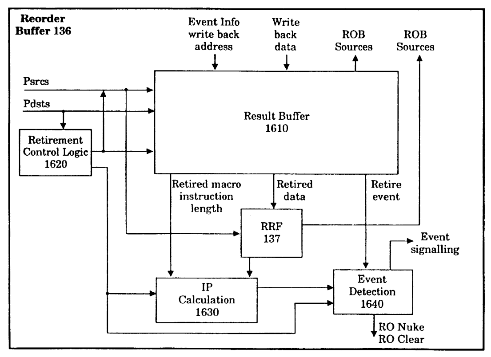](img/us5721855-fig16.png)

<figcaption>US 5,721,855, Figure 16 — ROB result, event/IP and RRF blocks.</figcaption>

</figure>

<figure markdown="1">

[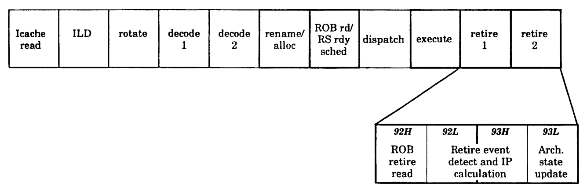](img/us5721855-fig17c.png)

<figcaption>US 5,721,855, Figure 17c — Retirement read, event/IP and RRF update.</figcaption>

</figure>

The ROB also arbitrates recovery. A jump-unit misprediction can clear and
redirect the in-order frontend early; the ROB still prevents younger wrong-path
state from retiring, and a retirement clear repairs the out-of-order state.
A faulting µop's event is carried with its speculative result and handled when
it reaches the ordered retirement boundary. Senior stores leave the ROB's
speculative domain only on retirement and may complete at the DCU later.
These recovery, event and store paths are distinct from ordinary 83 writeback;
see [Chapter 7 §§7.2.3, 7.5.1, 7.6](https://www.waveland.com/browse.php?t=624)
and [US5721855 ROB description](https://patents.google.com/patent/US5721855A/en).

## References and figure credits

- John Paul Shen and Mikko H. Lipasti, [*Modern Processor Design*](https://www.waveland.com/browse.php?t=624), Chapter 7, especially Figures 7.4, 7.6, 7.10 and 7.14 (cited for technical detail; book figures are not reproduced here).
- [US5721855](https://patents.google.com/patent/US5721855A/en), pipeline, execution, memory and ROB figures.
- [US5559974](https://patents.google.com/patent/US5559974A/en), decoder aliases and microcode sequencing, Figure 5.
- [US5630083](https://patents.google.com/patent/US5630083A/en), parallel instruction decoding.
- [US5673427](https://patents.google.com/patent/US5673427A/en), main and shadow µop queues, Figure 6.

[Back to the wiki](../index.md)
