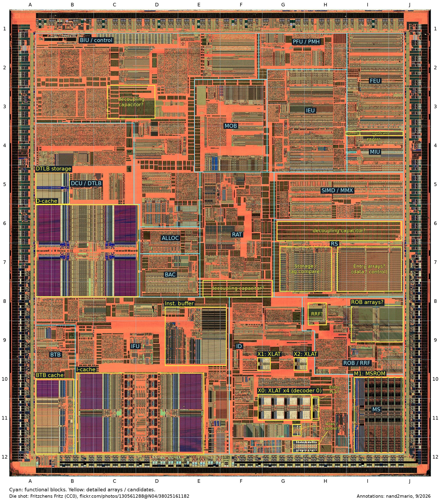

Here are the functional blocks and likely ROM/PLA locations on a P6 die: Deschutes, the 250 nm Pentium II.

This polysilicon-layer photograph has the metal layers removed, exposing transistor patterns. It helps identify logic, flip-flops and regular arrays such as SRAM, but hides the metal wiring that connects them.

## 4+1+1 decoder XLATs

In **ID**, near the bottom of the die, the arrays marked X0 (four PLAs), X1 and X2 are likely decoder XLATs.

P6 has one full decoder and two simple decoders (Shen and Lipasti, §7.3.3). The full decoder can emit up to four micro-ops in parallel; each simple decoder handles instructions that need just one. [US5559974, Figure 5](https://patents.google.com/patent/US5559974A/en) describes a full decoder with four XLAT PLAs and a separate entry-point PLA. The visible four-plus-one-plus-one arrangement fits this design.

The XLATs generate micro-op templates and alias controls; extracted instruction fields supply register and immediate details.

## Entry-point PLA and alias circuitry

The narrow structure immediately **right of the four XLATs** is my leading **entry-point PLA** candidate. In [US5559974, Figure 5](https://patents.google.com/patent/US5559974A/en), the four XLATs and entry-point PLA receive the same opcode inputs; the latter supplies a starting address to the microcode sequencer. A neighboring array fits that connectivity, although the patent drawing is not a physical floorplan.

The two smaller boxed arrays **below the XLATs** now look more likely to be **alias or decoder-control circuitry**. Figure 5 includes macro-alias and micro-alias registers, micro-op registers and selection multiplexers. These provide plausible roles for the arrays, without identifying either one individually or establishing that they are PLAs. Decoder aliasing substitutes instruction-specific fields into micro-op templates; it is separate from register renaming in RAT.

## CROM: location still open

CROM supplies constants used as micro-op operands. I no longer assign it to either lower ID array. MSROM and the leading FROM candidate both look darker than the XLAT structures, suggesting that CROM might also be a **small dark array or band**, possibly outside ID. Near MSROM would suit access to microcode-derived constant indices; near IEU would suit delivery of integer operands. These are search hypotheses, not established placement or read-stage information.

Our Pentium Pro 619 dump returns 512 constants with zero upper 32-bit halves. A direct 512 × 32 implementation would be only 16 Kbits, but that does not establish Deschutes's physical organization. Color alone cannot distinguish ROM from PLA, and a fixed constant lookup can also be implemented as logic. We need array structure or wiring evidence to locate CROM.

## FROM: floating-point constants

[US5721855](https://patents.google.com/patent/US5721855A/en) explicitly includes the floating-point constant ROM among MIU's sub-blocks. My leading **FROM** candidate is the thin horizontal strip along MIU's upper edge. Its narrow left section and much wider right section suggest separate **exponent** and **significand** arrays, resembling the layout Ken Shirriff describes in [Pi in the Pentium](https://www.righto.com/2025/01/pentium-floating-point-ROM.html).

These constants support floating-point functions such as logarithms and trigonometric operations. P6's FROM size is still unknown here; Shirriff found **304 × 86 bits** in P5, but P6 could differ.

## MSROM: the microcode sequencer's ROM

The large dark array at the **bottom-right, I10–J12**, is the established MSROM location. It supplies longer microcode sequences rather than an entry for every instruction: fast-path instructions are handled by the XLAT-based decoders. Both paths produce the same micro-op format and feed the shared rename, scheduling and execution machinery.

## A quick tour of instruction execution

The broad path is **fetch → decode → rename and allocate → wait and execute → retire**, with different instructions in flight at once. **IFU** fetches **16 bytes at a time** from the instruction cache into a wide instruction buffer; boundary detection and alignment prepare the variable-length x86 instructions for **ID**. The **BTB** predicts branch targets to guide fetching before branches execute. ID's full decoder produces up to four micro-ops, while its two simple decoders produce one each; longer sequences come from MSROM. The subsequent rename/allocation path accepts **three micro-ops per clock**.

The **RAT** renames registers to remove false dependencies caused by reusing names such as EAX, while preserving true data dependencies. Allocation reserves entries in the **40-entry ROB** and **20-entry RS**. ROB acts as a task manager for micro-ops, tracking their order, speculative results and exceptions. RS holds them until operands and execution resources are available, then dispatches ready work out of order.

Integer and floating-point work goes to execution resources in **IEU** and **FEU**. Results return to ROB and wake dependent operations in RS. ROB then retires completed operations in program order, committing register results to **RRF**. Finishing execution does not immediately change architectural state: wrong-path results can still be discarded, and faults are reported at the proper instruction boundary.

Memory operations also use **MOB** to track ordering, **DCU** for the data cache, and **BIU** for external transactions. The **DTLB** caches address translations and permissions; a miss may require a page-table walk by the page-miss handler. Loads can obtain data from older buffered stores, and retired stores may wait before draining into the memory system. **MIU** handles floating-point memory-format conversion. See Shen and Lipasti, Chapter 7, and [US5627985, Figures 4–6](https://patents.google.com/patent/US5627985A/en) for the ROB/RS/RRF organization.

## References

- **John Paul Shen and Mikko H. Lipasti, [Modern Processor Design](https://www.waveland.com/browse.php?t=624)**, Chapter 7, “Intel's P6 Microarchitecture.” Start with §7.3.3 for decoding, §7.4.1 for RS, §7.5.1 for ROB/RRF, and §7.6 for memory operations.
- **[US5559974](https://patents.google.com/patent/US5559974A/en)** — decoder XLATs, entry-point PLA, aliasing and microcode sequencing; especially Figure 5.
- **[US5721855](https://patents.google.com/patent/US5721855A/en)** — integrated pipeline and ROB; MIU description and Figure 26d for FROM.
- **[US5627985](https://patents.google.com/patent/US5627985A/en)** — speculative and committed register files, shared operand paths, and retirement.
- **[US5689674](https://patents.google.com/patent/US5689674A/en)** — reservation-station dispatch-port binding.
- **Ken Shirriff, [Pi in the Pentium](https://www.righto.com/2025/01/pentium-floating-point-ROM.html)** — physical reconstruction of the P5 floating-point constant ROM.
- **[Martin Hinner's P6 microcode wiki](https://martin.hinner.info/p6microcode/wiki/)** — microcode encodings, tooling and research.
- **[Fritzchens Fritz's Deschutes photograph](https://www.flickr.com/photos/130561288@N04/38025161182/)** — the polysilicon-layer image underlying the annotations, released under CC0.

[Back to the wiki](../index.md)
